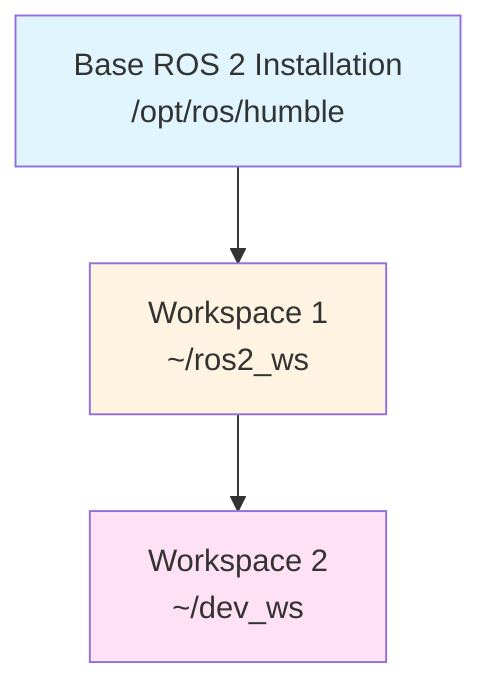
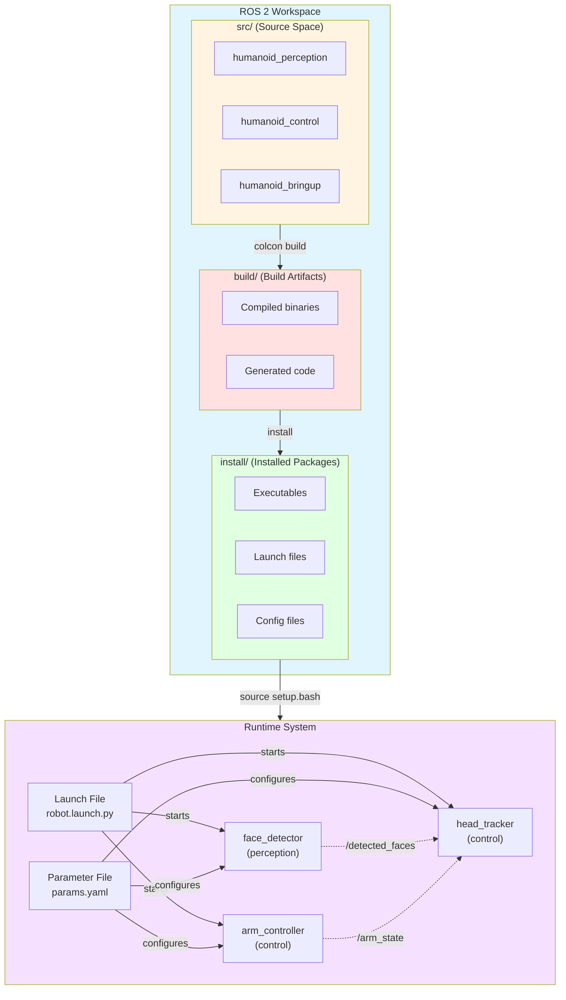

# Chapter 3: Packages, Launch Files, and Parameters

## Learning Objectives

By the end of this chapter, you will be able to:

1. **Create and organize ROS 2 workspaces** with proper directory structure
2. **Build Python packages** with package.xml and setup.py for reusable ROS 2 code
3. **Write launch files** to orchestrate multiple nodes and configure complex systems
4. **Manage parameters** with YAML files and dynamic reconfiguration
5. **Integrate ROS 2 with Gazebo and Isaac Sim** using launch file orchestration
6. **Use colcon** to build, test, and manage multi-package workspaces

## Key Concepts

This chapter introduces six critical concepts for professional ROS 2 development:

1. **ROS 2 Workspace**: A directory structure containing source code (`src/`), build artifacts (`build/`), and installed packages (`install/`)
2. **Package**: The fundamental unit of ROS 2 software organization, containing nodes, launch files, and configuration
3. **package.xml**: Manifest file declaring package dependencies, metadata, and build information
4. **Launch Files**: Python scripts that start multiple nodes, set parameters, and configure runtime environments
5. **Parameters**: Runtime configuration values that nodes can read and update dynamically
6. **Colcon**: Meta-build system for building multiple ROS 2 packages in a workspace

---

## 3.1 ROS 2 Workspace Structure

A **ROS 2 workspace** is a directory containing one or more packages. Understanding workspace structure is essential for organizing robotics projects.

### Standard Workspace Layout

```
~/ros2_ws/                    # Workspace root
├── src/                      # Source space (your code lives here)
│   ├── package_1/
│   │   ├── package_1/        # Python module directory
│   │   │   ├── __init__.py
│   │   │   └── node.py
│   │   ├── launch/
│   │   │   └── launch_file.py
│   │   ├── config/
│   │   │   └── params.yaml
│   │   ├── package.xml       # Package manifest
│   │   └── setup.py          # Python build configuration
│   └── package_2/
├── build/                    # Build artifacts (auto-generated)
├── install/                  # Installed packages (auto-generated)
└── log/                      # Build and test logs (auto-generated)
```

### Creating a Workspace

```bash
# File: Terminal commands for workspace creation

# Create workspace directory
mkdir -p ~/ros2_ws/src
cd ~/ros2_ws

# Build the empty workspace (creates build/, install/, log/)
colcon build

# Source the workspace overlay
source install/setup.bash
```

**Key Insight**: After building, you must `source install/setup.bash` to overlay your workspace packages on top of the base ROS 2 installation. This makes your packages discoverable by `ros2 run` and `ros2 launch`.

### Workspace Overlays

ROS 2 supports **workspace overlays** where one workspace builds on top of another:



Each workspace extends the previous one. This allows you to:
- Develop packages without modifying the base installation
- Test different versions of packages side-by-side
- Share a common base workspace across multiple projects

---

## 3.2 Creating a ROS 2 Python Package

Let's create a complete ROS 2 package for a humanoid robot head controller.

### Step 1: Create Package with `ros2 pkg create`

```bash
# File: Terminal commands

cd ~/ros2_ws/src

# Create package with dependencies
ros2 pkg create humanoid_head_controller \
  --build-type ament_python \
  --dependencies rclpy std_msgs sensor_msgs geometry_msgs

# Package structure created:
# humanoid_head_controller/
# ├── humanoid_head_controller/
# │   └── __init__.py
# ├── package.xml
# ├── setup.py
# ├── setup.cfg
# ├── resource/
# └── test/
```

### Step 2: Understanding `package.xml`

The `package.xml` manifest declares package metadata and dependencies:

```xml
<!-- File: ~/ros2_ws/src/humanoid_head_controller/package.xml -->

<?xml version="1.0"?>
<?xml-model href="http://download.ros.org/schema/package_format3.xsd" schematypens="http://www.w3.org/2001/XMLSchema"?>
<package format="3">
  <name>humanoid_head_controller</name>
  <version>1.0.0</version>
  <description>Head tracking controller for humanoid robots</description>
  <maintainer email="you@example.com">Your Name</maintainer>
  <license>Apache-2.0</license>

  <!-- Build tool dependency -->
  <buildtool_depend>ament_python</buildtool_depend>

  <!-- Runtime dependencies (packages needed when running) -->
  <depend>rclpy</depend>
  <depend>std_msgs</depend>
  <depend>sensor_msgs</depend>
  <depend>geometry_msgs</depend>

  <!-- Test dependencies -->
  <test_depend>ament_copyright</test_depend>
  <test_depend>ament_flake8</test_depend>
  <test_depend>ament_pep257</test_depend>
  <test_depend>python3-pytest</test_depend>

  <export>
    <build_type>ament_python</build_type>
  </export>
</package>
```

**Dependency Types**:
- `<buildtool_depend>`: Tools needed to build the package (e.g., `ament_python`)
- `<depend>`: Both build and runtime dependencies
- `<build_depend>`: Only needed during build
- `<exec_depend>`: Only needed at runtime
- `<test_depend>`: Only needed for testing

### Step 3: Configuring `setup.py`

The `setup.py` file tells Python how to install the package:

```python
# File: ~/ros2_ws/src/humanoid_head_controller/setup.py

from setuptools import find_packages, setup
import os
from glob import glob

package_name = 'humanoid_head_controller'

setup(
    name=package_name,
    version='1.0.0',
    packages=find_packages(exclude=['test']),
    data_files=[
        # Install package.xml
        ('share/ament_index/resource_index/packages',
            ['resource/' + package_name]),
        ('share/' + package_name, ['package.xml']),

        # Install launch files
        (os.path.join('share', package_name, 'launch'),
            glob(os.path.join('launch', '*launch.[pxy][yma]*'))),

        # Install config files
        (os.path.join('share', package_name, 'config'),
            glob(os.path.join('config', '*.yaml'))),
    ],
    install_requires=['setuptools'],
    zip_safe=True,
    maintainer='Your Name',
    maintainer_email='you@example.com',
    description='Head tracking controller for humanoid robots',
    license='Apache-2.0',
    tests_require=['pytest'],
    entry_points={
        'console_scripts': [
            'head_tracker = humanoid_head_controller.head_tracker_node:main',
            'gaze_controller = humanoid_head_controller.gaze_controller_node:main',
        ],
    },
)
```

**Key Sections**:
- `packages`: Auto-discovers Python packages in the directory
- `data_files`: Installs non-Python files (launch, config, URDF)
- `entry_points`: Creates executable commands that map to Python functions

### Step 4: Adding a Node

Create a head tracking node:

```python
# File: ~/ros2_ws/src/humanoid_head_controller/humanoid_head_controller/head_tracker_node.py

import rclpy
from rclpy.node import Node
from sensor_msgs.msg import JointState
from geometry_msgs.msg import Point
import math

class HeadTrackerNode(Node):
    """
    Tracks a 3D target point and commands head joint angles.

    Subscribes to:
        /target_point (geometry_msgs/Point): 3D point to look at

    Publishes to:
        /head_joint_commands (sensor_msgs/JointState): Pan/tilt joint angles
    """

    def __init__(self):
        super().__init__('head_tracker')

        # Declare parameters
        self.declare_parameter('max_pan_angle', 1.57)  # 90 degrees in radians
        self.declare_parameter('max_tilt_angle', 0.785)  # 45 degrees in radians
        self.declare_parameter('tracking_rate', 10.0)  # Hz

        # Get parameters
        self.max_pan = self.get_parameter('max_pan_angle').value
        self.max_tilt = self.get_parameter('max_tilt_angle').value
        rate = self.get_parameter('tracking_rate').value

        # Subscriber for target point
        self.subscription = self.create_subscription(
            Point,
            '/target_point',
            self.target_callback,
            10
        )

        # Publisher for joint commands
        self.publisher = self.create_publisher(
            JointState,
            '/head_joint_commands',
            10
        )

        # Timer for periodic publishing
        self.timer = self.create_timer(1.0 / rate, self.publish_joint_commands)

        # Current target (default: look straight ahead)
        self.target_x = 1.0
        self.target_y = 0.0
        self.target_z = 1.5  # Head height

        self.get_logger().info(f'Head tracker initialized (rate: {rate} Hz)')

    def target_callback(self, msg: Point):
        """Update target point from incoming messages."""
        self.target_x = msg.x
        self.target_y = msg.y
        self.target_z = msg.z

    def publish_joint_commands(self):
        """Compute and publish head joint angles to track target."""
        # Compute pan (yaw) angle: horizontal rotation
        pan_angle = math.atan2(self.target_y, self.target_x)
        pan_angle = max(-self.max_pan, min(self.max_pan, pan_angle))

        # Compute tilt (pitch) angle: vertical rotation
        horizontal_dist = math.sqrt(self.target_x**2 + self.target_y**2)
        tilt_angle = math.atan2(self.target_z - 1.5, horizontal_dist)
        tilt_angle = max(-self.max_tilt, min(self.max_tilt, tilt_angle))

        # Create JointState message
        msg = JointState()
        msg.header.stamp = self.get_clock().now().to_msg()
        msg.name = ['head_pan_joint', 'head_tilt_joint']
        msg.position = [pan_angle, tilt_angle]

        self.publisher.publish(msg)

def main(args=None):
    rclpy.init(args=args)
    node = HeadTrackerNode()

    try:
        rclpy.spin(node)
    except KeyboardInterrupt:
        pass
    finally:
        node.destroy_node()
        rclpy.shutdown()

if __name__ == '__main__':
    main()
```

### Step 5: Building the Package

```bash
# File: Terminal commands

cd ~/ros2_ws

# Build all packages (or specific package with --packages-select)
colcon build --packages-select humanoid_head_controller

# Source the workspace
source install/setup.bash

# Run the node
ros2 run humanoid_head_controller head_tracker

# Expected output:
# [INFO] [head_tracker]: Head tracker initialized (rate: 10.0 Hz)
```

---

## 3.3 Launch Files: Orchestrating Multiple Nodes

**Launch files** allow you to start multiple nodes, set parameters, and configure complex systems with a single command.

### Why Launch Files?

Starting a humanoid robot system manually is tedious:

```bash
# Manual approach (don't do this!)
ros2 run humanoid_head_controller head_tracker &
ros2 run humanoid_perception face_detector &
ros2 run humanoid_perception object_tracker &
ros2 run humanoid_control arm_controller &
ros2 run humanoid_control leg_controller &
# ... and 20 more nodes
```

Instead, use a launch file:

```bash
# Launch file approach (better!)
ros2 launch humanoid_bringup robot.launch.py
```

### Basic Launch File Syntax

Launch files are Python scripts using the `launch` API:

```python
# File: ~/ros2_ws/src/humanoid_head_controller/launch/head_system.launch.py

from launch import LaunchDescription
from launch_ros.actions import Node

def generate_launch_description():
    """Launch head tracking system with multiple nodes."""

    return LaunchDescription([
        # Head tracker node
        Node(
            package='humanoid_head_controller',
            executable='head_tracker',
            name='head_tracker',
            output='screen',
            parameters=[{
                'max_pan_angle': 1.57,
                'max_tilt_angle': 0.785,
                'tracking_rate': 20.0
            }]
        ),

        # Gaze controller node
        Node(
            package='humanoid_head_controller',
            executable='gaze_controller',
            name='gaze_controller',
            output='screen',
            remappings=[
                ('/input_image', '/camera/image_raw'),
                ('/target_point', '/head_tracker/target_point')
            ]
        ),

        # Camera driver (example)
        Node(
            package='usb_cam',
            executable='usb_cam_node',
            name='head_camera',
            output='screen',
            parameters=[{
                'video_device': '/dev/video0',
                'framerate': 30.0,
                'image_width': 640,
                'image_height': 480
            }]
        ),
    ])
```

**Key Elements**:
- `package`: Package name containing the executable
- `executable`: Entry point name from `setup.py`
- `name`: Node name (can differ from executable)
- `output='screen'`: Print logs to terminal
- `parameters`: List of parameter dictionaries
- `remappings`: Remap topic names

### Running Launch Files

```bash
# File: Terminal commands

# Install the package (copies launch files to install space)
cd ~/ros2_ws
colcon build --packages-select humanoid_head_controller
source install/setup.bash

# Run the launch file
ros2 launch humanoid_head_controller head_system.launch.py

# Expected output:
# [head_tracker-1] [INFO] [head_tracker]: Head tracker initialized (rate: 20.0 Hz)
# [gaze_controller-2] [INFO] [gaze_controller]: Gaze controller ready
# [head_camera-3] [INFO] [head_camera]: Camera opened: /dev/video0
```

---

## 3.4 Parameter Management

**Parameters** are runtime configuration values that nodes can read and update without recompilation.

### Declaring Parameters in Nodes

We already saw parameter declaration in the `HeadTrackerNode`:

```python
# Declare parameters with default values
self.declare_parameter('max_pan_angle', 1.57)
self.declare_parameter('max_tilt_angle', 0.785)
self.declare_parameter('tracking_rate', 10.0)

# Get parameter values
self.max_pan = self.get_parameter('max_pan_angle').value
```

### Parameter Files (YAML)

Instead of hardcoding parameters in launch files, use YAML configuration:

```yaml
# File: ~/ros2_ws/src/humanoid_head_controller/config/head_params.yaml

head_tracker:
  ros__parameters:
    max_pan_angle: 1.57      # 90 degrees
    max_tilt_angle: 0.785    # 45 degrees
    tracking_rate: 20.0      # Hz

gaze_controller:
  ros__parameters:
    detection_confidence: 0.7
    tracking_smoothing: 0.85
    face_detection_model: 'haarcascade_frontalface_default.xml'
```

### Loading Parameters in Launch Files

```python
# File: ~/ros2_ws/src/humanoid_head_controller/launch/head_system_with_params.launch.py

import os
from ament_index_python.packages import get_package_share_directory
from launch import LaunchDescription
from launch_ros.actions import Node

def generate_launch_description():
    # Get package directory
    pkg_dir = get_package_share_directory('humanoid_head_controller')

    # Path to parameter file
    params_file = os.path.join(pkg_dir, 'config', 'head_params.yaml')

    return LaunchDescription([
        Node(
            package='humanoid_head_controller',
            executable='head_tracker',
            name='head_tracker',
            output='screen',
            parameters=[params_file]  # Load from YAML
        ),

        Node(
            package='humanoid_head_controller',
            executable='gaze_controller',
            name='gaze_controller',
            output='screen',
            parameters=[params_file]  # Same file, different namespace
        ),
    ])
```

### Dynamic Parameter Updates

Parameters can be changed at runtime using CLI:

```bash
# File: Terminal commands

# List all parameters for a node
ros2 param list /head_tracker

# Get a specific parameter value
ros2 param get /head_tracker tracking_rate

# Set a parameter value (runtime update)
ros2 param set /head_tracker tracking_rate 30.0

# Dump all parameters to a file
ros2 param dump /head_tracker > head_tracker_params.yaml
```

---

## 3.5 Integrating with Gazebo Simulation

Let's create a launch file that starts a humanoid robot in Gazebo with our head controller.

### Gazebo Integration Launch File

```python
# File: ~/ros2_ws/src/humanoid_head_controller/launch/gazebo_head_demo.launch.py

import os
from ament_index_python.packages import get_package_share_directory
from launch import LaunchDescription
from launch.actions import IncludeLaunchDescription, DeclareLaunchArgument
from launch.launch_description_sources import PythonLaunchDescriptionSource
from launch.substitutions import LaunchConfiguration
from launch_ros.actions import Node

def generate_launch_description():
    # Get package directories
    pkg_gazebo_ros = get_package_share_directory('gazebo_ros')
    pkg_head_controller = get_package_share_directory('humanoid_head_controller')

    # Declare arguments
    use_sim_time_arg = DeclareLaunchArgument(
        'use_sim_time',
        default_value='true',
        description='Use simulation (Gazebo) clock if true'
    )

    # Gazebo world file path
    world_file = os.path.join(pkg_head_controller, 'worlds', 'humanoid_demo.world')

    # Include Gazebo launch file
    gazebo = IncludeLaunchDescription(
        PythonLaunchDescriptionSource([
            os.path.join(pkg_gazebo_ros, 'launch', 'gazebo.launch.py')
        ]),
        launch_arguments={'world': world_file}.items()
    )

    # Spawn humanoid robot in Gazebo
    spawn_robot = Node(
        package='gazebo_ros',
        executable='spawn_entity.py',
        arguments=[
            '-entity', 'humanoid_robot',
            '-file', os.path.join(pkg_head_controller, 'urdf', 'humanoid.urdf'),
            '-x', '0.0',
            '-y', '0.0',
            '-z', '1.0'
        ],
        output='screen'
    )

    # ROS 2 control hardware interface
    robot_controller = Node(
        package='controller_manager',
        executable='ros2_control_node',
        parameters=[
            os.path.join(pkg_head_controller, 'config', 'controllers.yaml'),
            {'use_sim_time': LaunchConfiguration('use_sim_time')}
        ],
        output='screen'
    )

    # Head tracking node
    head_tracker = Node(
        package='humanoid_head_controller',
        executable='head_tracker',
        name='head_tracker',
        output='screen',
        parameters=[
            os.path.join(pkg_head_controller, 'config', 'head_params.yaml'),
            {'use_sim_time': LaunchConfiguration('use_sim_time')}
        ]
    )

    return LaunchDescription([
        use_sim_time_arg,
        gazebo,
        spawn_robot,
        robot_controller,
        head_tracker,
    ])
```

**Key Features**:
- **IncludeLaunchDescription**: Reuses Gazebo's launch file
- **DeclareLaunchArgument**: Defines configurable arguments
- **LaunchConfiguration**: Retrieves argument values
- **use_sim_time**: Synchronizes ROS 2 nodes with Gazebo's simulated clock

### Running Gazebo Launch File

```bash
# File: Terminal commands

cd ~/ros2_ws
colcon build --packages-select humanoid_head_controller
source install/setup.bash

# Launch Gazebo with head controller
ros2 launch humanoid_head_controller gazebo_head_demo.launch.py

# Expected: Gazebo opens with humanoid robot, head tracker running
```

---

## 3.6 Multi-Node System Example

Here's a complete launch file orchestrating a humanoid perception and control system:

```python
# File: ~/ros2_ws/src/humanoid_bringup/launch/full_system.launch.py

import os
from ament_index_python.packages import get_package_share_directory
from launch import LaunchDescription
from launch.actions import DeclareLaunchArgument, GroupAction
from launch.substitutions import LaunchConfiguration, PythonExpression
from launch.conditions import IfCondition
from launch_ros.actions import Node, PushRosNamespace

def generate_launch_description():
    # Declare launch arguments
    namespace_arg = DeclareLaunchArgument('namespace', default_value='humanoid')
    use_sim_time_arg = DeclareLaunchArgument('use_sim_time', default_value='true')
    enable_visualization_arg = DeclareLaunchArgument('enable_rviz', default_value='true')

    # Get configuration files
    pkg_dir = get_package_share_directory('humanoid_bringup')
    params_file = os.path.join(pkg_dir, 'config', 'robot_params.yaml')
    rviz_config = os.path.join(pkg_dir, 'config', 'default.rviz')

    # Perception nodes (grouped with namespace)
    perception_group = GroupAction([
        PushRosNamespace(LaunchConfiguration('namespace')),

        Node(
            package='humanoid_perception',
            executable='face_detector',
            name='face_detector',
            output='screen',
            parameters=[params_file, {'use_sim_time': LaunchConfiguration('use_sim_time')}]
        ),

        Node(
            package='humanoid_perception',
            executable='object_detector',
            name='object_detector',
            output='screen',
            parameters=[params_file, {'use_sim_time': LaunchConfiguration('use_sim_time')}]
        ),

        Node(
            package='humanoid_perception',
            executable='depth_processor',
            name='depth_processor',
            output='screen',
            parameters=[params_file, {'use_sim_time': LaunchConfiguration('use_sim_time')}]
        ),
    ])

    # Control nodes
    control_group = GroupAction([
        PushRosNamespace(LaunchConfiguration('namespace')),

        Node(
            package='humanoid_control',
            executable='head_controller',
            name='head_controller',
            output='screen',
            parameters=[params_file, {'use_sim_time': LaunchConfiguration('use_sim_time')}]
        ),

        Node(
            package='humanoid_control',
            executable='arm_controller',
            name='arm_controller',
            output='screen',
            parameters=[params_file, {'use_sim_time': LaunchConfiguration('use_sim_time')}]
        ),

        Node(
            package='humanoid_control',
            executable='balance_controller',
            name='balance_controller',
            output='screen',
            parameters=[params_file, {'use_sim_time': LaunchConfiguration('use_sim_time')}]
        ),
    ])

    # Visualization (conditional on enable_rviz argument)
    rviz_node = Node(
        package='rviz2',
        executable='rviz2',
        name='rviz2',
        output='screen',
        arguments=['-d', rviz_config],
        condition=IfCondition(LaunchConfiguration('enable_rviz')),
        parameters=[{'use_sim_time': LaunchConfiguration('use_sim_time')}]
    )

    # Static transform publishers (robot's sensor frames)
    static_transforms = [
        Node(
            package='tf2_ros',
            executable='static_transform_publisher',
            name='camera_tf',
            arguments=['0', '0', '1.6', '0', '0', '0', 'base_link', 'camera_link']
        ),
        Node(
            package='tf2_ros',
            executable='static_transform_publisher',
            name='lidar_tf',
            arguments=['0', '0', '1.7', '0', '0', '0', 'base_link', 'lidar_link']
        ),
    ]

    return LaunchDescription([
        namespace_arg,
        use_sim_time_arg,
        enable_visualization_arg,
        perception_group,
        control_group,
        rviz_node,
        *static_transforms,
    ])
```

**Advanced Features**:
- **GroupAction + PushRosNamespace**: Groups nodes under a namespace (`/humanoid/face_detector`, etc.)
- **DeclareLaunchArgument**: Makes launch file configurable
- **IfCondition**: Conditionally launches nodes based on arguments
- **Static Transform Publishers**: Defines fixed spatial relationships between robot frames

### Running with Custom Arguments

```bash
# File: Terminal commands

# Default run (namespace='humanoid', rviz=true, sim_time=true)
ros2 launch humanoid_bringup full_system.launch.py

# Custom namespace and disable RViz
ros2 launch humanoid_bringup full_system.launch.py \
  namespace:=robot1 \
  enable_rviz:=false

# Multiple robots (run twice with different namespaces)
ros2 launch humanoid_bringup full_system.launch.py namespace:=robot1 &
ros2 launch humanoid_bringup full_system.launch.py namespace:=robot2 &
```

---

## 3.7 Colcon Build System

**Colcon** is the build tool for ROS 2 workspaces. It handles dependencies, parallel builds, and testing.

### Common Colcon Commands

```bash
# File: Terminal commands - Colcon build system

# Build all packages in workspace
cd ~/ros2_ws
colcon build

# Build specific package
colcon build --packages-select humanoid_head_controller

# Build with dependencies
colcon build --packages-up-to humanoid_head_controller

# Clean build (delete build/ and install/ directories)
rm -rf build/ install/ log/
colcon build

# Parallel builds (use 4 CPU cores)
colcon build --parallel-workers 4

# Build with verbose output (see compiler commands)
colcon build --event-handlers console_direct+

# Build and run tests
colcon build
colcon test
colcon test-result --verbose

# Symlink install (no need to rebuild after Python changes)
colcon build --symlink-install
```

**Key Options**:
- `--packages-select <pkg>`: Build only specified packages
- `--packages-up-to <pkg>`: Build package and all its dependencies
- `--symlink-install`: Create symlinks instead of copying (faster iteration)
- `--event-handlers console_direct+`: Show detailed build output

### Workspace Sourcing Best Practices

```bash
# File: ~/.bashrc - Add ROS 2 setup to shell configuration

# Source ROS 2 base installation
source /opt/ros/humble/setup.bash

# Source your workspace (overlay)
source ~/ros2_ws/install/setup.bash

# Optional: Create alias for rebuilding and sourcing
alias rosb='cd ~/ros2_ws && colcon build --symlink-install && source install/setup.bash'
```

**Warning**: Always source `setup.bash` after building to update environment variables.

---

## 3.8 Best Practices for Package Organization

### Multi-Package Project Structure

For large projects, organize code into multiple specialized packages:

```
~/ros2_ws/src/
├── humanoid_bringup/              # Launch files and top-level configuration
│   ├── launch/
│   │   ├── robot.launch.py
│   │   ├── simulation.launch.py
│   │   └── perception.launch.py
│   └── config/
│       └── robot_params.yaml
│
├── humanoid_description/          # URDF, meshes, and robot models
│   ├── urdf/
│   ├── meshes/
│   └── config/
│
├── humanoid_perception/           # Perception nodes (vision, sensors)
│   ├── humanoid_perception/
│   │   ├── face_detector.py
│   │   └── object_detector.py
│   └── launch/
│
├── humanoid_control/              # Control nodes (arms, legs, balance)
│   ├── humanoid_control/
│   │   ├── arm_controller.py
│   │   └── balance_controller.py
│   └── config/
│
└── humanoid_msgs/                 # Custom message definitions
    └── msg/
        ├── JointCommand.msg
        └── BalanceState.msg
```

**Design Principles**:
1. **Separation of Concerns**: Each package has a single responsibility
2. **Reusability**: Packages can be used across multiple projects
3. **Testability**: Isolated packages are easier to test
4. **Modularity**: Teams can work on different packages independently

### Naming Conventions

Follow ROS 2 community conventions:

- **Packages**: `lowercase_with_underscores` (e.g., `humanoid_head_controller`)
- **Nodes**: `lowercase_with_underscores` (e.g., `head_tracker_node.py`)
- **Topics**: `/lowercase_with_underscores` (e.g., `/head_joint_commands`)
- **Launch files**: `descriptive_name.launch.py` (e.g., `gazebo_head_demo.launch.py`)
- **Parameters**: `lowercase_with_underscores` (e.g., `max_pan_angle`)

---

## 3.9 Architecture Diagram

Here's how packages, launch files, and parameters fit together in a ROS 2 system:



---

## End-of-Chapter Exercises

Test your understanding of ROS 2 packages, launch files, and parameters with these progressive challenges.

### Exercise 1: Create a Custom Package (Easy)

**Task**: Create a ROS 2 package called `my_humanoid_controller` with the following:
- Package type: `ament_python`
- Dependencies: `rclpy`, `std_msgs`, `geometry_msgs`
- One node: `balance_monitor.py` that publishes `/balance_status` (std_msgs/String) every second

**Acceptance Criteria**:
- Package builds successfully with `colcon build`
- Node runs with `ros2 run my_humanoid_controller balance_monitor`
- Topic `/balance_status` is published at 1 Hz

**Hints**:
- Use `ros2 pkg create` to scaffold the package
- Add entry point in `setup.py`
- Use `create_timer()` for periodic publishing

---

### Exercise 2: Parameter Configuration (Easy-Medium)

**Task**: Extend the `balance_monitor.py` node to accept three parameters:
- `publish_rate` (default: 1.0 Hz)
- `warning_threshold` (default: 0.1 meters)
- `critical_threshold` (default: 0.2 meters)

Create a YAML config file `balance_params.yaml` and a launch file `balance_system.launch.py` that loads these parameters.

**Acceptance Criteria**:
- Parameters can be set via YAML file
- Node logs different messages when thresholds are exceeded
- Launch file starts node with custom parameters

**Hints**:
- Use `declare_parameter()` and `get_parameter()`
- YAML structure: `node_name: ros__parameters: ...`
- Load params in launch file: `parameters=[params_file]`

---

### Exercise 3: Multi-Node Launch File (Medium)

**Task**: Create a launch file `perception_system.launch.py` that starts:
1. A camera driver node (simulated with a simple publisher)
2. An image processor node (subscribes to camera, republishes processed data)
3. An object detector node (subscribes to processed images)

All nodes should:
- Use the same parameter file
- Use `use_sim_time:=true`
- Have `output='screen'`

**Acceptance Criteria**:
- All three nodes start with one `ros2 launch` command
- Nodes communicate via topics (verify with `ros2 topic echo`)
- Parameter file is shared across all nodes

**Hints**:
- Create three separate Python node files
- Add all as entry points in `setup.py`
- Use `remappings` if topic names need to be changed

---

### Exercise 4: Gazebo Integration (Medium)

**Task**: Create a launch file that:
1. Starts Gazebo with an empty world
2. Spawns a simple robot (use a box URDF as placeholder)
3. Launches a teleoperation node to move the robot

**Acceptance Criteria**:
- Gazebo opens and robot is visible
- Teleop node can send velocity commands
- Robot moves in Gazebo when commanded

**Hints**:
- Use `IncludeLaunchDescription` to include Gazebo's launch file
- Use `spawn_entity.py` from `gazebo_ros`
- Create a simple box URDF if you don't have a robot model yet

---

### Exercise 5: Namespace and Remapping (Medium-Hard)

**Task**: Modify the `perception_system.launch.py` to support launching multiple instances with different namespaces. Create a top-level launch file that launches two perception systems:
- System 1: namespace `/robot1`
- System 2: namespace `/robot2`

**Acceptance Criteria**:
- Both systems run simultaneously
- Topics are properly namespaced (`/robot1/camera/image`, `/robot2/camera/image`)
- Use `ros2 node list` to verify namespace separation

**Hints**:
- Use `PushRosNamespace` or `GroupAction`
- Use `DeclareLaunchArgument` for configurable namespace
- Include the launch file twice with different arguments

---

### Exercise 6: Complete Humanoid Bringup (Hard)

**Task**: Create a complete humanoid robot bringup system with:
1. **Package**: `humanoid_bringup`
2. **Launch file**: `full_robot.launch.py`
3. **Nodes to start**:
   - Head controller
   - Arm controller (left and right)
   - Leg controller
   - Balance monitor
   - Camera driver
4. **Configuration**: All parameters from a single YAML file
5. **Visualization**: Launch RViz with a custom config (conditional)
6. **Arguments**: `use_sim_time`, `enable_rviz`, `namespace`

**Acceptance Criteria**:
- All nodes start correctly
- Parameters loaded from YAML
- RViz launches when `enable_rviz:=true`
- System works with custom namespace
- All nodes visible in `rqt_graph`

**Hints**:
- Structure similar to the `full_system.launch.py` example
- Create placeholder nodes if you don't have real controllers
- Test incrementally (add nodes one by one)

---

## Capstone Integration: Module 1 Final Project

In the Module 1 capstone, you'll build a **complete humanoid head tracking system** that integrates everything from Chapters 1-4:

**Requirements**:
1. **Package**: `humanoid_head_system` (this chapter)
2. **Nodes**: Head tracker, gaze controller, face detector (Chapter 2)
3. **URDF**: Humanoid head model with pan/tilt joints (Chapter 4)
4. **Launch File**: Single command to start entire system
5. **Simulation**: Gazebo integration with physics (Chapter 4)
6. **Visualization**: RViz showing robot model and camera feed

**Skills from this Chapter**:
- Creating multi-package workspace
- Writing complex launch files with arguments
- Managing parameters with YAML
- Integrating Gazebo and RViz

Start thinking about your system architecture now! The capstone will test your ability to orchestrate a complete ROS 2 robotics system.

---

## Summary

In this chapter, you learned:

✅ **ROS 2 workspace structure** and the role of `src/`, `build/`, `install/` directories
✅ **Creating Python packages** with `package.xml` and `setup.py`
✅ **Writing launch files** to orchestrate multiple nodes and set parameters
✅ **Managing parameters** with YAML files and dynamic reconfiguration
✅ **Integrating Gazebo** using launch file includes and simulation time
✅ **Using colcon** to build and manage multi-package workspaces
✅ **Best practices** for package organization and naming conventions

### Key Takeaways

1. **Packages are the unit of organization** in ROS 2 - keep them focused and reusable
2. **Launch files eliminate manual node startup** - essential for complex systems
3. **Parameters enable runtime configuration** - avoid hardcoded values
4. **Colcon builds all packages** - use `--symlink-install` for faster iteration
5. **Namespaces and remappings** allow running multiple robot instances

### Next Steps

You're now ready for [Chapter 4: URDF for Humanoid Robots →](./chapter-4-urdf-for-humanoids.md), where you'll learn to describe robot structure using URDF and visualize humanoid robots in RViz and Gazebo.

---

**Need Help?**
- [ROS 2 Launch System Documentation](https://docs.ros.org/en/humble/Tutorials/Intermediate/Launch/Launch-Main.html)
- [Colcon Build Tool Guide](https://colcon.readthedocs.io/)
- [ROS 2 Parameters Tutorial](https://docs.ros.org/en/humble/Tutorials/Beginner-CLI-Tools/Understanding-ROS2-Parameters/Understanding-ROS2-Parameters.html)
