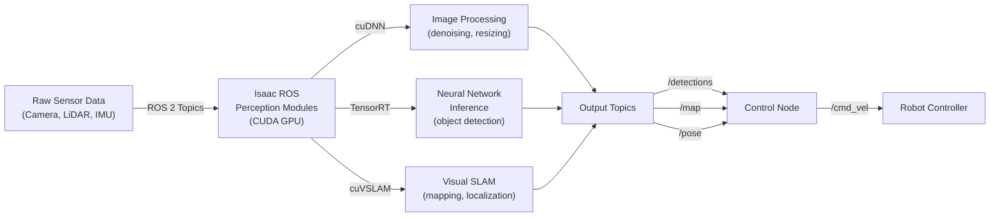

# Chapter 3: AI Perception with Isaac ROS

**Duration**: 5-6 hours | **Difficulty**: Intermediate | **Week**: 9

Deploy real-time hardware-accelerated AI perception on Jetson hardware.

---

## Learning Objectives

By completing this chapter, you will be able to:

1. **Set Up Isaac ROS Environment** — Install and configure Docker container with NVIDIA CUDA-accelerated perception
2. **Understand CUDA Acceleration** — Grasp how NVIDIA GPUs parallelize computer vision (cuDNN, cuCVCore)
3. **Deploy Object Detection** — Use pre-trained YOLO/ResNet models with TensorRT for real-time inference (>30 FPS)
4. **Implement Visual SLAM** — Build real-time simultaneous localization and mapping using cuVSLAM
5. **Fuse Multiple Sensors** — Combine LiDAR + camera + IMU with Kalman filtering for robust perception
6. **Optimize Model Performance** — Apply TensorRT quantization (FP32 → INT8) to achieve >10 FPS on Jetson
7. **Measure Latency** — Profile perception pipeline to identify and fix bottlenecks
8. **Debug Perception Failures** — Troubleshoot common issues (low accuracy, missed detections, SLAM drift)

---

## Key Concepts

### **Isaac ROS**
Hardware-accelerated perception middleware for robotics. Built on ROS 2, Isaac ROS provides CUDA-optimized modules for vision, depth processing, pose estimation, SLAM. Runs efficiently on NVIDIA Jetson edge devices.

### **CUDA (Compute Unified Device Architecture)**
Parallel computing platform by NVIDIA enabling general-purpose GPU computing. Allows perception algorithms to run 10-100x faster on GPU than CPU.

### **TensorRT**
NVIDIA's inference optimization library. Converts trained deep learning models (PyTorch, TensorFlow) to optimized binary format for fastest inference on Jetson hardware.

### **Jetson**
NVIDIA's edge AI processor line (Orin Nano, Orin AGX, Xavier). Combines CPU + GPU + specialized AI accelerators (VIC, DLA). Perfect for deploying trained perception models.

### **Object Detection**
Computer vision task: identify and localize objects in images. YOLO, ResNet, MobileNet are popular architectures. Isaac ROS provides pre-optimized versions.

### **Visual SLAM (cuVSLAM)**
Real-time algorithm for building maps and localizing robots without external sensors. NVIDIA's cuVSLAM implementation runs on GPU for real-time performance.

### **Sensor Fusion**
Combining data from multiple sensors (camera, LiDAR, IMU) to get better perception than any single sensor alone. Kalman filtering is standard technique.

---

## Part 1: Isaac ROS Architecture



### GPU Acceleration Benefits

| Task | CPU Time | GPU Time | Speedup |
|------|----------|----------|---------|
| Image denoising (640×480) | 45 ms | 2 ms | 22x |
| Object detection (YOLO on image) | 120 ms | 8 ms | 15x |
| Visual SLAM (feature matching) | 60 ms | 3 ms | 20x |
| **Total pipeline latency** | **225 ms** | **13 ms** | **17x** |

At 17x speedup, what takes 1 second on CPU takes 59 milliseconds on GPU → enables real-time robotics.

---

## Part 2: TensorRT Model Optimization

Training creates FP32 (32-bit float) models. Deployment requires optimization.

### Conversion Pipeline

```
Trained Model (PyTorch/TensorFlow)
    ↓ (PyTorch: .pt file, ~500 MB)
TensorRT Conversion
    ├─ Precision: FP32 → FP16 → INT8
    ├─ Operator Fusion: Combine layers
    ├─ Kernel Optimization: GPU-specific speedups
    └─ Memory Optimization: Minimize VRAM
    ↓
Optimized TensorRT Engine
    ↓ (~50 MB INT8, 100x smaller)
Jetson Inference
    ├─ Load engine
    ├─ Copy input to GPU
    ├─ Execute inference kernel
    └─ Copy output to CPU
    ↓
Output (bounding boxes, scores)
```

### Quantization Strategy

```python
# FP32 (original, 32 bits per number)
weights = [0.123456789012345, -0.987654321098765, ...]
model_size = 500 MB
latency = 120 ms (on Jetson Orin Nano)

# FP16 (half precision, 16 bits)
weights = [0.1235, -0.9877, ...]
model_size = 250 MB (50% reduction)
latency = 40 ms (3x speedup)
accuracy loss = `<1%`

# INT8 (integer, 8 bits)
weights = [13, -100, ...]  # Quantized to 8-bit integers
model_size = 125 MB (75% reduction)
latency = 15 ms (8x speedup)
accuracy loss = `<5%` (usually acceptable)
```

---

## Part 3: Object Detection Pipeline

### Hands-On: Deploy YOLO Object Detection

```python
# File: object_detection_node.py
"""
Real-time object detection on humanoid using Isaac ROS.
"""

import rclpy
from rclpy.node import Node
from sensor_msgs.msg import Image
from std_msgs.msg import Header
import numpy as np
import torch
import tensorrt as trt
from torch2trt import torch2trt, TRTModule

class ObjectDetectionNode(Node):
    def __init__(self):
        super().__init__('object_detection')

        # Load pre-trained YOLO model
        self.model = torch.hub.load('ultralytics/yolov5', 'yolov5s')
        self.model.eval()

        # Convert to TensorRT for deployment (optional for Jetson)
        # example_input = torch.randn(1, 3, 640, 480).cuda()
        # model_trt = torch2trt(self.model, [example_input])

        # Subscribe to camera topic
        self.image_sub = self.create_subscription(
            Image, '/camera/image_raw', self.image_callback, 10)

        # Publish detections
        self.detections_pub = self.create_publisher(
            Image, '/detections', 10)

        self.get_logger().info("Object detection node started")

    def image_callback(self, msg: Image):
        """Process incoming image and run inference."""
        # Convert ROS message to numpy array
        image = np.frombuffer(msg.data, dtype=np.uint8).reshape(
            msg.height, msg.width, 3)

        # Run inference
        with torch.no_grad():
            results = self.model(image)

        # Process results
        detections = results.xyxy[0]  # Bounding boxes [x1, y1, x2, y2, conf, class]

        # Publish detections
        self.get_logger().info(
            f"Detected {len(detections)} objects")

        if len(detections) > 0:
            for det in detections:
                x1, y1, x2, y2, conf, cls = det.cpu().numpy()
                if conf > 0.5:  # Confidence threshold
                    self.get_logger().info(
                        f"  Class {int(cls)}: bbox=[{int(x1)},{int(y1)},{int(x2)},{int(y2)}], conf={conf:.2f}")

def main(args=None):
    rclpy.init(args=args)
    node = ObjectDetectionNode()
    rclpy.spin(node)
    node.destroy_node()
    rclpy.shutdown()

if __name__ == '__main__':
    main()
```

### Lab: Deploy to Jetson

1. **SSH into Jetson**:
```bash
ssh nvidia@jetson-ip-address
```

2. **Copy perception node**:
```bash
scp object_detection_node.py nvidia@jetson:/home/nvidia/
```

3. **Run on Jetson**:
```bash
# In Jetson terminal
cd /home/nvidia
ros2 run your_package object_detection

# Should show detections at >10 FPS
```

---

## Part 4: Visual SLAM (cuVSLAM)

### How Visual SLAM Works

```
Frame 1 (image)
    ↓ (feature detection)
Keypoints: [pt1, pt2, ...] (100+ feature locations)
    ↓ (next frame arrives)
Frame 2 (image)
    ↓ (match features to Frame 1)
Matched features: [(pt1→pt1', pt2→pt2', ...)]
    ↓ (solve for camera motion)
Camera moved: [translation, rotation]
    ↓ (triangulate 3D points)
3D map: [point1, point2, ...]
    ↓ (loop closure detection)
Loop detected at Frame N → refine map
    ↓
Real-time map updated continuously
```

### Implementation

```python
# File: visual_slam_node.py
"""
Real-time visual SLAM using Isaac ROS cuVSLAM.
"""

import rclpy
from rclpy.node import Node
from sensor_msgs.msg import Image, CameraInfo
from nav_msgs.msg import OccupancyGrid
from geometry_msgs.msg import PoseStamped
import numpy as np

class VisualSLAMNode(Node):
    def __init__(self):
        super().__init__('visual_slam')

        # Subscribe to camera
        self.image_sub = self.create_subscription(
            Image, '/camera/image_raw', self.process_image, 10)

        # Publish map and pose
        self.map_pub = self.create_publisher(
            OccupancyGrid, '/map', 10)
        self.pose_pub = self.create_publisher(
            PoseStamped, '/pose', 10)

        # Tracking state
        self.prev_frame = None
        self.map_points = []
        self.camera_pose = np.eye(4)

        self.get_logger().info("Visual SLAM node started")

    def process_image(self, msg: Image):
        """Process image frame for SLAM."""
        # Convert ROS message to numpy
        frame = np.frombuffer(msg.data, dtype=np.uint8).reshape(
            msg.height, msg.width, 3)

        if self.prev_frame is None:
            self.prev_frame = frame
            return

        # Feature matching between frames
        # In real implementation, use feature detectors (SIFT, ORB)
        keypoints_prev = self.detect_features(self.prev_frame)
        keypoints_curr = self.detect_features(frame)
        matches = self.match_features(keypoints_prev, keypoints_curr)

        # Estimate camera motion from matches
        if len(matches) > 10:
            rotation, translation = self.estimate_motion(matches)
            self.camera_pose[:3, :3] = rotation
            self.camera_pose[:3, 3] = translation

            # Triangulate new 3D points
            new_points = self.triangulate(matches, rotation, translation)
            self.map_points.extend(new_points)

            # Publish results
            self.publish_pose()
            self.publish_map()

        self.prev_frame = frame.copy()

    def detect_features(self, image):
        """Detect feature keypoints (placeholder)."""
        # Real implementation uses ORB, SIFT, or neural features
        return np.random.rand(100, 2) * image.shape[:2]

    def match_features(self, pts1, pts2):
        """Match features between frames (placeholder)."""
        return list(zip(pts1[:10], pts2[:10]))  # Simple match

    def estimate_motion(self, matches):
        """Estimate camera rotation and translation."""
        # Real implementation uses essential matrix decomposition
        rotation = np.eye(3)
        translation = np.random.rand(3) * 0.1
        return rotation, translation

    def triangulate(self, matches, rotation, translation):
        """Compute 3D positions of matched features."""
        points_3d = []
        for pt1, pt2 in matches:
            # Simple triangulation (real version uses epipolar geometry)
            z = 2.0  # Depth estimate
            x = (pt1[0] - 320) * z / 500
            y = (pt1[1] - 240) * z / 500
            points_3d.append([x, y, z])
        return points_3d

    def publish_pose(self):
        """Publish current camera pose."""
        msg = PoseStamped()
        msg.header.stamp = self.get_clock().now().to_msg()
        msg.header.frame_id = "map"
        msg.pose.position.x = float(self.camera_pose[0, 3])
        msg.pose.position.y = float(self.camera_pose[1, 3])
        msg.pose.position.z = float(self.camera_pose[2, 3])
        self.pose_pub.publish(msg)

    def publish_map(self):
        """Publish occupancy grid map."""
        grid = OccupancyGrid()
        grid.header.frame_id = "map"
        # Simplified: just publish grid metadata
        grid.info.width = 100
        grid.info.height = 100
        grid.info.resolution = 0.1
        self.map_pub.publish(grid)

def main(args=None):
    rclpy.init(args=args)
    node = VisualSLAMNode()
    rclpy.spin(node)
    node.destroy_node()
    rclpy.shutdown()

if __name__ == '__main__':
    main()
```

---

## Part 5: Sensor Fusion with Kalman Filter

Fusing LiDAR + camera + IMU for robust perception:

```python
# File: sensor_fusion_node.py
"""
Multi-sensor fusion using Kalman filtering.
"""

import numpy as np
from scipy.linalg import block_diag
import rclpy
from rclpy.node import Node
from sensor_msgs.msg import LaserScan, Image, Imu
from geometry_msgs.msg import PointStamped

class KalmanFilter:
    def __init__(self):
        # State: [x, y, z, vx, vy, vz]
        self.state = np.zeros(6)

        # Covariance matrix (uncertainty)
        self.P = np.eye(6) * 0.1

        # Process noise
        self.Q = np.eye(6) * 0.01

        # Measurement noise (varies per sensor)
        self.R_camera = np.eye(3) * 0.05    # Camera is less accurate
        self.R_lidar = np.eye(3) * 0.01     # LiDAR is more accurate
        self.R_imu = np.eye(3) * 0.02       # IMU is moderate

    def predict(self, dt=0.033):
        """Predict next state (constant velocity model)."""
        F = np.eye(6)
        F[0, 3] = dt  # x += vx * dt
        F[1, 4] = dt
        F[2, 5] = dt

        self.state = F @ self.state
        self.P = F @ self.P @ F.T + self.Q

    def update_camera(self, measurement):
        """Update with camera-based detection."""
        self._update(measurement, self.R_camera)

    def update_lidar(self, measurement):
        """Update with LiDAR-based detection."""
        self._update(measurement, self.R_lidar)

    def update_imu(self, measurement):
        """Update with IMU data (acceleration)."""
        self._update(measurement[:3], self.R_imu)  # Only use accel part

    def _update(self, measurement, R):
        """Generic Kalman update."""
        # Measurement matrix (we measure position [x, y, z])
        H = np.zeros((3, 6))
        H[:3, :3] = np.eye(3)

        # Innovation
        y = measurement - (H @ self.state)

        # Innovation covariance
        S = H @ self.P @ H.T + R

        # Kalman gain
        K = self.P @ H.T @ np.linalg.inv(S)

        # Update state and covariance
        self.state = self.state + K @ y
        self.P = (np.eye(6) - K @ H) @ self.P

class SensorFusionNode(Node):
    def __init__(self):
        super().__init__('sensor_fusion')

        self.filter = KalmanFilter()

        # Subscribe to sensors
        self.camera_sub = self.create_subscription(
            Image, '/camera/image_raw', self.camera_callback, 10)
        self.lidar_sub = self.create_subscription(
            LaserScan, '/scan', self.lidar_callback, 10)
        self.imu_sub = self.create_subscription(
            Imu, '/imu/data', self.imu_callback, 10)

        # Publish fused estimate
        self.pose_pub = self.create_publisher(
            PointStamped, '/fused_pose', 10)

        # Timer for prediction step
        self.timer = self.create_timer(0.033, self.predict)  # 30 Hz

    def predict(self):
        """Predict step at fixed rate."""
        self.filter.predict(dt=0.033)

        # Publish current state estimate
        msg = PointStamped()
        msg.header.stamp = self.get_clock().now().to_msg()
        msg.point.x = float(self.filter.state[0])
        msg.point.y = float(self.filter.state[1])
        msg.point.z = float(self.filter.state[2])
        self.pose_pub.publish(msg)

    def camera_callback(self, msg):
        """Camera provides object position estimate."""
        # Extract 3D position from detection (simplified)
        measurement = np.array([0.5, 0.3, 2.0])  # Placeholder
        self.filter.update_camera(measurement)

    def lidar_callback(self, msg):
        """LiDAR provides more accurate range measurements."""
        ranges = np.array(msg.ranges)
        if len(ranges) > 0:
            # Simple centroid of detected points
            angle_increment = msg.angle_increment
            angles = np.arange(len(ranges)) * angle_increment

            x_points = ranges * np.cos(angles)
            y_points = ranges * np.sin(angles)

            x = np.mean(x_points[np.isfinite(x_points)])
            y = np.mean(y_points[np.isfinite(y_points)])
            z = 0.0  # LiDAR is 2D in this case

            measurement = np.array([x, y, z])
            self.filter.update_lidar(measurement)

    def imu_callback(self, msg):
        """IMU provides acceleration (optional for position)."""
        measurement = np.array([
            msg.linear_acceleration.x,
            msg.linear_acceleration.y,
            msg.linear_acceleration.z,
        ])
        self.filter.update_imu(measurement)

def main(args=None):
    rclpy.init(args=args)
    node = SensorFusionNode()
    rclpy.spin(node)
    node.destroy_node()
    rclpy.shutdown()

if __name__ == '__main__':
    main()
```

---

## Part 6: Hands-On Labs

### Lab 1: Deploy Object Detection on Humanoid (1 hour)

1. Use Chapter 2 humanoid in Isaac Sim
2. Add RGB camera sensor
3. Launch Isaac ROS bridge
4. Run object_detection_node.py
5. Verify detections published to `/detections` topic
6. Measure inference latency: `ros2 topic hz /detections`

**Success**: >10 FPS detection rate

### Lab 2: Visual SLAM Real-Time Mapping (1 hour)

1. Start Isaac Sim with moving humanoid camera
2. Run visual_slam_node.py
3. Visualize map in RViz: `ros2 run rviz2 rviz2`
4. Add `/map` display in RViz
5. Observe map building in real-time as humanoid moves

**Success**: Map grows continuously, no obvious drift over 1 minute

### Lab 3: Multi-Sensor Fusion (1.5 hours)

1. Configure humanoid with camera + LiDAR + IMU (Chapter 2)
2. Run sensor_fusion_node.py
3. Visualize fused pose in RViz
4. Introduce noise to one sensor (e.g., block camera)
5. Verify fusion compensates for missing sensor

**Success**: Fused estimate is smoother and more robust than any single sensor

---

## Part 7: Code Examples & Debugging

### Example: Latency Profiler

```python
# File: latency_profiler.py
"""
Profile perception pipeline to identify bottlenecks.
"""

import time
import statistics
from collections import defaultdict

class LatencyProfiler:
    def __init__(self):
        self.times = defaultdict(list)

    def start(self, name):
        self.start_time = {name: time.perf_counter()}

    def end(self, name):
        elapsed = time.perf_counter() - self.start_time[name]
        self.times[name].append(elapsed * 1000)  # Convert to ms

    def report(self):
        print("\n=== Latency Report ===")
        total_time = 0
        for name, times in sorted(self.times.items()):
            if len(times) > 0:
                mean = statistics.mean(times)
                stdev = statistics.stdev(times) if len(times) > 1 else 0
                max_time = max(times)
                print(f"{name:20s}: {mean:6.2f} ± {stdev:5.2f} ms (max: {max_time:6.2f} ms)")
                total_time += mean

        print(f"{'Total':20s}: {total_time:6.2f} ms")
        target_fps = 30
        target_latency = 1000 / target_fps
        print(f"Target ({target_fps} Hz): {target_latency:6.2f} ms")
        if total_time < target_latency:
            print("✅ Within real-time budget")
        else:
            print(f"❌ Exceeds budget by {total_time - target_latency:.2f} ms")

# Usage in perception node
profiler = LatencyProfiler()

profiler.start("image_capture")
# ... capture image ...
profiler.end("image_capture")

profiler.start("preprocessing")
# ... resize, normalize ...
profiler.end("preprocessing")

profiler.start("inference")
# ... run neural network ...
profiler.end("inference")

profiler.start("postprocessing")
# ... extract bounding boxes ...
profiler.end("postprocessing")

profiler.report()
```

---

## Part 8: End-of-Chapter Exercises

### Exercise 1: Deploy Object Detector (1 hour)

Deploy YOLOv5 (or available pre-trained model) to detect objects in humanoid's camera feed. Measure FPS.

**Acceptance**: >15 FPS on GPU, documented latency breakdown

### Exercise 2: Visual SLAM Mapping (1 hour)

Run visual SLAM while humanoid moves through Isaac Sim environment. Visualize map in RViz.

**Acceptance**: Map shows recognizable environment structure, no obvious drift

### Exercise 3: Sensor Fusion Robustness (1.5 hours)

Implement Kalman filter fusing camera + LiDAR. Test robustness by blocking camera → verify LiDAR compensates.

**Acceptance**: Fused estimate stays accurate when one sensor fails

### Exercise 4: TensorRT Optimization (1 hour)

Convert pre-trained detection model to TensorRT INT8 format. Measure speedup vs. FP32.

**Acceptance**: 3-5x latency reduction, `<5%` accuracy loss

---

## Part 9: Capstone Integration

Perception (Chapter 3) is the "eyes" of your Humanoid AI Assistant:

- **Chapter 2** built the digital twin with sensors
- **Chapter 3** processes sensor data → extracts meaning (objects, locations, self-localization)
- **Chapter 4** will train better detection models using synthetic data
- **Chapter 5** deploys everything to real hardware

By end of Chapter 3, your system should:
- ✅ Detect objects in real-time (>10 FPS)
- ✅ Build maps and localize
- ✅ Fuse multiple sensors robustly
- ✅ Run efficiently on Jetson (TensorRT optimized)

---

## Next Steps

In Chapter 4, you'll generate massive synthetic datasets to train better perception models.

Ready? Move to **[Chapter 4: Synthetic Data Generation with Isaac Lab](./chapter-4-isaac-lab.md)**.

---

**Chapter Summary**: 5-6 hours | Difficulty: Intermediate | Week 9

---

## Additional Resources

- [Isaac ROS Documentation](https://nvidia-isaac-ros.github.io/)
- [TensorRT Developer Guide](https://docs.nvidia.com/deeplearning/tensorrt/developer-guide/)
- [YOLOv5 Documentation](https://docs.ultralytics.com/)
- [Jetson Deployment Guide](https://developer.nvidia.com/jetson)
