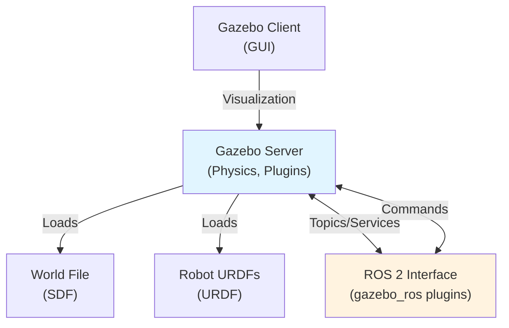

# Chapter 2: Physics Simulation in Gazebo

**Estimated time**: 4-5 hours | **Difficulty**: Intermediate | **Week**: 6, Days 2-5

## Learning Objectives

After completing this chapter, you will be able to:

1. **Install and verify** Gazebo on Ubuntu 22.04 with all dependencies
2. **Understand Gazebo architecture** including world files, plugins, and physics engines
3. **Distinguish between URDF and SDF** formats and when to use each
4. **Configure physics engines** (ODE, Bullet, DART) and understand their trade-offs
5. **Create custom Gazebo worlds** with ground planes, objects, and physics parameters
6. **Load and spawn humanoid robots** from URDF files into your simulation
7. **Debug physics issues** using Gazebo visualization tools and ROS 2 inspection
8. **Configure sensors** (cameras, IMU, LiDAR) with SDF plugins
9. **Interact with simulations** using ROS 2 commands and custom control nodes

## Key Concepts

1. **SDF (Simulation Description Format)**: XML-based file format for describing Gazebo worlds, robots, and physics parameters
2. **URDF (Unified Robot Description Format)**: XML format for robot structure (links, joints, sensors) created in Module 1
3. **Physics engine**: Software (ODE, Bullet, DART, PhysX) that computes collisions and rigid-body dynamics
4. **Plugin**: Gazebo extension that adds functionality (sensors, actuators, controllers) to simulation
5. **World file**: SDF description of the entire simulation environment (gravity, ground, objects, robots)

---

## Gazebo Architecture Overview

### Components

Gazebo consists of several key components that work together:



1. **Gazebo Server**: The core simulation engine running physics
2. **Gazebo Client**: GUI for visualization and interaction
3. **World File (SDF)**: Defines the environment (gravity, ground, objects)
4. **Robot URDFs**: Describe individual robots (from Module 1)
5. **Plugins**: Extend functionality (cameras, IMU, control)
6. **ROS 2 Interface**: Bridges simulation to your control algorithms

### World File Structure

A basic Gazebo world file (SDF format) looks like:

```xml
<?xml version="1.0" ?>
<sdf version="1.7">
  <world name="my_world">
    <!-- Physics configuration -->
    <physics name="default_physics" type="ode">
      <gravity>0 0 -9.81</gravity>
      <ode>
        <solver>
          <type>quick</type>
          <iters>50</iters>
          <precon_iters>0</precon_iters>
          <sor>1.3</sor>
          <use_dynamic_moi_rescaling>false</use_dynamic_moi_rescaling>
        </solver>
      </ode>
    </physics>

    <!-- Ground plane -->
    <include>
      <uri>model://ground_plane</uri>
    </include>

    <!-- Lighting -->
    <include>
      <uri>model://sun</uri>
    </include>

    <!-- Custom objects and robots are added here -->
  </world>
</sdf>
```

---

## URDF vs. SDF: When to Use Each

Both formats describe robots and objects, but they serve different purposes:

### Comparison Table

| Aspect | URDF | SDF |
|--------|------|-----|
| **Purpose** | Describe robot structure | Describe simulation world and physics |
| **Scope** | One robot (links, joints, sensors) | Entire scene (robots, ground, objects, physics) |
| **Physics** | Limited (collision geometry) | Complete (gravity, engines, constraints) |
| **Use Case** | Created once, reused everywhere | Created per simulation scenario |
| **Format** | XML (simpler subset) | XML (more complex) |
| **Example** | humanoid.urdf | my_world.world (SDF) |

### Example: URDF (Robot Structure)

```xml
<!-- File: humanoid.urdf (from Module 1) -->
<?xml version="1.0" ?>
<robot name="humanoid">
  <link name="base_link">
    <inertial>
      <mass value="70.0" />  <!-- kg -->
      <inertia ixx="5.0" ixy="0" ixz="0" iyy="5.0" iyz="0" izz="2.0" />
    </inertial>
    <collision>
      <geometry>
        <cylinder length="0.5" radius="0.2" />
      </geometry>
    </collision>
    <visual>
      <geometry>
        <cylinder length="0.5" radius="0.2" />
      </geometry>
      <material name="blue">
        <color rgba="0 0 1 1" />
      </material>
    </visual>
  </link>

  <joint name="left_hip" type="revolute">
    <parent link="base_link" />
    <child link="left_thigh" />
    <axis xyz="0 1 0" />  <!-- Rotate around Y-axis -->
    <limit lower="-0.785" upper="0.785" effort="300" velocity="1.0" />
  </joint>
  <!-- More joints... -->
</robot>
```

### Example: SDF (World with Physics)

```xml
<!-- File: humanoid_world.sdf -->
<?xml version="1.0" ?>
<sdf version="1.7">
  <world name="humanoid_sim">
    <!-- Define physics engine and parameters -->
    <physics name="default_physics" type="ode">
      <max_step_size>0.001</max_step_size>  <!-- 1000 Hz -->
      <real_time_factor>1.0</real_time_factor>
      <real_time_update_rate>1000</real_time_update_rate>
      <gravity>0 0 -9.81</gravity>
      <ode>
        <solver>
          <type>quick</type>
          <iters>50</iters>
          <sor>1.3</sor>
        </solver>
        <constraints>
          <cfm>0</cfm>
          <erp>0.2</erp>
          <contact_max_correcting_vel>100.0</contact_max_correcting_vel>
          <contact_surface_layer>0.001</contact_surface_layer>
        </constraints>
      </ode>
    </physics>

    <!-- Ground plane model -->
    <model name="ground_plane">
      <static>true</static>
      <link name="link">
        <collision name="collision">
          <geometry>
            <plane>
              <normal>0 0 1</normal>
              <size>100 100</size>
            </plane>
          </geometry>
          <surface>
            <friction>
              <ode>
                <mu>1.0</mu>  <!-- Friction coefficient -->
              </ode>
            </friction>
          </surface>
        </collision>
        <visual name="visual">
          <geometry>
            <plane>
              <normal>0 0 1</normal>
              <size>100 100</size>
            </plane>
          </geometry>
          <material>
            <ambient>0.8 0.8 0.8 1</ambient>
          </material>
        </visual>
      </link>
    </model>

    <!-- Humanoid robot loaded from URDF -->
    <include>
      <uri>file:///path/to/humanoid.urdf</uri>
      <name>humanoid_robot</name>
      <pose>0 0 1.0 0 0 0</pose>  <!-- Position: x=0, y=0, z=1.0m (above ground) -->
    </include>

    <!-- Lighting -->
    <include>
      <uri>model://sun</uri>
    </include>
  </world>
</sdf>
```

---

## Physics Engines Comparison

Gazebo supports multiple physics engines. Each has different characteristics:

### Comparison Table

| Engine | Speed | Accuracy | Stability | Best For |
|--------|-------|----------|-----------|----------|
| **ODE (Open Dynamics Engine)** | Medium | High | Good | General robotics, research |
| **Bullet** | Fast | Medium | Medium | Real-time responsiveness |
| **DART (Dynamic Animation and Robotics Toolkit)** | Slow | Very High | Excellent | Humanoid dynamics, research |

### ODE (Default)

- **Speed**: Medium - handles most simulations in real-time or faster
- **Accuracy**: High - uses iterative solver, good for long-horizon sims
- **Stability**: Generally stable with proper parameter tuning
- **Use**: Default for Gazebo, good general-purpose choice

```xml
<physics type="ode">
  <max_step_size>0.001</max_step_size>
  <ode>
    <solver>
      <type>quick</type>
      <iters>50</iters>
    </solver>
  </ode>
</physics>
```

### Bullet

- **Speed**: Fastest - optimized for real-time
- **Accuracy**: Medium - faster but less precise
- **Stability**: Can be jumpy without tuning
- **Use**: When speed is critical, initial prototyping

```xml
<physics type="bullet">
  <max_step_size>0.001</max_step_size>
  <bullet>
    <solver>
      <type>sequential_impulse</type>
      <iters>50</iters>
    </solver>
  </bullet>
</physics>
```

### DART

- **Speed**: Slowest - intensive computation
- **Accuracy**: Very high - accurate humanoid dynamics
- **Stability**: Excellent stability, even with extreme parameters
- **Use**: Humanoid research, validation before hardware

```xml
<physics type="dart">
  <max_step_size>0.001</max_step_size>
  <dart>
    <solver>
      <solver_type>dantzig</solver_type>
    </solver>
  </dart>
</physics>
```

---

## Creating Your First Gazebo World

Let's walk through creating a simple simulation world step-by-step.

### Step 1: Create World File

Create a file named `my_world.sdf`:

```xml
<?xml version="1.0" ?>
<sdf version="1.7">
  <world name="simple_world">
    <!-- Physics -->
    <physics name="default_physics" type="ode">
      <max_step_size>0.001</max_step_size>
      <real_time_factor>1.0</real_time_factor>
      <real_time_update_rate>1000</real_time_update_rate>
      <gravity>0 0 -9.81</gravity>
      <ode>
        <solver>
          <type>quick</type>
          <iters>50</iters>
          <sor>1.3</sor>
        </solver>
      </ode>
    </physics>

    <!-- Ground plane -->
    <include>
      <uri>model://ground_plane</uri>
    </include>

    <!-- Sun for lighting -->
    <include>
      <uri>model://sun</uri>
      <pose>0 0 10 0 0 0</pose>
    </include>

    <!-- A simple box obstacle -->
    <model name="box_obstacle">
      <static>false</static>
      <pose>2.0 0 0.5 0 0 0</pose>
      <link name="link">
        <inertial>
          <mass>5.0</mass>
          <inertia>
            <ixx>0.04</ixx>
            <iyy>0.04</iyy>
            <izz>0.04</izz>
          </inertia>
        </inertial>
        <collision name="collision">
          <geometry>
            <box>
              <size>1.0 1.0 1.0</size>
            </box>
          </geometry>
          <surface>
            <friction>
              <ode>
                <mu>0.7</mu>
              </ode>
            </friction>
          </surface>
        </collision>
        <visual name="visual">
          <geometry>
            <box>
              <size>1.0 1.0 1.0</size>
            </box>
          </geometry>
          <material>
            <ambient>1 0 0 1</ambient>  <!-- Red -->
          </material>
        </visual>
      </link>
    </model>
  </world>
</sdf>
```

### Step 2: Launch Gazebo with Your World

```bash
gazebo my_world.sdf
```

You should see the ground plane, a red box obstacle, and sun lighting. Congratulations! You've created your first Gazebo world.

---

## Loading Humanoid Robots

To add a humanoid robot (from Module 1) to your world:

### Method 1: Include in SDF

Add this to your world file:

```xml
<!-- In my_world.sdf, inside the <world> tag -->
<include>
  <uri>file:///path/to/humanoid.urdf</uri>
  <name>humanoid_robot</name>
  <pose>0 0 1.5 0 0 0</pose>  <!-- x=0, y=0, z=1.5m (start above ground) -->
</include>
```

### Method 2: Spawn via ROS 2 Service

Use the provided Python script from Chapter 1:

```bash
ros2 run your_package spawn_object_client
```

This will add the robot to a running Gazebo simulation.

---

## Configuring Physics Parameters

Physics parameters control how realistically the simulation behaves. Key parameters:

### Gravity

```xml
<!-- In physics section -->
<gravity>0 0 -9.81</gravity>  <!-- m/s² (Earth gravity) -->
```

### Friction

```xml
<!-- In model collision surface -->
<surface>
  <friction>
    <ode>
      <mu>0.7</mu>  <!-- Coefficient of friction: 0.5-2.0 -->
      <mu2>0.7</mu2>  <!-- For anisotropic friction -->
      <slip1>0.0</slip1>  <!-- Slip velocity -->
      <slip2>0.0</slip2>
    </ode>
  </friction>
</surface>
```

**Tuning guidance**:
- **mu = 0.5**: Slippery (ice, smooth plastic)
- **mu = 0.7**: Default (rubber on concrete)
- **mu = 1.5**: Very grippy (rubber on rough surface)
- **mu = 2.0+**: Extremely sticky

### Damping (Friction-like Resistance)

```xml
<!-- In link definition -->
<link name="torso">
  <inertial>
    <mass>30.0</mass>
    <inertia>...</inertia>
    <!-- Linear damping: reduces linear velocity -->
    <velocity_decay>
      <linear>0.05</linear>  <!-- 0.0-1.0, higher = more damping -->
      <angular>0.01</angular>  <!-- Same for rotation -->
    </velocity_decay>
  </inertial>
  <!-- ... collision/visual ... -->
</link>
```

### Collision Margin (Critical for Stability)

```xml
<!-- In ODE solver constraints -->
<ode>
  <constraints>
    <contact_surface_layer>0.001</contact_surface_layer>  <!-- 1mm buffer -->
    <contact_max_correcting_vel>100.0</contact_max_correcting_vel>
  </constraints>
</ode>
```

**Effect**: Smaller margin = tighter tolerance but more unstable. Larger = looser but more stable.

---

## Handling Collisions

### Collision Detection

Gazebo checks for collisions between objects automatically. For a collision to be detected, both objects need:

```xml
<collision name="collision">
  <geometry>
    <cylinder length="0.5" radius="0.1" />
  </geometry>
</collision>
```

### Surface Properties

Define how objects behave when they collide:

```xml
<surface>
  <bounce>
    <restitution_coefficient>0.2</restitution_coefficient>  <!-- 0.0=no bounce, 1.0=bouncy -->
  </bounce>
  <friction>
    <ode>
      <mu>0.7</mu>
      <mu2>0.7</mu2>
    </ode>
  </friction>
  <contact>
    <ode>
      <soft_cfm>0.0</soft_cfm>
      <soft_erp>0.2</soft_erp>
      <kp>1000000.0</kp>
      <kd>1.0</kd>
      <max_vel>0.01</max_vel>
      <min_depth>0.001</min_depth>
    </ode>
  </contact>
</surface>
```

---

## Adding Sensors to Gazebo

### Camera Plugin (RGB Image)

```xml
<!-- Add to humanoid robot's head link in world file -->
<sensor name="front_camera" type="camera">
  <camera>
    <horizontal_fov>1.047</horizontal_fov>  <!-- 60 degrees -->
    <image>
      <width>640</width>
      <height>480</height>
      <format>R8G8B8</format>
    </image>
    <clip>
      <near>0.01</near>
      <far>300</far>
    </clip>
  </camera>
  <always_on>1</always_on>
  <update_rate>30</update_rate>
  <visualize>true</visualize>
  <plugin name="camera_controller" filename="libgazebo_ros_camera.so">
    <ros>
      <namespace>humanoid_robot</namespace>
      <remapping>image_raw:=camera/image_raw</remapping>
      <remapping>camera_info:=camera/camera_info</remapping>
    </ros>
    <camera_name>front_camera</camera_name>
    <frame_name>camera_frame</frame_name>
  </plugin>
</sensor>
```

### IMU Plugin (Acceleration + Rotation)

```xml
<!-- Add to humanoid robot's torso link -->
<sensor name="imu_sensor" type="imu">
  <always_on>1</always_on>
  <update_rate>100</update_rate>
  <visualize>false</visualize>
  <imu>
    <angular_velocity>
      <x>
        <noise type="gaussian">
          <mean>0.0</mean>
          <stddev>0.001</stddev>  <!-- Small noise -->
        </noise>
      </x>
      <y>
        <noise type="gaussian">
          <mean>0.0</mean>
          <stddev>0.001</stddev>
        </noise>
      </y>
      <z>
        <noise type="gaussian">
          <mean>0.0</mean>
          <stddev>0.001</stddev>
        </noise>
      </z>
    </angular_velocity>
    <linear_acceleration>
      <x>
        <noise type="gaussian">
          <mean>0.0</mean>
          <stddev>0.01</stddev>
        </noise>
      </x>
      <y>
        <noise type="gaussian">
          <mean>0.0</mean>
          <stddev>0.01</stddev>
        </noise>
      </y>
      <z>
        <noise type="gaussian">
          <mean>0.0</mean>
          <stddev>0.01</stddev>
        </noise>
      </z>
    </linear_acceleration>
  </imu>
  <plugin name="imu_plugin" filename="libgazebo_ros_imu_sensor.so">
    <ros>
      <namespace>humanoid_robot</namespace>
      <remapping>imu:=imu/data</remapping>
    </ros>
    <initial_orientation_as_reference>false</initial_orientation_as_reference>
  </plugin>
</sensor>
```

---

## Debugging Physics Issues

### Visualization Tools in Gazebo

1. **Show Center of Mass**: Tools → View → Show Center of Mass (red sphere on each body)
2. **Show Collisions**: Tools → View → Show Collisions (visualize collision geometry)
3. **Show Joints**: Tools → View → Show Joints (show joint axes)
4. **Show Transparent**: Tools → View → Show Transparent (see inside objects)

### ROS 2 Inspection Commands

```bash
# List all robots and objects in simulation
ros2 service list | grep gazebo

# Check joint states
ros2 topic echo /joint_states

# Check sensor topics
ros2 topic list | grep humanoid_robot

# Get info about a specific topic
ros2 topic info /joint_states
```

### Common Issues and Solutions

**Problem**: Robot sinks through ground or falls unexpectedly
- **Cause**: Incorrect mass, inertia, or collision geometry
- **Solution**: Check URDF inertia tensor, ensure collision meshes match visual meshes

**Problem**: Jittering/vibration when at rest
- **Cause**: Friction too low, contact parameters too stiff
- **Solution**: Increase friction (mu to 1.0+), increase contact_surface_layer

**Problem**: Slow simulation (running slower than real-time)
- **Cause**: Physics engine can't keep up, too many objects/constraints
- **Solution**: Reduce world complexity, use Bullet instead of DART, lower ODE iterations

---

## ROS 2 Integration

### Joint State Publisher

The humanoid's current joint angles are published automatically:

```bash
# View joint states
ros2 topic echo /joint_states

# Output:
# header:
#   stamp: {sec: 123, nanosec: 456}
#   frame_id: ''
# name: [left_hip_flexion, left_hip_abduction, ...]
# position: [0.1, 0.05, ...]  # radians
# velocity: [0.01, 0.02, ...]  # rad/s
# effort: [10.5, 5.2, ...]  # torques in Nm
```

### Sending Commands via ROS 2

Use a ROS 2 control plugin to command joint movements:

```python
# File: src/joint_commander.py
import rclpy
from rclpy.node import Node
from sensor_msgs.msg import JointState

class JointCommander(Node):
    def __init__(self):
        super().__init__('joint_commander')
        # Publisher for joint commands
        self.cmd_pub = self.create_publisher(JointState, '/humanoid_robot/cmd_vel', 10)
        self.timer = self.create_timer(0.1, self.send_command)

    def send_command(self):
        # Command a simple walking motion
        msg = JointState()
        msg.header.stamp = self.get_clock().now().to_msg()
        msg.name = ['left_hip_flexion', 'right_hip_flexion']
        msg.position = [0.5, -0.5]  # Opposite legs
        msg.velocity = [0.0, 0.0]
        msg.effort = [0.0, 0.0]
        self.cmd_pub.publish(msg)

def main(args=None):
    rclpy.init(args=args)
    node = JointCommander()
    rclpy.spin(node)
    node.destroy_node()
    rclpy.shutdown()
```

---

## Hands-On Labs

### Lab 1: Install Gazebo and Verify Installation

**Objective**: Set up Gazebo on your Ubuntu 22.04 machine and verify it's working.

**Steps**:
1. Update package list: `sudo apt-get update`
2. Install Gazebo: `sudo apt-get install gazebo`
3. Verify installation:
   ```bash
   gazebo --version
   # Output: Gazebo 11.x.x  (or later version)
   ```
4. Launch Gazebo:
   ```bash
   gazebo
   # Gazebo GUI should open with empty world
   ```

**Verification**: Gazebo window opens, shows empty world with sun and ground plane.

### Lab 2: Create Custom World with Ground and Objects

**Objective**: Create a Gazebo world with a ground plane, a 1m × 1m × 1m box, and a humanoid robot.

**Steps**:
1. Create `my_humanoid_world.sdf` (use example from "Creating Your First Gazebo World" section)
2. Ensure your humanoid.urdf is accessible
3. Launch:
   ```bash
   gazebo my_humanoid_world.sdf
   ```
4. Verify: You should see ground plane, red box, and humanoid robot standing on ground

**Verification Checklist**:
- ✅ Ground plane visible
- ✅ Red box at position (2, 0, 0.5)
- ✅ Humanoid robot standing upright at origin
- ✅ No error messages in terminal

### Lab 3: Configure and Visualize Sensors

**Objective**: Add a camera and IMU to the humanoid, publish sensor data to ROS 2 topics, and visualize.

**Steps**:
1. Modify your world file to include camera and IMU plugins (from "Adding Sensors" section)
2. Launch Gazebo:
   ```bash
   gazebo my_humanoid_world.sdf
   ```
3. In another terminal, view camera images:
   ```bash
   ros2 run rqt_image_view rqt_image_view
   # Select /humanoid_robot/camera/image_raw
   ```
4. In another terminal, view IMU data:
   ```bash
   ros2 topic echo /humanoid_robot/imu/data
   ```

**Verification Checklist**:
- ✅ Camera images display in rqt_image_view
- ✅ IMU data prints with acceleration and angular velocity
- ✅ Physically moving humanoid (in GUI) changes sensor readings

---

## End-of-Chapter Exercises

### Exercise 1: Create a Multi-Object World

**Task**: Create a Gazebo world file with:
- Ground plane
- A 2m × 2m × 0.1m flat platform at (0, 0, 0.5)
- Three objects of different masses: 1kg box, 5kg cylinder, 10kg sphere, arranged in a line
- Your humanoid robot at the origin

**Acceptance Criteria**:
- World file is valid SDF (gazebo launches without errors)
- All objects are visible in Gazebo GUI
- Objects have realistic physics (fall due to gravity, collide with ground)

**Hint**: Use `<model>` tags with `<link>`, `<collision>`, and `<visual>` elements for each object.

### Exercise 2: Physics Parameter Tuning

**Task**: Modify physics parameters to make the world more stable:
- Start with ODE solver with `iters=50`
- Incrementally increase to `iters=100`
- Add contact_surface_layer of 0.002m
- Increase friction coefficient on all objects to 1.0

**Acceptance Criteria**:
- Objects no longer vibrate when resting
- Humanoid is stable and doesn't sink through ground
- Simulation still runs smoothly (no slowdown)

### Exercise 3: Load and Move Humanoid

**Task**: Load your humanoid into Gazebo and use a ROS 2 node to command joint movements.

**Acceptance Criteria**:
- Humanoid spawns in Gazebo at a specified pose
- ROS 2 node subscribes to `/joint_states` and logs joint angles
- Moving the humanoid (gravity or joint commands) changes logged joint angles

### Exercise 4: Compare Physics Engines

**Task**: Create two identical worlds, one with ODE and one with Bullet physics. Compare how a humanoid falls due to gravity.

**Acceptance Criteria**:
- Both worlds simulate identically initially
- Measure fall time (should be similar)
- Document any visual differences (jitter, stability)

---

## Summary

In this chapter, you've learned:

✅ **Gazebo architecture**: Server, client, world files, plugins

✅ **URDF vs. SDF**: URDF for robots, SDF for worlds and physics

✅ **Physics engines**: ODE (general), Bullet (fast), DART (accurate)

✅ **Creating worlds**: Gravity, ground planes, objects with physics

✅ **Loading robots**: Spawning humanoids from URDF into your worlds

✅ **Physics parameters**: Friction, damping, collision margins for stable simulation

✅ **Sensor plugins**: Cameras and IMU for perception

✅ **ROS 2 integration**: Topics and services for control

---

## What's Next?

Now that you can create physics simulations, Chapter 3 focuses on **Sensor Simulation**. You'll:
- Add LiDAR sensors for navigation
- Configure depth cameras with realistic noise
- Simulate IMU sensors for odometry
- Visualize all sensor data in RViz

**Estimated time for Chapter 3**: 4-5 hours

Ready? Head to [Chapter 3: Sensor Simulation (LiDAR, Depth Camera, IMU)](./chapter-3-sensor-simulation.md)!
