# Module 2: The Digital Twin (Gazebo & Unity)

**Weeks 6-7 | 18-24 hours of study | Intermediate difficulty**

Welcome to Module 2! In this module, you'll learn to create **Digital Twin simulations** of humanoid robots using two powerful tools: **Gazebo** for physics-accurate simulation and **Unity** for high-fidelity rendering. By the end of this module, you'll be able to build complete simulation environments where you can test algorithms, validate sensor configurations, and generate training data—all before deploying to real hardware.

## What You'll Learn

After completing Module 2, you will be able to:

1. **Define and explain Digital Twin concepts** in robotics and understand why simulation is critical for humanoid development
2. **Set up and configure Gazebo** for physics-accurate simulation of humanoid robots on Ubuntu 22.04
3. **Create custom simulation worlds** with physics parameters, ground planes, obstacles, and interactive objects
4. **Load and manipulate humanoid URDFs** in Gazebo, controlling joints via ROS 2 commands
5. **Simulate realistic sensors** including LiDAR, depth cameras, and IMU sensors with configurable noise models
6. **Visualize sensor data** in RViz and understand how perception feeds into robot control systems
7. **Set up Unity for robotics** with ROS 2 communication via ros2cs bridge
8. **Create photorealistic simulations** in Unity with physics interactions, grasping, and rendering suitable for training data generation
9. **Compare simulation tools** and understand when to use Gazebo (physics-focused) versus Unity (rendering-focused)
10. **Build complete Digital Twin workflows** combining Gazebo for physics validation and Unity for visualization

## Module Structure

### **Chapter 1: Introduction to Digital Twin Simulation** (Week 6, Day 1)
Learn the foundational concepts of Digital Twin simulations. Understand what a Digital Twin is, why simulation is essential for humanoid robotics, and how Gazebo and Unity serve different purposes in your development workflow.

**Time**: 2-3 hours | **Difficulty**: Beginner | **Prerequisites**: Module 1 completion

**What you'll learn**: Digital Twin definition and use cases, simulation benefits, Gazebo vs Unity comparison, rigid-body physics basics, humanoid-specific challenges, ROS 2 integration overview

**Key deliverable**: Conceptual understanding of simulation workflows

### **Chapter 2: Physics Simulation in Gazebo** (Week 6, Days 2-5)
Dive into hands-on Gazebo simulation. Install Gazebo, create physics-based worlds, load humanoid robots via URDF, configure physics engines, add sensors, and interact with simulations using ROS 2 commands.

**Time**: 4-5 hours | **Difficulty**: Intermediate | **Prerequisites**: Chapter 1, Ubuntu 22.04, ROS 2 Humble

**What you'll learn**: Gazebo architecture, URDF vs SDF formats, physics engines (ODE/Bullet/DART), world configuration, sensor plugins, ROS 2 integration, debugging techniques

**Key deliverable**: Working Gazebo simulation with spawned humanoid robot responding to ROS 2 commands

### **Chapter 3: Sensor Simulation (LiDAR, Depth Camera, IMU)** (Week 7, Days 1-3)
Add perception to your simulations. Configure LiDAR scanners, depth cameras, and IMU sensors with realistic noise models. Publish sensor data over ROS 2 topics and visualize them in RViz.

**Time**: 4-5 hours | **Difficulty**: Intermediate | **Prerequisites**: Chapter 2

**What you'll learn**: Sensor simulation fundamentals, LiDAR point clouds, RGB and depth cameras, stereo vision, IMU noise models, ROS 2 sensor topics, sensor validation and fusion

**Key deliverable**: Humanoid robot with simulated sensors generating realistic ROS 2 data streams

### **Chapter 4: High-Fidelity Simulation in Unity** (Week 7, Days 4-5)
Create photorealistic simulations in Unity. Set up ROS 2 communication, import humanoid models, configure materials and lighting, simulate grasping interactions, and export training datasets.

**Time**: 4-5 hours | **Difficulty**: Advanced | **Prerequisites**: Chapters 1-3, Unity 2022 LTS

**What you'll learn**: Unity robotics setup, ros2cs ROS 2 bridge, PhysX physics configuration, humanoid import and rigging, photorealistic rendering (HDRP/URP), dataset export with annotations, performance optimization

**Key deliverable**: High-fidelity Unity simulation with ROS 2 communication and synthetic dataset generation

## Prerequisites

Before starting Module 2, you should have:

- ✅ **Completed Module 1**: Understand ROS 2 fundamentals, URDF basics, and launch files
- ✅ **Ubuntu 22.04 LTS**: Installed and configured with required build tools (gcc, cmake, git)
- ✅ **ROS 2 Humble Hawksbill**: Fully installed with colcon and standard development tools
- ✅ **Basic Linux command line**: Comfortable with terminal commands, file navigation, environment variables
- ✅ **Git version control**: Basic Git workflows (clone, add, commit, push)

**Optional but recommended**:
- Experience with physics simulations or game engines
- Familiarity with 3D modeling concepts (meshes, materials, lighting)
- Basic knowledge of computer vision concepts

## Getting Started

### Step 1: Install Gazebo
```bash
# Add Gazebo repository and install
sudo apt-get update
sudo apt-get install gazebo
gazebo --version  # Verify installation
```

### Step 2: Install Unity (for Chapters 4 only)
Download [Unity 2022 LTS](https://unity.com/download) and follow platform-specific installation instructions.

### Step 3: Set Up Your ROS 2 Environment
```bash
source /opt/ros/humble/setup.bash
ros2 --version  # Verify ROS 2 Humble is active
```

### Step 4: Start with Chapter 1
Begin with conceptual foundations, then progress through hands-on labs in Chapters 2-4.

## Module Overview Diagram

```mermaid
graph TB
    ROS2["ROS 2 Nodes<br/>(Control, Planning)"]

    subgraph Gazebo["🔷 Gazebo: Physics-Focused"]
        Physics["Physics Engine<br/>(ODE/Bullet/DART)"]
        Sensors1["Sensor Plugins<br/>(Camera, LiDAR, IMU)"]
        World["Simulation World<br/>(Ground, Objects)"]
        Physics --> Sensors1
        Sensors1 --> World
    end

    subgraph Unity["🎮 Unity: Rendering-Focused"]
        PhysX["PhysX Physics Engine"]
        Materials["Materials & Lighting<br/>(HDRP/URP)"]
        Sensors2["Virtual Sensors<br/>(Camera, Depth)"]
        PhysX --> Materials
        Materials --> Sensors2
    end

    Dataset["Training Datasets<br/>(Synthetic Images + Labels)"]

    ROS2 -->|Joint Commands| Gazebo
    ROS2 -->|Joint Commands| Unity
    Gazebo -->|Sensor Data| ROS2
    Unity -->|Sensor Data| ROS2
    Unity -->|Export| Dataset

    style Gazebo fill:#e1f5ff
    style Unity fill:#fff3e0
    style Dataset fill:#f3e5f5
```



**Left side (Gazebo)**: Physics simulation for fast iteration, algorithm validation, and sensor integration testing

**Right side (Unity)**: High-fidelity rendering for visualization, training data generation, and human-robot interaction

**Integration**: Both tools communicate with ROS 2 nodes, enabling seamless workflows where you validate physics in Gazebo and render in Unity

## Week 6 Focus: Gazebo & Physics

**Week 6 Learning Goals**:
- Install and configure Gazebo on Ubuntu 22.04
- Understand Gazebo architecture (worlds, plugins, physics engines)
- Create custom simulation worlds with physics parameters
- Load humanoid robots via URDF and spawn them in Gazebo
- Configure sensors and publish data over ROS 2 topics
- Debug physics issues using visualization tools

**Week 6 Structure**:
- **Days 1-2**: Gazebo installation and orientation (Chapter 1 concepts + initial setup)
- **Days 3-5**: Hands-on labs creating worlds, loading robots, configuring sensors
- **Practice Guide**: 5 exercises + 2 challenge projects with daily breakdown

**Expected Outcome**: Working Gazebo simulation environment with a humanoid robot that you can control via ROS 2

## Week 7 Focus: Sensors & Unity

**Week 7 Learning Goals**:
- Configure and simulate realistic perception sensors
- Add LiDAR, depth cameras, and IMU sensors to simulated robots
- Visualize sensor data in RViz and understand sensor fusion
- Set up Unity for robotics with ROS 2 communication
- Create photorealistic environments and render humanoid simulations
- Export synthetic training datasets

**Week 7 Structure**:
- **Days 1-3**: Sensor simulation in Gazebo (Chapter 3)
- **Days 4-5**: Unity setup, ROS 2 integration, rendering, dataset export (Chapter 4)
- **Practice Guide**: 5 exercises + 2 challenge projects spanning sensors and Unity

**Expected Outcome**: High-fidelity Digital Twin with realistic sensor simulation and photorealistic rendering

## How to Use This Module

1. **Read conceptually first** (Chapters 1 focus): Understand the "why" before the "how"
2. **Follow hands-on labs** (Chapters 2-4): Execute each lab step-by-step, observe outputs
3. **Complete exercises**: Each chapter has 3-5 exercises progressing from guided to independent
4. **Work through weekly guides**: Week 6 and Week 7 guides provide structured daily breakdowns
5. **Tackle challenge projects**: Apply all chapter concepts in multi-day challenge scenarios
6. **Reference official docs**: Links provided throughout for Gazebo, ROS 2, and Unity official documentation

## Learning Path Visualization

```
Week 6:
Day 1 → Ch.1 Concepts ──┐
Day 2 → Gazebo Install ─┤
Day 3 → World Creation  ├─→ Working Gazebo Simulation
Day 4 → Load Humanoid   ┤
Day 5 → Sensors + ROS2  ┘

Week 7:
Day 1 → Sensor Types ───┐
Day 2 → LiDAR + Camera  ┤
Day 3 → IMU + RViz      ├─→ Realistic Digital Twin
Day 4 → Unity Setup     ┤
Day 5 → Rendering + Export ┘
```

## Chapters & Weekly Guides

### Chapters
- **[Chapter 1: Introduction to Digital Twin Simulation](./chapter-1-digital-twin-introduction.md)** - Foundational concepts and comparisons
- **[Chapter 2: Physics Simulation in Gazebo](./chapter-2-gazebo-physics-simulation.md)** - Hands-on Gazebo setup and configuration
- **[Chapter 3: Sensor Simulation (LiDAR, Depth Camera, IMU)](./chapter-3-sensor-simulation.md)** - Realistic perception sensors
- **[Chapter 4: High-Fidelity Simulation in Unity](./chapter-4-unity-high-fidelity-simulation.md)** - Photorealistic rendering and datasets

### Weekly Practice Guides
- **[Week 6 Practice Guide: Gazebo Fundamentals](./week-6.md)** - Daily tasks, exercises, and challenges
- **[Week 7 Practice Guide: Sensors & Unity](./week-7.md)** - Daily tasks, exercises, and challenges

## Next Steps: Module 3

After completing Module 2, you'll be ready for **Module 3: NVIDIA Isaac Platform**, where you'll:
- Use NVIDIA Isaac Sim for advanced simulation features
- Generate large-scale synthetic training datasets
- Set up Isaac ROS perception pipelines
- Prepare simulations for sim-to-real transfer

The Digital Twin skills from Module 2 are the foundation for everything you'll do with Isaac and beyond!

## Resources & Support

### Official Documentation
- **[Gazebo Documentation](https://gazebosim.org/docs/)** - Comprehensive Gazebo guides and API references
- **[ROS 2 Humble Documentation](https://docs.ros.org/en/humble/)** - ROS 2 official docs for Humble
- **[Unity Robotics Documentation](https://github.com/Unity-Technologies/Unity-Robotics-Hub)** - Unity robotics setup guides
- **[ros2cs GitHub](https://github.com/ROS2ForUnity/ROS2-Unity)** - ROS 2 ↔ Unity bridge library

### Community Resources
- **ROS 2 Discourse**: https://discourse.ros.org/ - Ask questions, find solutions
- **Gazebo Community**: https://community.gazebosim.org/ - Gazebo-specific questions
- **Unity Forum**: https://forum.unity.com/ - Unity and game engine questions

## Questions?

Use this textbook in combination with the RAG chatbot available throughout the site. Select any text, ask a question, and the chatbot will provide context-aware answers based on the entire curriculum.

---

**Ready to dive in?** Start with [Chapter 1: Introduction to Digital Twin Simulation](./chapter-1-digital-twin-introduction.md)

**Estimated time to complete Module 2**: 18-24 hours spread over Weeks 6-7
