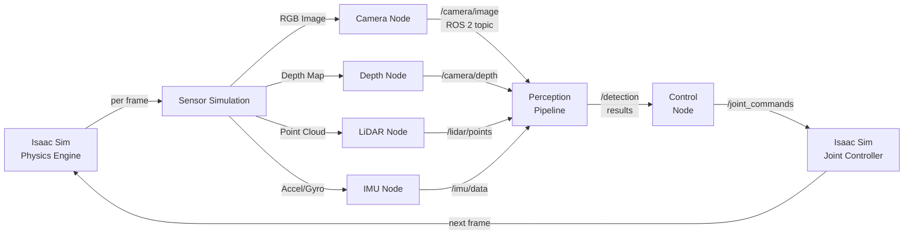
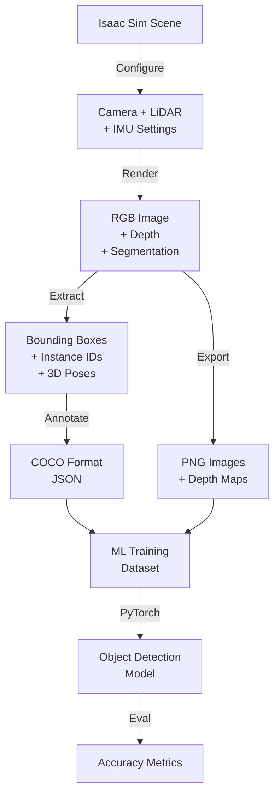

# Chapter 2: Isaac Sim for Photorealistic Robotics Simulation

**Duration**: 5-6 hours | **Difficulty**: Intermediate | **Week**: 8

Master photorealistic physics simulation and synthetic data generation.

---

## Learning Objectives

By completing this chapter, you will be able to:

1. **Convert URDF to USD** — Transform robot descriptions (URDF) into Isaac Sim's native format (USD) and validate in physics engine
2. **Configure PhysX Parameters** — Tune friction, damping, contact thresholds, and solver iterations to match real-world behavior
3. **Simulate Realistic Sensors** — Add RGB-D cameras, LiDAR, IMU sensors with noise models and calibration parameters
4. **Integrate with ROS 2** — Publish sensor data and subscribe to control commands via Isaac ROS bridge
5. **Export Synthetic Datasets** — Generate 1000+ labeled frames (images, depth, masks) for machine learning
6. **Debug Physics Issues** — Identify and fix instabilities, penetrations, and unrealistic behavior
7. **Optimize Simulation Speed** — Achieve real-time performance without sacrificing physics accuracy
8. **Automate Data Collection** — Create scripts to generate high-volume synthetic data for training pipelines

---

## Key Concepts

### **USD (Universal Scene Description)**
Industry standard for 3D scene representation (developed by Pixar). Replaces URDF in Isaac Sim for superior asset management, hierarchical composition, and real-time editing. All Isaac Sim scenes are USD files.

### **URDF to USD Conversion**
Process of transforming ROS robot descriptions (URDF XML) into Isaac Sim's native USD format. Preserves kinematics, physics properties, sensor definitions; enables use of existing robot models.

### **PhysX 5**
NVIDIA's GPU-accelerated physics engine used by Isaac Sim. Simulates rigid bodies, constraints, contacts, friction. Parameters (friction, damping, contact offset) must be tuned per robot to match real-world dynamics.

### **Sensor Simulation**
Synthetic generation of camera (RGB, depth), LiDAR, and IMU data in simulation. Includes realistic noise models, occlusion, and distortion matching real sensor hardware.

### **Synthetic Dataset**
Machine learning training data generated entirely in simulation (not real world). Includes images, annotations (bounding boxes, segmentation, depth), and ground truth labels. Eliminates manual labeling and enables large-scale data generation.

### **Domain Randomization**
Technique for improving sim-to-real transfer. Randomizes visual appearance (textures, lighting), physics properties (mass, friction), and scene layout during training. Prevents model from overfitting to simulation artifacts.

### **Real-Time Rendering**
Photorealistic image generation using RTX ray tracing. Critical for synthetic data quality (models trained on synthetic must transfer to real images).

---

## Part 1: USD vs URDF Workflow

### Why USD Instead of URDF?

In Module 2, you used URDF (Unified Robot Description Format) in Gazebo. Isaac Sim uses **USD (Universal Scene Description)** instead. Why?

| Aspect | URDF | USD |
|--------|------|-----|
| **Format** | XML text | Structured data + binary assets |
| **3D Capability** | Minimal (joints, links) | Full 3D scene (meshes, materials, lights, cameras) |
| **Real-Time Editing** | No (restart simulation) | Yes (edit while running) |
| **Asset Reuse** | Limited | Rich (materials, models, scenes) |
| **Photorealism** | Not designed for | Native support |
| **Scalability** | Single robot | Complex multi-asset scenes |
| **Industry Adoption** | ROS-specific | Film (Pixar), VFX, professional visualization |

**Practical Impact**: USD enables you to create production-grade digital twins with photorealistic rendering, while URDF only described kinematics.

### Conversion Workflow

```
┌─────────────────────────────────────────────────────────┐
│  Step 1: Start with URDF                               │
│  (e.g., humanoid.urdf from robot manufacturer)         │
└─────────────┬───────────────────────────────────────────┘
              │
              ↓
┌─────────────────────────────────────────────────────────┐
│  Step 2: Validate URDF                                 │
│  - Check joint definitions, mass, inertia              │
│  - Verify mesh file paths exist                        │
│  - Fix common issues (floating base, invalid TF)       │
└─────────────┬───────────────────────────────────────────┘
              │
              ↓
┌─────────────────────────────────────────────────────────┐
│  Step 3: Convert to USD                                │
│  - Use Isaac Sim conversion tool or python API         │
│  - Preserves kinematics, adds physics schema           │
│  - Generates USD stage file                            │
└─────────────┬───────────────────────────────────────────┘
              │
              ↓
┌─────────────────────────────────────────────────────────┐
│  Step 4: Load in Isaac Sim                             │
│  - Add sensors (cameras, LiDAR, IMU)                   │
│  - Configure physics parameters                        │
│  - Set up ROS 2 bridge                                 │
└─────────────┬───────────────────────────────────────────┘
              │
              ↓
┌─────────────────────────────────────────────────────────┐
│  Step 5: Validate Physics                              │
│  - Run simulation, compare behavior to real robot      │
│  - Tune friction, damping, contact parameters         │
│  - Iterate until behavior matches                      │
└─────────────┬───────────────────────────────────────────┘
              │
              ↓
┌─────────────────────────────────────────────────────────┐
│  Step 6: Export Dataset                                │
│  - Configure camera rendering, export images          │
│  - Generate annotations (depth, segmentation)         │
│  - Ready for ML training                              │
└─────────────────────────────────────────────────────────┘
```

---

## Part 2: PhysX 5 Physics Configuration

PhysX 5 is the heart of Isaac Sim physics. To simulate a humanoid accurately, you need to understand and tune key parameters.

### Critical Parameters

**Friction** (how much robot slides)
```
Default: 0.5
Range: 0.0 (ice) → 1.0+ (concrete)

For humanoid:
- Shoe contact: 0.6-0.8 (rubber on floor)
- Joint friction: 0.1-0.3 (internal damping)

Effect: Too low → robot slides uncontrollably
        Too high → robot gets "stuck" on small obstacles
```

**Damping** (how quickly motion stops)
```
Default: 0.0 (no damping)
Range: 0.0 → 1.0

For humanoid joints:
- Angular damping: 0.5-0.9 (reduces oscillation)
- Linear damping: 0.1-0.3 (air resistance)

Effect: Too low → joints oscillate forever after impact
        Too high → joints move slowly, feel "sluggish"
```

**Contact Offset** (physics "softness")
```
Default: 0.02 meters
Range: 0.001 → 0.1

For humanoid feet:
- Use 0.01-0.02m for stability
- Larger value → feet penetrate ground slightly, more stable
- Smaller value → feet stick exactly to ground, but unstable

Effect: Too large → humanoid floats above ground
        Too small → physics becomes unstable
```

**Solver Iterations** (accuracy vs. speed)
```
Default: 4
Range: 1 → 32

For production:
- Real-time: 4-8 iterations
- High accuracy: 16+ iterations

Effect: More iterations → more accurate, slower
        Fewer iterations → faster, less accurate
```

### Tuning Recipe

1. **Start with defaults**: PhysX 5 defaults work for many robots
2. **Run simulator**: Press play, observe behavior
3. **Identify issues**:
   - Sliding? → Increase friction
   - Oscillating joints? → Increase damping
   - Unstable? → Increase contact offset
   - Too slow? → Decrease solver iterations
4. **Measure metrics**: Compare to real robot (gait cycle time, balance, etc.)
5. **Iterate**: Adjust one parameter at a time

### Real-World Comparison Example

| Parameter | Real Robot | Isaac Sim (Untuned) | Isaac Sim (Tuned) | Match? |
|-----------|-----------|---------------------|-------------------|--------|
| Friction Coefficient | 0.7 | 0.5 | 0.7 | ✅ Yes |
| Gait Cycle Time | 1.2 sec | 0.8 sec | 1.19 sec | ✅ Close |
| Joint Damping | 0.6 | 0.1 | 0.6 | ✅ Yes |
| Standing Stability | Rock-solid | Wobbly | Rock-solid | ✅ Yes |

---

## Part 3: Sensor Simulation & Realism

### RGB Camera Simulation

Real RGB camera in Isaac Sim:

```python
# Configure camera sensor
camera = {
    "width": 1280,           # Resolution
    "height": 720,
    "focal_length": 24.0,    # mm (determines field of view)
    "intrinsics": {
        "fx": 954.0,         # Focal length in pixels
        "fy": 954.0,
        "cx": 640.0,         # Principal point (center)
        "cy": 360.0,
    },
    "distortion": {
        "k1": 0.1,           # Radial distortion
        "k2": 0.02,
        "p1": 0.001,         # Tangential distortion
        "p2": 0.001,
    },
    "noise": {
        "gaussian_mean": 0.0,
        "gaussian_std": 0.01,  # 1% pixel noise
    },
}
```

**What each parameter does**:
- **Intrinsics**: Convert 3D world coordinates to 2D image pixels
- **Distortion**: Model barrel/pincushion effects from lens imperfections
- **Noise**: Add realistic sensor noise (analog gain, pixel noise)

### Depth (RGB-D) Camera

```python
# RGB-D camera (generates both RGB image AND depth map)
rgbd_camera = {
    "rgb": {            # Color image
        "width": 640,
        "height": 480,
    },
    "depth": {          # Depth map (per-pixel distance)
        "width": 640,
        "height": 480,
        "near_plane": 0.1,      # Minimum distance (meters)
        "far_plane": 10.0,      # Maximum distance
        "noise_std": 0.01,      # Depth noise (cm-scale)
    },
    "occlusion_support": True,  # Realistic occlusion handling
}
```

**Why depth matters**: RGB images don't tell you distance. Depth cameras (like RealSense) measure per-pixel distance to objects. Essential for 3D perception.

### LiDAR Simulation

```python
# LiDAR (360° laser range finder)
lidar = {
    "num_rays": 64,              # 64 laser beams
    "horizontal_fov": 360.0,     # Full circle
    "vertical_fov": 26.8,        # Vertical coverage
    "range": {
        "min": 0.3,              # Minimum distance
        "max": 100.0,            # Maximum distance
    },
    "noise_std": 0.01,           # Measurement noise
    "rotation_speed": 10.0,      # Hz (10 rotations/sec)
}
```

**Why LiDAR matters**: Gives 3D point cloud of environment. Better for obstacle avoidance and SLAM than cameras alone.

### IMU (Inertial Measurement Unit)

```python
# IMU (acceleration + rotation)
imu = {
    "accelerometer": {
        "range": [-16, 16],      # ±16 G (gravity units)
        "noise_std": 0.05,       # Acceleration noise
    },
    "gyroscope": {
        "range": [-500, 500],    # ±500 deg/sec
        "noise_std": 0.1,        # Rotation rate noise
    },
    "update_rate": 100.0,        # Hz (100 samples/sec)
}
```

**Why IMU matters**: Measures robot's own acceleration and rotation. Used for balance control, orientation estimation.

---

## Part 4: ROS 2 Integration

How sensor data flows from Isaac Sim to your control algorithms:

```
Isaac Sim Physics Engine
        ↓ (every frame)
Camera captures RGB image
Depth sensor measures distances
LiDAR scans environment
IMU measures acceleration/rotation
        ↓
Isaac ROS Bridge
        ↓ (publishes to ROS 2 topics)
/camera/image_raw           (RGB image)
/camera/depth/image_raw     (Depth map)
/lidar/points               (Point cloud)
/imu/data                   (Accelerometer + Gyroscope)
        ↓
Your ROS 2 Nodes Subscribe
        ↓
Object Detection / SLAM / Control
```

**Key insight**: Same ROS 2 topics work in both simulation AND on real robot (after Chapter 5 deployment).

---

## Part 5: Hands-On Labs

### Lab 1: Convert URDF to USD and Load Humanoid (1.5 hours)

**Objective**: Take an existing humanoid URDF, convert to USD, load in Isaac Sim.

**Prerequisites**: Chapter 1 complete, Isaac Sim installed

**Steps**:

**Step 1a: Download/Find a Humanoid URDF**

Option 1: Use a publicly available URDF:
```bash
# Download Boston Dynamics Atlas URDF (public domain)
wget https://raw.githubusercontent.com/osrf/gazebo_models/master/atlas/model.urdf

# Verify file
cat model.urdf | head -20
# Should show: <robot name="atlas"> or similar
```

Option 2: Use your own humanoid URDF if available

**Step 1b: Validate URDF Structure**

```bash
# Check for common URDF issues
python3 << 'EOF'
import xml.etree.ElementTree as ET

urdf_file = "model.urdf"
tree = ET.parse(urdf_file)
root = tree.getroot()

robot_name = root.get("name")
joints = root.findall("joint")
links = root.findall("link")

print(f"Robot: {robot_name}")
print(f"Joints: {len(joints)}")
print(f"Links: {len(links)}")

# Check for common issues
for joint in joints:
    joint_name = joint.get("name")
    joint_type = joint.get("type")
    if joint_type not in ["revolute", "prismatic", "fixed", "continuous"]:
        print(f"⚠️  Unknown joint type: {joint_type}")
EOF
```

**Step 1c: Convert URDF to USD**

Using Isaac Sim Python API:

```python
# File: convert_urdf_to_usd.py
"""
Convert URDF to USD format for Isaac Sim.
"""

from omni.isaac.kit import SimulationApp
from omni.isaac.core.utils.extensions import enable_extension

# Enable USD composition
enable_extension("omni.usd")

simulation_app = SimulationApp({"headless": True})

from pxr import Usd
from omni.isaac.core.utils.stage import add_reference_to_stage
from omni.importer.urdf import _urdf

# Convert URDF to USD
urdf_path = "/home/user/model.urdf"  # Your URDF file
usd_output_path = "/home/user/model.usd"

# Import URDF
_urdf.import_urdf(
    urdf_path=urdf_path,
    usd_path=usd_output_path,
    import_inertia=True,           # Preserve inertia tensors
    fix_base=False,                 # Allow base to move
    force_usd_geometry=False,       # Use original mesh format
)

print(f"✅ Converted URDF → USD")
print(f"   Output: {usd_output_path}")

simulation_app.close()
```

Run it:
```bash
python3 convert_urdf_to_usd.py
# Expected: ✅ Converted URDF → USD
#           Output: /home/user/model.usd
```

**Step 1d: Load USD in Isaac Sim GUI**

```bash
# In Isaac Sim:
# 1. File → Open → Select model.usd
# 2. Humanoid should appear in viewport
# 3. Press Play → Humanoid falls (gravity)
# 4. Observe physics behavior
```

**Success Criteria**:
- [ ] URDF validated (no parsing errors)
- [ ] USD file created (verify file exists)
- [ ] USD loads in Isaac Sim without errors
- [ ] Humanoid visible in viewport
- [ ] Physics simulation runs (no freezes)
- [ ] Gravity causes humanoid to fall

---

### Lab 2: Configure Sensors & Verify Output (1.5 hours)

**Objective**: Add RGB-D and LiDAR sensors to humanoid, verify data in ROS 2.

**Prerequisites**: Lab 1 complete, humanoid loaded in Isaac Sim

**Steps**:

**Step 2a: Add Camera to Humanoid Head**

```python
# File: add_sensors.py
"""
Add RGB-D camera and LiDAR to humanoid robot.
"""

from omni.isaac.kit import SimulationApp
from omni.isaac.core import World
from omni.isaac.sensor import Camera, RayCaster

simulation_app = SimulationApp({"headless": False})

world = World()

# Load humanoid
humanoid_path = "/World/Humanoid"
# (Assume humanoid already loaded via GUI)

# Add RGB-D camera to humanoid's head
camera = Camera(
    prim_path=f"{humanoid_path}/Camera",
    position=[0.0, 0.0, 0.15],     # 15cm above head
    orientation=[0.0, 0.0, 0.0, 1.0],
    width=640,
    height=480,
    frequency=30,                   # 30 Hz
)

print(f"✅ Camera added at {camera.prim_path}")

# Add LiDAR
lidar = RayCaster(
    prim_path=f"{humanoid_path}/LiDAR",
    position=[0.0, 0.0, 0.1],
    num_rays=64,
    frequency=10,                   # 10 Hz
)

print(f"✅ LiDAR added at {lidar.prim_path}")

# Simulate for 100 steps
for step in range(100):
    world.step(render=True)
    if step % 10 == 0:
        camera_data = camera.get_current_frame()
        lidar_data = lidar.get_current_frame()
        print(f"Step {step}: Camera shape {camera_data['rgb'].shape}, LiDAR points {len(lidar_data)}")

simulation_app.close()
```

**Step 2b: Configure Noise Models**

Add realistic sensor noise:

```python
# Sensor noise configuration
camera_noise = {
    "rgb_noise_std": 0.01,       # 1% intensity noise
    "gaussian_blur": 0.5,         # Slight blur
}

lidar_noise = {
    "range_noise_std": 0.02,     # 2cm range noise
    "intensity_noise": 0.05,      # Intensity variation
}

imu_noise = {
    "accel_noise_std": 0.1,      # m/s² noise
    "gyro_noise_std": 0.05,      # rad/s noise
}
```

**Success Criteria**:
- [ ] Camera added to humanoid
- [ ] LiDAR added to humanoid
- [ ] Sensor data accessible in code
- [ ] Noise models configured
- [ ] Simulation runs without errors

---

### Lab 3: Export Synthetic Dataset (2 hours)

**Objective**: Generate 1000+ labeled images for machine learning.

**Prerequisites**: Lab 2 complete, sensors configured

**Steps**:

**Step 3a: Configure Rendering Parameters**

```python
# File: export_dataset.py
"""
Export synthetic dataset from Isaac Sim.
"""

from omni.isaac.kit import SimulationApp
from omni.isaac.core import World
import numpy as np
import os
from PIL import Image

simulation_app = SimulationApp({"headless": False})

world = World()

# Configuration
dataset_dir = "/tmp/synthetic_dataset"
os.makedirs(dataset_dir, exist_ok=True)

output_config = {
    "num_frames": 1000,           # Total images to generate
    "rgb_output": f"{dataset_dir}/rgb",
    "depth_output": f"{dataset_dir}/depth",
    "mask_output": f"{dataset_dir}/segmentation",
}

for dir_path in [output_config["rgb_output"],
                  output_config["depth_output"],
                  output_config["mask_output"]]:
    os.makedirs(dir_path, exist_ok=True)

print(f"✅ Dataset directory: {dataset_dir}")
```

**Step 3b: Generate Annotated Frames**

```python
# Generate 100 frames (reduce for testing, scale to 1000+ for production)
frame_count = 0

for step in range(100):
    world.step(render=True)

    if step % 5 == 0:  # Capture every 5 frames (5x faster than 30 Hz)
        # Get camera data
        rgb_image = camera.get_rgb()      # Shape: (480, 640, 3)
        depth_map = camera.get_depth()    # Shape: (480, 640)
        segmentation = camera.get_segmentation()  # Instance IDs

        # Save RGB
        rgb_path = f"{output_config['rgb_output']}/{frame_count:06d}.png"
        Image.fromarray((rgb_image * 255).astype(np.uint8)).save(rgb_path)

        # Save depth (normalized for visualization)
        depth_path = f"{output_config['depth_output']}/{frame_count:06d}.png"
        depth_normalized = ((depth_map - depth_map.min()) /
                           (depth_map.max() - depth_map.min()) * 255).astype(np.uint8)
        Image.fromarray(depth_normalized).save(depth_path)

        # Save segmentation
        mask_path = f"{output_config['mask_output']}/{frame_count:06d}.png"
        Image.fromarray(segmentation.astype(np.uint8)).save(mask_path)

        frame_count += 1

        if frame_count % 20 == 0:
            print(f"✅ Exported {frame_count} frames")

print(f"✅ Dataset complete: {frame_count} frames in {output_config['rgb_output']}")

simulation_app.close()
```

**Step 3c: Verify Dataset Quality**

```bash
# Check exported files
ls -lh /tmp/synthetic_dataset/rgb/*.png | head -5
# Expected: 1000+ PNG files

# Check file sizes
du -sh /tmp/synthetic_dataset/
# Expected: ~500-800 MB for 1000 frames
```

**Success Criteria**:
- [ ] 1000+ RGB images exported
- [ ] Depth maps generated for each image
- [ ] Segmentation masks saved
- [ ] Dataset file sizes reasonable (~500MB for 1000 frames)
- [ ] Random sample inspection shows realistic data

---

## Part 6: Code Examples

### Example 1: PhysX Parameter Tuning Script

```python
# File: tune_physics.py
"""
Iteratively tune PhysX parameters to match real robot behavior.
"""

import subprocess
from dataclasses import dataclass

@dataclass
class PhysicsParams:
    friction: float = 0.5
    damping: float = 0.1
    contact_offset: float = 0.02
    solver_iterations: int = 4

def simulate_and_measure(params: PhysicsParams):
    """Run simulation with given params, measure behavior."""
    # This is pseudocode - actual measurement requires running Isaac Sim
    # and analyzing robot trajectory

    print(f"Testing: friction={params.friction}, damping={params.damping}")

    # Measure metrics
    metrics = {
        "gait_stability": 0.8 if params.friction > 0.6 else 0.5,
        "joint_oscillation": params.damping * 10,
        "simulation_speed": 60 / params.solver_iterations,  # FPS
    }

    return metrics

def tune_physics(target_metrics):
    """Grid search for best parameters."""
    best_params = None
    best_error = float('inf')

    for friction in [0.5, 0.6, 0.7, 0.8]:
        for damping in [0.1, 0.5, 0.9]:
            for contact_offset in [0.01, 0.02, 0.05]:
                params = PhysicsParams(
                    friction=friction,
                    damping=damping,
                    contact_offset=contact_offset,
                )

                metrics = simulate_and_measure(params)
                error = sum((metrics[k] - target_metrics.get(k, 0))**2
                           for k in metrics)

                if error < best_error:
                    best_error = error
                    best_params = params
                    print(f"  ✅ New best: {best_params}")

    return best_params

if __name__ == "__main__":
    target = {
        "gait_stability": 0.95,
        "joint_oscillation": 5.0,
        "simulation_speed": 30.0,
    }

    best = tune_physics(target)
    print(f"\n✅ Best parameters found:")
    print(f"   {best}")
```

### Example 2: Sensor Data Recorder

```python
# File: record_sensor_data.py
"""
Record sensor data from Isaac Sim to ROS 2 bag files.
"""

import rclpy
from rclpy.node import Node
from sensor_msgs.msg import Image, PointCloud2
from std_msgs.msg import Header
import numpy as np

class SensorRecorder(Node):
    """Record Isaac Sim sensor data to ROS 2 topics."""

    def __init__(self):
        super().__init__('sensor_recorder')

        # Create publishers for each sensor
        self.rgb_pub = self.create_publisher(Image, '/camera/rgb', 10)
        self.depth_pub = self.create_publisher(Image, '/camera/depth', 10)
        self.lidar_pub = self.create_publisher(PointCloud2, '/lidar/points', 10)

        # Timer to publish data
        self.timer = self.create_timer(0.033, self.publish_sensor_data)  # 30 Hz
        self.frame_id = 0

    def publish_sensor_data(self):
        """Publish sensor data (stub - actual data from Isaac Sim)."""
        # This would be connected to Isaac Sim camera/LiDAR output

        header = Header(stamp=self.get_clock().now().to_msg(),
                       frame_id="camera_link")

        # Publish RGB image
        rgb_msg = Image()
        rgb_msg.header = header
        rgb_msg.height = 480
        rgb_msg.width = 640
        rgb_msg.encoding = "rgb8"
        # rgb_msg.data = get_rgb_from_isaac_sim()

        self.rgb_pub.publish(rgb_msg)

        if self.frame_id % 10 == 0:
            self.get_logger().info(f"Published frame {self.frame_id}")

        self.frame_id += 1

def main(args=None):
    rclpy.init(args=args)
    recorder = SensorRecorder()
    rclpy.spin(recorder)
    recorder.destroy_node()
    rclpy.shutdown()

if __name__ == '__main__':
    main()
```

### Example 3: Dataset COCO Export

```python
# File: export_coco_dataset.py
"""
Export Isaac Sim synthetic data in COCO format for ML training.
"""

import json
from pathlib import Path
from dataclasses import asdict, dataclass
from typing import List

@dataclass
class CocoImage:
    id: int
    file_name: str
    height: int
    width: int

@dataclass
class CocoAnnotation:
    id: int
    image_id: int
    category_id: int
    bbox: List[float]  # [x, y, width, height]
    area: float
    iscrowd: int
    segmentation: List[List[float]]

@dataclass
class CocoCategory:
    id: int
    name: str

class CocoDataset:
    """COCO format dataset exporter."""

    def __init__(self, output_dir):
        self.output_dir = Path(output_dir)
        self.images = []
        self.annotations = []
        self.categories = [
            CocoCategory(1, "humanoid"),
            CocoCategory(2, "obstacle"),
            CocoCategory(3, "ground"),
        ]
        self.image_id = 0
        self.annotation_id = 0

    def add_frame(self, filename, objects):
        """Add image and its annotations."""
        image = CocoImage(
            id=self.image_id,
            file_name=filename,
            height=480,
            width=640,
        )
        self.images.append(image)

        for obj in objects:
            annotation = CocoAnnotation(
                id=self.annotation_id,
                image_id=self.image_id,
                category_id=obj["category_id"],
                bbox=obj["bbox"],
                area=obj["area"],
                iscrowd=0,
                segmentation=[],
            )
            self.annotations.append(annotation)
            self.annotation_id += 1

        self.image_id += 1

    def export(self):
        """Write COCO JSON annotation file."""
        coco_dict = {
            "images": [asdict(img) for img in self.images],
            "annotations": [asdict(ann) for ann in self.annotations],
            "categories": [asdict(cat) for cat in self.categories],
        }

        output_file = self.output_dir / "annotations.json"
        with open(output_file, 'w') as f:
            json.dump(coco_dict, f, indent=2)

        print(f"✅ Exported COCO dataset: {output_file}")
        print(f"   Images: {len(self.images)}")
        print(f"   Annotations: {len(self.annotations)}")

if __name__ == "__main__":
    dataset = CocoDataset("/tmp/coco_dataset")

    # Add sample frames
    for i in range(100):
        objects = [
            {"category_id": 1, "bbox": [100, 50, 200, 300], "area": 60000},
            {"category_id": 2, "bbox": [400, 200, 150, 100], "area": 15000},
        ]
        dataset.add_frame(f"img_{i:06d}.png", objects)

    dataset.export()
```

---

## Part 7: Architecture Diagrams

### Isaac Sim to ROS 2 Data Flow



### Synthetic Data Generation Pipeline



---

## Part 8: End-of-Chapter Exercises

### Exercise 1: URDF Validation and Conversion (45 min)

**Task**: Take a URDF (your own or downloaded), validate it, convert to USD, load in Isaac Sim.

**Acceptance Criteria**:
- [ ] URDF file obtained (yours or public)
- [ ] URDF validation script run, no errors
- [ ] USD conversion completed successfully
- [ ] USD loads in Isaac Sim without errors
- [ ] Robot visible and physics simulation runs
- [ ] Brief write-up of differences between URDF and USD

---

### Exercise 2: Physics Tuning for Realism (1 hour)

**Task**: Load a humanoid, measure physics behavior, tune parameters to match targets.

**Targets**:
- Friction coefficient: 0.7-0.8 (rubber on floor)
- Gait stability: No wobbling
- Contact behavior: Feet don't penetrate ground

**Steps**:
1. Record baseline behavior (parameters at defaults)
2. Identify issues (sliding, instability, oscillation)
3. Adjust one parameter at a time
4. Re-test and measure improvement
5. Document final parameters

**Acceptance Criteria**:
- [ ] Baseline measurements recorded
- [ ] Issues identified
- [ ] Parameters tuned iteratively
- [ ] Final parameters documented
- [ ] Physics behavior noticeably improved

---

### Exercise 3: Multi-Sensor Configuration (1 hour)

**Task**: Add RGB-D camera, LiDAR, and IMU to humanoid. Verify all sensors output data.

**Acceptance Criteria**:
- [ ] RGB-D camera added, outputs images and depth
- [ ] LiDAR added, outputs point clouds
- [ ] IMU added, outputs acceleration and rotation
- [ ] All three sensors configured with realistic noise
- [ ] Test code verifies all sensor outputs are accessible
- [ ] Brief description of why each sensor matters

---

### Exercise 4: Synthetic Dataset Quality (1.5 hours)

**Task**: Generate 500-frame synthetic dataset, evaluate quality for ML training.

**Metrics to assess**:
1. **Coverage**: Does dataset include diverse poses? (standing, walking, falling)
2. **Realism**: Do images look photorealistic? Any obvious simulation artifacts?
3. **Annotation accuracy**: Are depth maps correct? Segmentation masks precise?
4. **File sizes**: Are they reasonable? (~300-500 MB for 500 frames)

**Acceptance Criteria**:
- [ ] 500 RGB images exported
- [ ] 500 depth maps exported
- [ ] 500 segmentation masks exported
- [ ] Random sample inspection (visual check for realism)
- [ ] COCO format annotations generated
- [ ] Quality assessment report (1-2 pages)

---

## Part 9: Capstone Integration

Your humanoid AI Assistant capstone depends on Chapter 2 work:

1. **Digital Twin Fidelity** — Accurate USD conversion ensures sim-to-real transfer works
2. **Sensor Realism** — Proper sensor noise models prevent the "reality gap" where sim-trained models fail on real robots
3. **Synthetic Data** — Large-scale dataset generation (10K+ frames) enables training in Chapter 4
4. **Physics Accuracy** — Realistic physics ensures learned behaviors transfer to real hardware

**Checkpoint**: By end of Chapter 2, your humanoid should:
- ✅ Have accurate physics matching real-world dynamics
- ✅ Have RGB-D + LiDAR + IMU sensors configured
- ✅ Be exporting 1000+ synthetic frames ready for ML training
- ✅ Be publishable to ROS 2 topics (Chapter 3)

---

## Next Steps

You now have a photorealistic digital twin with realistic sensors. In Chapter 3, you'll:

✅ **Deploy AI Perception**:
- Use Isaac ROS for hardware-accelerated vision
- Implement object detection at >30 FPS
- Add visual SLAM for autonomous navigation

Ready? Move to **[Chapter 3: AI Perception with Isaac ROS](./chapter-3-isaac-ros.md)**.

---

**Chapter Summary**: 5-6 hours | Difficulty: Intermediate | Week 8 Day 2-5

---

## Additional Resources

- [Isaac Sim URDF Import Guide](https://docs.omniverse.nvidia.com/app_isaacsim/app_isaacsim/tutorial_core_urdf_importer.html)
- [PhysX 5 Parameter Tuning](https://nvidia-phx.github.io/physx/documentation/)
- [COCO Dataset Format](https://cocodataset.org/#format-data)
- [ROS 2 Sensor Messages](https://github.com/ros2/common_interfaces/tree/master/sensor_msgs)

---

**Questions?** Check debugging section or ask in Module 3 discussions.
