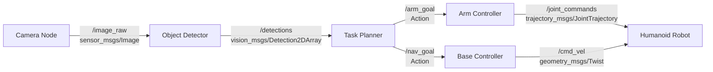
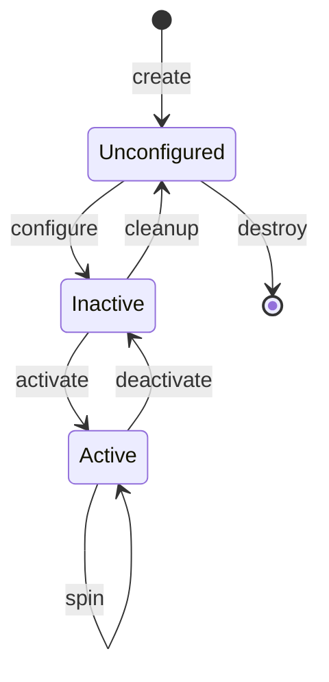
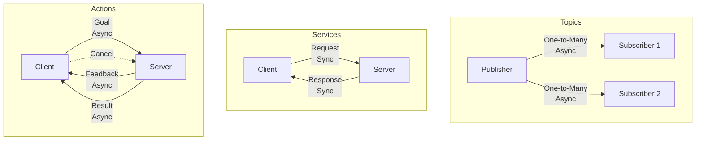

# Chapter 2: ROS 2 Architecture

## Learning Objectives

After completing this chapter, you will be able to:

1. **Create** ROS 2 nodes in Python using the rclpy library
2. **Implement** publishers and subscribers for topic-based communication
3. **Build** service servers and clients for request-response patterns
4. **Develop** action servers and clients for long-running tasks with feedback
5. **Configure** Quality of Service (QoS) policies for reliable robotics applications
6. **Select** appropriate communication patterns (topics vs services vs actions) for different robotics scenarios

## Key Concepts

1. **Node**: An independent process that performs computation. Nodes are the building blocks of ROS 2 systems.

2. **Topic**: A named bus over which nodes exchange messages via publish-subscribe pattern. One-to-many communication.

3. **Service**: Synchronous request-response communication between a client and server. One-to-one, blocking.

4. **Action**: Asynchronous goal-oriented communication with feedback and cancellation. For long-running tasks.

5. **Quality of Service (QoS)**: Policies that control message delivery guarantees (reliability, durability, history).

6. **Message Types**: Standardized data structures (`sensor_msgs`, `geometry_msgs`) for inter-node communication.

## ROS 2 Graph Architecture

A ROS 2 system is a **computation graph** where:
- **Nodes** are vertices (processes doing work)
- **Topics, Services, Actions** are edges (communication channels)



**Key characteristics**:
- **Decoupled**: Nodes don't need to know about each other's implementation
- **Scalable**: Add new nodes without modifying existing ones
- **Distributed**: Nodes can run on different machines (robot, workstation, cloud)

## Node Lifecycle

ROS 2 nodes have a lifecycle with states and transitions:



**States explained**:
- **Unconfigured**: Node created but not initialized
- **Inactive**: Configured (parameters loaded, connections established) but not processing
- **Active**: Fully operational, processing callbacks
- **Finalized**: Shutdown, resources released

For simple nodes (like in this chapter), we'll use the simplified lifecycle where nodes go directly to Active upon creation.

## Hands-On Tutorial: Minimal Node

Let's start with the simplest possible ROS 2 node—one that just prints "Hello ROS 2!" every second.

```python showLineNumbers title="minimal_node.py"
# File: minimal_node.py
import rclpy
from rclpy.node import Node

class MinimalNode(Node):
    """
    A minimal ROS 2 node that prints a message every second.
    Demonstrates basic node structure and timer usage.
    """
    def __init__(self):
        # Initialize the node with name 'minimal_node'
        super().__init__('minimal_node')

        # Create a timer that calls timer_callback every 1.0 seconds
        self.timer = self.create_timer(1.0, self.timer_callback)
        self.count = 0

        self.get_logger().info('Minimal node started!')

    def timer_callback(self):
        """Called every second by the timer"""
        self.count += 1
        self.get_logger().info(f'Hello ROS 2! Count: {self.count}')

def main(args=None):
    # Initialize the ROS 2 Python client library
    rclpy.init(args=args)

    # Create the node
    node = MinimalNode()

    # Spin the node (process callbacks until shutdown)
    rclpy.spin(node)

    # Cleanup
    node.destroy_node()
    rclpy.shutdown()

if __name__ == '__main__':
    main()
```

**How to run**:
```bash
# Make the file executable
chmod +x minimal_node.py

# Run the node
python3 minimal_node.py

# Output:
# [INFO] [minimal_node]: Minimal node started!
# [INFO] [minimal_node]: Hello ROS 2! Count: 1
# [INFO] [minimal_node]: Hello ROS 2! Count: 2
# ...
```

**Key components**:
- **Line 1-2**: Import rclpy (ROS 2 Python client library) and Node base class
- **Line 12**: Call parent constructor with node name
- **Line 15**: Create timer (1 Hz) that triggers callback
- **Line 27**: Initialize rclpy (must be called before creating nodes)
- **Line 33**: `spin()` keeps node alive, processing callbacks until Ctrl+C

## Hands-On Tutorial: Talker/Listener Pair

Now let's implement the classic ROS 2 example: a **publisher** (talker) sends messages, a **subscriber** (listener) receives them.

### Publisher (Talker)

```python showLineNumbers title="talker.py"
# File: talker.py
import rclpy
from rclpy.node import Node
from std_msgs.msg import String

class TalkerNode(Node):
    """
    Publisher node that sends string messages on /chatter topic.
    """
    def __init__(self):
        super().__init__('talker')

        # Create publisher: topic '/chatter', message type String, queue size 10
        self.publisher_ = self.create_publisher(String, '/chatter', 10)

        # Timer to publish at 2 Hz
        self.timer = self.create_timer(0.5, self.publish_message)
        self.count = 0

        self.get_logger().info('Talker node started, publishing to /chatter')

    def publish_message(self):
        """Publish a message every 0.5 seconds"""
        msg = String()
        msg.data = f'Hello from Talker! Message #{self.count}'

        # Publish the message
        self.publisher_.publish(msg)
        self.get_logger().info(f'Published: "{msg.data}"')

        self.count += 1

def main(args=None):
    rclpy.init(args=args)
    node = TalkerNode()
    rclpy.spin(node)
    node.destroy_node()
    rclpy.shutdown()

if __name__ == '__main__':
    main()
```

### Subscriber (Listener)

```python showLineNumbers title="listener.py"
# File: listener.py
import rclpy
from rclpy.node import Node
from std_msgs.msg import String

class ListenerNode(Node):
    """
    Subscriber node that receives string messages from /chatter topic.
    """
    def __init__(self):
        super().__init__('listener')

        # Create subscriber: topic '/chatter', message type String, callback function
        self.subscription = self.create_subscription(
            String,
            '/chatter',
            self.listener_callback,
            10  # QoS queue size
        )

        self.get_logger().info('Listener node started, subscribed to /chatter')

    def listener_callback(self, msg):
        """Called every time a message is received on /chatter"""
        self.get_logger().info(f'Received: "{msg.data}"')

def main(args=None):
    rclpy.init(args=args)
    node = ListenerNode()
    rclpy.spin(node)
    node.destroy_node()
    rclpy.shutdown()

if __name__ == '__main__':
    main()
```

**How to run** (in two terminals):

Terminal 1:
```bash
python3 talker.py
# [INFO] [talker]: Talker node started, publishing to /chatter
# [INFO] [talker]: Published: "Hello from Talker! Message #0"
# [INFO] [talker]: Published: "Hello from Talker! Message #1"
```

Terminal 2:
```bash
python3 listener.py
# [INFO] [listener]: Listener node started, subscribed to /chatter
# [INFO] [listener]: Received: "Hello from Talker! Message #0"
# [INFO] [listener]: Received: "Hello from Talker! Message #1"
```

**What's happening**:
1. Talker publishes `String` messages to `/chatter` topic every 0.5 seconds
2. Listener subscribes to `/chatter` and receives messages via callback
3. Communication is **one-to-many** (multiple listeners can subscribe to same topic)
4. **Asynchronous** (talker doesn't wait for listener acknowledgment)

## Quality of Service (QoS) Policies

Real robotics applications need control over **how** messages are delivered. QoS policies configure this.

### Key QoS Settings

| Policy | Options | When to Use |
|--------|---------|-------------|
| **Reliability** | Reliable / Best-Effort | Reliable: motor commands, Best-Effort: camera streams |
| **Durability** | Transient-Local / Volatile | Transient: late-joiners get last message, Volatile: only live data |
| **History** | Keep-Last-N / Keep-All | Keep-Last-1 for latest sensor data, Keep-All for logging |
| **Liveliness** | Automatic / Manual | Detect if publisher is still alive |
| **Deadline** | Duration | Warn if messages arrive slower than expected |

### Example: Configuring QoS

```python showLineNumbers title="qos_publisher.py"
# File: qos_publisher.py
import rclpy
from rclpy.node import Node
from rclpy.qos import QoSProfile, QoSReliabilityPolicy, QoSHistoryPolicy
from std_msgs.msg import String

class QoSPublisher(Node):
    def __init__(self):
        super().__init__('qos_publisher')

        # Create custom QoS profile
        qos_profile = QoSProfile(
            reliability=QoSReliabilityPolicy.BEST_EFFORT,  # Allow message loss for low latency
            history=QoSHistoryPolicy.KEEP_LAST,           # Keep only last N messages
            depth=1                                        # Queue size of 1
        )

        self.publisher_ = self.create_publisher(String, '/sensor_data', qos_profile)
        self.timer = self.create_timer(0.1, self.publish_sensor)

    def publish_sensor(self):
        msg = String()
        msg.data = f'Sensor reading at {self.get_clock().now().to_msg()}'
        self.publisher_.publish(msg)

def main(args=None):
    rclpy.init(args=args)
    node = QoSPublisher()
    rclpy.spin(node)
    node.destroy_node()
    rclpy.shutdown()

if __name__ == '__main__':
    main()
```

:::warning[QoS Compatibility]

Publishers and subscribers must have **compatible** QoS settings, or they won't connect!

**Compatible combinations**:
- Reliable publisher ↔ Reliable subscriber ✅
- Best-Effort publisher ↔ Best-Effort subscriber ✅
- Best-Effort publisher ↔ Reliable subscriber ✅
- Reliable publisher ↔ Best-Effort subscriber ❌ (subscriber won't receive messages!)

Use `ros2 topic info -v /topic_name` to check QoS settings.
:::

## Topics vs Services vs Actions: When to Use What?

| Communication Pattern | Use Case | Example |
|----------------------|----------|---------|
| **Topic** | Continuous data streams, one-to-many | Camera images, sensor readings, robot state |
| **Service** | Request-response, synchronous | "Get current joint angles", "Is path collision-free?" |
| **Action** | Long-running tasks with feedback | "Walk to goal", "Grasp object", "Navigate to waypoint" |

Decision tree:
```
Need communication?
├─ Continuous stream? → Topic
├─ Quick request/response (< 1 sec)? → Service
└─ Long task with progress updates? → Action
```

## Hands-On Tutorial: Service Server/Client

Services implement **request-response** patterns. Let's build a service that adds two integers.

### Service Server

```python showLineNumbers title="add_server.py"
# File: add_server.py
import rclpy
from rclpy.node import Node
from example_interfaces.srv import AddTwoInts  # Standard service type

class AddServerNode(Node):
    """
    Service server that adds two integers.
    """
    def __init__(self):
        super().__init__('add_server')

        # Create service: name '/add_two_ints', type AddTwoInts, callback function
        self.service = self.create_service(
            AddTwoInts,
            '/add_two_ints',
            self.add_callback
        )

        self.get_logger().info('Add server ready, waiting for requests...')

    def add_callback(self, request, response):
        """
        Called when a client sends a request.
        Args:
            request: Contains request.a and request.b (two integers)
            response: We fill response.sum
        """
        response.sum = request.a + request.b
        self.get_logger().info(f'Request: {request.a} + {request.b} = {response.sum}')
        return response

def main(args=None):
    rclpy.init(args=args)
    node = AddServerNode()
    rclpy.spin(node)
    node.destroy_node()
    rclpy.shutdown()

if __name__ == '__main__':
    main()
```

### Service Client

```python showLineNumbers title="add_client.py"
# File: add_client.py
import sys
import rclpy
from rclpy.node import Node
from example_interfaces.srv import AddTwoInts

class AddClientNode(Node):
    """
    Service client that requests addition of two integers.
    """
    def __init__(self):
        super().__init__('add_client')

        # Create client: service name '/add_two_ints', type AddTwoInts
        self.client = self.create_client(AddTwoInts, '/add_two_ints')

        # Wait for service to be available (timeout 5 seconds)
        while not self.client.wait_for_service(timeout_sec=5.0):
            self.get_logger().warn('Service /add_two_ints not available, waiting...')

        self.get_logger().info('Connected to service /add_two_ints')

    def send_request(self, a, b):
        """Send request to add two integers"""
        request = AddTwoInts.Request()
        request.a = a
        request.b = b

        # Call service (async, returns future)
        future = self.client.call_async(request)
        return future

def main(args=None):
    rclpy.init(args=args)

    # Get numbers from command line
    if len(sys.argv) != 3:
        print('Usage: python3 add_client.py <a> <b>')
        return

    a = int(sys.argv[1])
    b = int(sys.argv[2])

    node = AddClientNode()
    future = node.send_request(a, b)

    # Wait for response (spin until future is complete)
    rclpy.spin_until_future_complete(node, future)

    if future.result() is not None:
        response = future.result()
        node.get_logger().info(f'Result: {a} + {b} = {response.sum}')
    else:
        node.get_logger().error('Service call failed!')

    node.destroy_node()
    rclpy.shutdown()

if __name__ == '__main__':
    main()
```

**How to run**:

Terminal 1 (server):
```bash
python3 add_server.py
# [INFO] [add_server]: Add server ready, waiting for requests...
```

Terminal 2 (client):
```bash
python3 add_client.py 5 7
# [INFO] [add_client]: Connected to service /add_two_ints
# [INFO] [add_client]: Result: 5 + 7 = 12
```

**Key points**:
- **Synchronous** (client waits for response)
- **One-to-one** (only one server per service name)
- **Stateless** (each request is independent)

## Hands-On Tutorial: Action Server/Client

Actions are for **long-running tasks** that provide **feedback** and can be **canceled**. Perfect for humanoid tasks like "walk to goal" or "grasp object".

### Action Server

```python showLineNumbers title="fibonacci_action_server.py"
# File: fibonacci_action_server.py
import time
import rclpy
from rclpy.action import ActionServer
from rclpy.node import Node
from example_interfaces.action import Fibonacci  # Standard action type

class FibonacciActionServer(Node):
    """
    Action server that computes Fibonacci sequence.
    Demonstrates goal execution, feedback, and result.
    """
    def __init__(self):
        super().__init__('fibonacci_action_server')

        # Create action server
        self._action_server = ActionServer(
            self,
            Fibonacci,
            '/fibonacci',
            self.execute_callback
        )

        self.get_logger().info('Fibonacci action server started')

    def execute_callback(self, goal_handle):
        """
        Execute the Fibonacci goal.
        Args:
            goal_handle: Contains goal.order (number of Fibonacci numbers to compute)
        """
        self.get_logger().info(f'Executing goal: compute {goal_handle.request.order} Fibonacci numbers')

        # Initialize feedback and result
        feedback_msg = Fibonacci.Feedback()
        feedback_msg.sequence = [0, 1]

        # Compute Fibonacci sequence
        for i in range(1, goal_handle.request.order):
            # Check if goal was canceled
            if goal_handle.is_cancel_requested:
                goal_handle.canceled()
                self.get_logger().info('Goal canceled')
                return Fibonacci.Result()

            # Compute next Fibonacci number
            feedback_msg.sequence.append(
                feedback_msg.sequence[i] + feedback_msg.sequence[i-1]
            )

            # Publish feedback
            self.get_logger().info(f'Feedback: {feedback_msg.sequence}')
            goal_handle.publish_feedback(feedback_msg)

            # Simulate computation time
            time.sleep(0.5)

        # Goal succeeded
        goal_handle.succeed()

        # Return result
        result = Fibonacci.Result()
        result.sequence = feedback_msg.sequence
        self.get_logger().info(f'Goal succeeded! Result: {result.sequence}')
        return result

def main(args=None):
    rclpy.init(args=args)
    node = FibonacciActionServer()
    rclpy.spin(node)
    node.destroy_node()
    rclpy.shutdown()

if __name__ == '__main__':
    main()
```

### Action Client

```python showLineNumbers title="fibonacci_action_client.py"
# File: fibonacci_action_client.py
import rclpy
from rclpy.action import ActionClient
from rclpy.node import Node
from example_interfaces.action import Fibonacci

class FibonacciActionClient(Node):
    """
    Action client that requests Fibonacci sequence computation.
    """
    def __init__(self):
        super().__init__('fibonacci_action_client')

        # Create action client
        self._action_client = ActionClient(self, Fibonacci, '/fibonacci')

        self.get_logger().info('Waiting for action server...')
        self._action_client.wait_for_server()
        self.get_logger().info('Action server available!')

    def send_goal(self, order):
        """Send goal to compute Fibonacci sequence"""
        goal_msg = Fibonacci.Goal()
        goal_msg.order = order

        self.get_logger().info(f'Sending goal: compute {order} Fibonacci numbers')

        # Send goal with callbacks
        self._send_goal_future = self._action_client.send_goal_async(
            goal_msg,
            feedback_callback=self.feedback_callback
        )

        self._send_goal_future.add_done_callback(self.goal_response_callback)

    def goal_response_callback(self, future):
        """Called when server accepts/rejects goal"""
        goal_handle = future.result()

        if not goal_handle.accepted:
            self.get_logger().error('Goal rejected!')
            return

        self.get_logger().info('Goal accepted, waiting for result...')

        # Get result
        self._get_result_future = goal_handle.get_result_async()
        self._get_result_future.add_done_callback(self.get_result_callback)

    def get_result_callback(self, future):
        """Called when result is ready"""
        result = future.result().result
        self.get_logger().info(f'Result received: {result.sequence}')
        rclpy.shutdown()

    def feedback_callback(self, feedback_msg):
        """Called when server publishes feedback"""
        feedback = feedback_msg.feedback
        self.get_logger().info(f'Feedback: {feedback.sequence}')

def main(args=None):
    rclpy.init(args=args)
    node = FibonacciActionClient()
    node.send_goal(10)  # Request 10 Fibonacci numbers
    rclpy.spin(node)
    node.destroy_node()

if __name__ == '__main__':
    main()
```

**How to run**:

Terminal 1 (server):
```bash
python3 fibonacci_action_server.py
# [INFO] [fibonacci_action_server]: Fibonacci action server started
# [INFO] [fibonacci_action_server]: Executing goal: compute 10 Fibonacci numbers
# [INFO] [fibonacci_action_server]: Feedback: [0, 1, 1]
# [INFO] [fibonacci_action_server]: Feedback: [0, 1, 1, 2]
# ...
# [INFO] [fibonacci_action_server]: Goal succeeded! Result: [0, 1, 1, 2, 3, 5, 8, 13, 21, 34, 55]
```

Terminal 2 (client):
```bash
python3 fibonacci_action_client.py
# [INFO] [fibonacci_action_client]: Action server available!
# [INFO] [fibonacci_action_client]: Sending goal: compute 10 Fibonacci numbers
# [INFO] [fibonacci_action_client]: Goal accepted, waiting for result...
# [INFO] [fibonacci_action_client]: Feedback: [0, 1, 1]
# ...
# [INFO] [fibonacci_action_client]: Result received: [0, 1, 1, 2, 3, 5, 8, 13, 21, 34, 55]
```

**Why use actions?**
- **Feedback**: Client sees progress (critical for "walk 10 meters" - you want to know current distance!)
- **Cancellation**: Client can stop action mid-execution ("stop walking, obstacle detected!")
- **Asynchronous**: Client continues other work while action executes

## Common Message Types

ROS 2 provides standard message types in packages like `std_msgs`, `sensor_msgs`, `geometry_msgs`. Using standard types ensures interoperability.

### Key Message Packages for Humanoids

| Package | Common Types | Use Case |
|---------|--------------|----------|
| **std_msgs** | `String`, `Int32`, `Float64`, `Bool` | Simple data |
| **geometry_msgs** | `Twist`, `Pose`, `PoseStamped`, `Transform` | Robot motion, position |
| **sensor_msgs** | `Image`, `CameraInfo`, `Imu`, `JointState`, `LaserScan` | Sensor data |
| **trajectory_msgs** | `JointTrajectory`, `MultiDOFJointTrajectory` | Joint motion |
| **nav_msgs** | `Odometry`, `Path` | Navigation |

**Example: Velocity command for humanoid base**

```python
from geometry_msgs.msg import Twist

# Create velocity command
cmd_vel = Twist()
cmd_vel.linear.x = 0.5   # Move forward at 0.5 m/s
cmd_vel.linear.y = 0.0   # No lateral movement
cmd_vel.angular.z = 0.1  # Turn left at 0.1 rad/s

publisher.publish(cmd_vel)
```

**Example: Joint state for humanoid arms**

```python
from sensor_msgs.msg import JointState

joint_state = JointState()
joint_state.name = ['shoulder_pan', 'shoulder_lift', 'elbow', 'wrist']
joint_state.position = [0.0, -1.57, 1.57, 0.0]  # radians
joint_state.velocity = [0.0, 0.0, 0.0, 0.0]
joint_state.effort = [0.0, 0.0, 0.0, 0.0]  # torques

publisher.publish(joint_state)
```

## Communication Patterns Comparison



## End-of-Chapter Exercises

### Exercise 1: Temperature Monitor (Easy)

Create a publisher that simulates a temperature sensor:
- Publish to `/temperature` topic
- Use `std_msgs/Float64` message type
- Publish random temperature between 20-30°C every second

**Acceptance**: Node publishes messages visible with `ros2 topic echo /temperature`

### Exercise 2: Emergency Stop Subscriber (Easy)

Create a subscriber that listens to `/emergency_stop` topic (`std_msgs/Bool`):
- When `True` received, log "EMERGENCY STOP ACTIVATED!"
- When `False` received, log "System resumed"

**Acceptance**: Node responds to messages published with `ros2 topic pub`

### Exercise 3: String Reversal Service (Medium)

Create a service that reverses strings:
- Service name: `/reverse_string`
- Use a custom request/response (or `example_interfaces/srv/Trigger` with string in response)
- Server reverses input string and returns result

**Acceptance**: Client sends "hello" and receives "olleh"

### Exercise 4: Countdown Action (Medium)

Create an action server that counts down from N to 0:
- Action name: `/countdown`
- Goal: integer N
- Feedback: current count every second
- Result: "Countdown complete!"

**Acceptance**: Client sees feedback printed as countdown progresses

### Exercise 5: Multi-Node Humanoid System (Hard)

Design a 3-node system for a humanoid:
1. **Vision Node**: Publishes `/detected_objects` (simulate with timer + random data)
2. **Planner Node**: Subscribes to `/detected_objects`, publishes `/target_pose`
3. **Controller Node**: Subscribes to `/target_pose`, logs "Moving to target: [x, y, z]"

**Acceptance**: All three nodes communicate correctly when run simultaneously

### Exercise 6: QoS Experiment (Medium)

Create two pairs of talker/listener nodes:
- **Pair 1**: Both use Reliable QoS
- **Pair 2**: Publisher uses Reliable, Subscriber uses Best-Effort

Run both pairs and observe which pair communicates successfully. Explain why.

**Acceptance**: Correct prediction (Pair 1 works, Pair 2 doesn't) with QoS compatibility explanation

## Capstone Integration

**How This Chapter Connects to the Final Humanoid Project**

Your capstone humanoid will have a multi-node architecture:

- **Perception nodes** (publishers): Camera streams → `/camera/image_raw`, Object detection → `/detected_objects`
- **Planning nodes** (subscribers + publishers): Subscribe to perception, publish `/navigation/goal`, `/manipulation/target`
- **Control nodes** (action servers): Execute `/walk_to_goal` action, `/grasp_object` action with feedback
- **Low-level controllers** (subscribers): Listen to `/joint_commands`, send to motors

**From this chapter, you now know**:
- How to structure nodes for each subsystem
- When to use topics (sensor streams), services (queries), actions (tasks)
- How to configure QoS (reliable for commands, best-effort for camera streams)

## Summary

In this chapter, you learned:

✅ **Nodes**: Independent processes that perform computation and communicate via ROS 2 graph
✅ **Topics**: Publish-subscribe communication for one-to-many, continuous data streams
✅ **Services**: Request-response communication for synchronous queries
✅ **Actions**: Goal-oriented communication with feedback and cancellation for long-running tasks
✅ **QoS Policies**: Configure reliability, durability, history for application-specific needs
✅ **Message Types**: Standard messages (`sensor_msgs`, `geometry_msgs`) for interoperability

## What's Next?

You can now write ROS 2 nodes that communicate! But as your robot grows, you'll have 10+ nodes. How do you organize them?

In **[Chapter 3: Packages, Launch Files, and Parameters →](./chapter-3-ros2-packages-launch.md)**, you'll learn:
- How to structure ROS 2 code into packages
- Use launch files to start multiple nodes with one command
- Manage configuration through parameters
- Integrate with Gazebo and Isaac Sim

---

**Additional Resources**:
- [rclpy API Documentation](https://docs.ros2.org/latest/api/rclpy/)
- [ROS 2 Communication Patterns](https://docs.ros.org/en/humble/Concepts/About-Different-Middleware-Vendors.html)
- [QoS Guide](https://docs.ros.org/en/humble/Concepts/About-Quality-of-Service-Settings.html)
- [Standard Message Types](https://github.com/ros2/common_interfaces)
