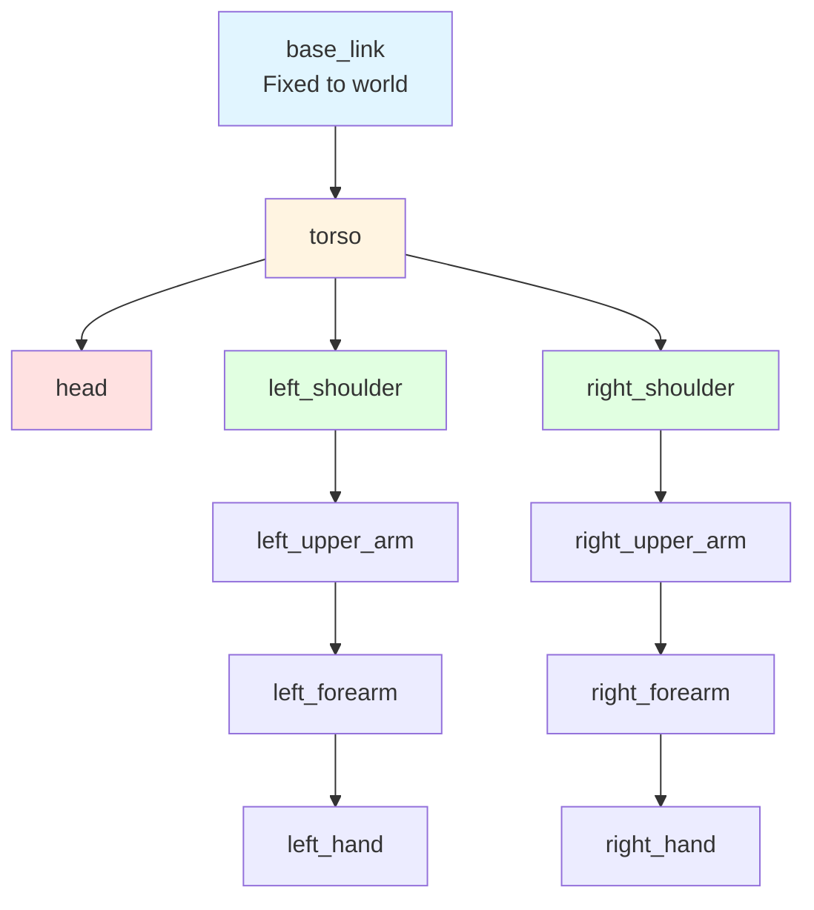

# Chapter 4: URDF for Humanoid Robots

## Learning Objectives

By the end of this chapter, you will be able to:

1. **Write URDF files** to describe robot structure with links, joints, and physical properties
2. **Create humanoid robot models** with torso, head, arms, legs, and hands
3. **Use Xacro** to reduce code duplication and create parameterized robot models
4. **Visualize robots in RViz** using joint state publishers and robot state publishers
5. **Load URDF into Gazebo** with physics properties, sensors, and controller plugins
6. **Optimize URDF** with separate collision and visual meshes for performance

## Key Concepts

This chapter introduces six critical concepts for robot modeling:

1. **URDF (Unified Robot Description Format)**: XML-based format for describing robot kinematics, dynamics, and visualization
2. **Link**: A rigid body in the robot (e.g., torso, upper arm, forearm)
3. **Joint**: Connection between two links defining how they move relative to each other
4. **Xacro (XML Macros)**: Macro language for URDF that enables variables, functions, and code reuse
5. **RViz**: 3D visualization tool for viewing robot models and sensor data
6. **Gazebo URDF Extensions**: Tags for physics simulation, sensors, and controller plugins

---

## 4.1 URDF Fundamentals

**URDF (Unified Robot Description Format)** is an XML specification for representing a robot's physical structure. It defines:
- **Links**: Rigid bodies with visual appearance, collision geometry, and inertial properties
- **Joints**: Connections between links with motion constraints

### Basic URDF Structure

```xml
<!-- File: Simple robot with two links and one joint -->

<?xml version="1.0"?>
<robot name="simple_robot">

  <!-- Base link (fixed to world) -->
  <link name="base_link">
    <visual>
      <geometry>
        <box size="0.5 0.3 0.1"/>
      </geometry>
      <material name="blue">
        <color rgba="0 0 0.8 1"/>
      </material>
    </visual>
    <collision>
      <geometry>
        <box size="0.5 0.3 0.1"/>
      </geometry>
    </collision>
    <inertial>
      <mass value="10.0"/>
      <inertia ixx="0.1" ixy="0" ixz="0" iyy="0.1" iyz="0" izz="0.1"/>
    </inertial>
  </link>

  <!-- Moving link (arm) -->
  <link name="arm_link">
    <visual>
      <geometry>
        <cylinder radius="0.05" length="0.5"/>
      </geometry>
      <material name="red">
        <color rgba="0.8 0 0 1"/>
      </material>
    </visual>
    <collision>
      <geometry>
        <cylinder radius="0.05" length="0.5"/>
      </geometry>
    </collision>
    <inertial>
      <mass value="2.0"/>
      <inertia ixx="0.02" ixy="0" ixz="0" iyy="0.02" iyz="0" izz="0.001"/>
    </inertial>
  </link>

  <!-- Revolute joint (rotation) -->
  <joint name="base_to_arm" type="revolute">
    <parent link="base_link"/>
    <child link="arm_link"/>
    <origin xyz="0 0 0.05" rpy="0 0 0"/>
    <axis xyz="0 0 1"/>
    <limit lower="-1.57" upper="1.57" effort="100" velocity="1.0"/>
  </joint>

</robot>
```

**Key Elements**:
- `<link>`: Defines a rigid body
  - `<visual>`: How the link appears in visualization (RViz)
  - `<collision>`: Simplified geometry for collision detection
  - `<inertial>`: Mass and inertia tensor for physics simulation
- `<joint>`: Connects parent and child links
  - `<origin>`: Translation (xyz) and rotation (roll-pitch-yaw) from parent to joint
  - `<axis>`: Rotation axis for revolute/continuous joints
  - `<limit>`: Joint constraints (position, velocity, effort)

### Joint Types

URDF supports six joint types:

| Joint Type | Description | Use Case |
|------------|-------------|----------|
| `fixed` | No motion (welded connection) | Attach sensors, connect rigid parts |
| `revolute` | Rotation with limits | Humanoid joints (elbows, knees, neck) |
| `continuous` | Unlimited rotation | Wheels, rotating sensors |
| `prismatic` | Linear translation with limits | Telescoping links, grippers |
| `planar` | Motion in a plane (2D translation + 1D rotation) | Rarely used in humanoids |
| `floating` | 6-DOF free motion (no constraints) | Simulating free-flying robots |

**For humanoids**, you'll primarily use:
- `revolute` for all limb joints (shoulders, elbows, hips, knees, ankles, fingers)
- `fixed` for attaching cameras, IMUs, and other sensors

---

## 4.2 Humanoid URDF Example

Let's build a simplified humanoid upper body with head, torso, and arms.

### Humanoid Kinematic Chain



### Complete Humanoid Upper Body URDF

```xml
<!-- File: ~/ros2_ws/src/humanoid_description/urdf/humanoid_upper_body.urdf -->

<?xml version="1.0"?>
<robot name="humanoid_upper_body">

  <!-- ========== BASE LINK (Fixed to world) ========== -->
  <link name="base_link"/>

  <!-- ========== TORSO ========== -->
  <link name="torso">
    <visual>
      <geometry>
        <box size="0.3 0.2 0.5"/>
      </geometry>
      <material name="white">
        <color rgba="0.9 0.9 0.9 1"/>
      </material>
    </visual>
    <collision>
      <geometry>
        <box size="0.3 0.2 0.5"/>
      </geometry>
    </collision>
    <inertial>
      <mass value="15.0"/>
      <origin xyz="0 0 0.25"/>
      <inertia ixx="0.5" ixy="0" ixz="0" iyy="0.5" iyz="0" izz="0.2"/>
    </inertial>
  </link>

  <joint name="base_to_torso" type="fixed">
    <parent link="base_link"/>
    <child link="torso"/>
    <origin xyz="0 0 0.5" rpy="0 0 0"/>
  </joint>

  <!-- ========== HEAD ========== -->
  <link name="head">
    <visual>
      <geometry>
        <sphere radius="0.12"/>
      </geometry>
      <material name="skin">
        <color rgba="0.96 0.8 0.69 1"/>
      </material>
    </visual>
    <collision>
      <geometry>
        <sphere radius="0.12"/>
      </geometry>
    </collision>
    <inertial>
      <mass value="3.0"/>
      <inertia ixx="0.01" ixy="0" ixz="0" iyy="0.01" iyz="0" izz="0.01"/>
    </inertial>
  </link>

  <joint name="neck_joint" type="revolute">
    <parent link="torso"/>
    <child link="head"/>
    <origin xyz="0 0 0.3" rpy="0 0 0"/>
    <axis xyz="0 0 1"/>
    <limit lower="-1.57" upper="1.57" effort="50" velocity="2.0"/>
  </joint>

  <!-- ========== LEFT ARM ========== -->
  <!-- Shoulder joint -->
  <link name="left_shoulder">
    <visual>
      <geometry>
        <sphere radius="0.05"/>
      </geometry>
      <material name="dark_gray">
        <color rgba="0.3 0.3 0.3 1"/>
      </material>
    </visual>
    <collision>
      <geometry>
        <sphere radius="0.05"/>
      </geometry>
    </collision>
    <inertial>
      <mass value="0.5"/>
      <inertia ixx="0.001" ixy="0" ixz="0" iyy="0.001" iyz="0" izz="0.001"/>
    </inertial>
  </link>

  <joint name="left_shoulder_joint" type="revolute">
    <parent link="torso"/>
    <child link="left_shoulder"/>
    <origin xyz="0 0.15 0.2" rpy="0 0 0"/>
    <axis xyz="0 1 0"/>
    <limit lower="-3.14" upper="3.14" effort="100" velocity="2.0"/>
  </joint>

  <!-- Upper arm -->
  <link name="left_upper_arm">
    <visual>
      <origin xyz="0 0 -0.15" rpy="0 0 0"/>
      <geometry>
        <cylinder radius="0.04" length="0.3"/>
      </geometry>
      <material name="skin">
        <color rgba="0.96 0.8 0.69 1"/>
      </material>
    </visual>
    <collision>
      <origin xyz="0 0 -0.15" rpy="0 0 0"/>
      <geometry>
        <cylinder radius="0.04" length="0.3"/>
      </geometry>
    </collision>
    <inertial>
      <mass value="2.0"/>
      <origin xyz="0 0 -0.15"/>
      <inertia ixx="0.02" ixy="0" ixz="0" iyy="0.02" iyz="0" izz="0.001"/>
    </inertial>
  </link>

  <joint name="left_shoulder_to_upper_arm" type="fixed">
    <parent link="left_shoulder"/>
    <child link="left_upper_arm"/>
    <origin xyz="0 0 0" rpy="0 0 0"/>
  </joint>

  <!-- Elbow joint -->
  <link name="left_forearm">
    <visual>
      <origin xyz="0 0 -0.125" rpy="0 0 0"/>
      <geometry>
        <cylinder radius="0.035" length="0.25"/>
      </geometry>
      <material name="skin">
        <color rgba="0.96 0.8 0.69 1"/>
      </material>
    </visual>
    <collision>
      <origin xyz="0 0 -0.125" rpy="0 0 0"/>
      <geometry>
        <cylinder radius="0.035" length="0.25"/>
      </geometry>
    </collision>
    <inertial>
      <mass value="1.5"/>
      <origin xyz="0 0 -0.125"/>
      <inertia ixx="0.01" ixy="0" ixz="0" iyy="0.01" iyz="0" izz="0.001"/>
    </inertial>
  </link>

  <joint name="left_elbow_joint" type="revolute">
    <parent link="left_upper_arm"/>
    <child link="left_forearm"/>
    <origin xyz="0 0 -0.3" rpy="0 0 0"/>
    <axis xyz="0 1 0"/>
    <limit lower="0" upper="2.5" effort="80" velocity="2.0"/>
  </joint>

  <!-- Hand -->
  <link name="left_hand">
    <visual>
      <geometry>
        <box size="0.08 0.15 0.05"/>
      </geometry>
      <material name="skin">
        <color rgba="0.96 0.8 0.69 1"/>
      </material>
    </visual>
    <collision>
      <geometry>
        <box size="0.08 0.15 0.05"/>
      </geometry>
    </collision>
    <inertial>
      <mass value="0.5"/>
      <inertia ixx="0.001" ixy="0" ixz="0" iyy="0.001" iyz="0" izz="0.001"/>
    </inertial>
  </link>

  <joint name="left_wrist_joint" type="fixed">
    <parent link="left_forearm"/>
    <child link="left_hand"/>
    <origin xyz="0 0 -0.25" rpy="0 0 0"/>
  </joint>

  <!-- ========== RIGHT ARM (Mirror of left) ========== -->
  <!-- Shoulder joint -->
  <link name="right_shoulder">
    <visual>
      <geometry>
        <sphere radius="0.05"/>
      </geometry>
      <material name="dark_gray"/>
    </visual>
    <collision>
      <geometry>
        <sphere radius="0.05"/>
      </geometry>
    </collision>
    <inertial>
      <mass value="0.5"/>
      <inertia ixx="0.001" ixy="0" ixz="0" iyy="0.001" iyz="0" izz="0.001"/>
    </inertial>
  </link>

  <!-- Note: Y offset is negative for right side -->
  <joint name="right_shoulder_joint" type="revolute">
    <parent link="torso"/>
    <child link="right_shoulder"/>
    <origin xyz="0 -0.15 0.2" rpy="0 0 0"/>
    <axis xyz="0 1 0"/>
    <limit lower="-3.14" upper="3.14" effort="100" velocity="2.0"/>
  </joint>

  <!-- Upper arm -->
  <link name="right_upper_arm">
    <visual>
      <origin xyz="0 0 -0.15" rpy="0 0 0"/>
      <geometry>
        <cylinder radius="0.04" length="0.3"/>
      </geometry>
      <material name="skin"/>
    </visual>
    <collision>
      <origin xyz="0 0 -0.15" rpy="0 0 0"/>
      <geometry>
        <cylinder radius="0.04" length="0.3"/>
      </geometry>
    </collision>
    <inertial>
      <mass value="2.0"/>
      <origin xyz="0 0 -0.15"/>
      <inertia ixx="0.02" ixy="0" ixz="0" iyy="0.02" iyz="0" izz="0.001"/>
    </inertial>
  </link>

  <joint name="right_shoulder_to_upper_arm" type="fixed">
    <parent link="right_shoulder"/>
    <child link="right_upper_arm"/>
    <origin xyz="0 0 0" rpy="0 0 0"/>
  </joint>

  <!-- Forearm -->
  <link name="right_forearm">
    <visual>
      <origin xyz="0 0 -0.125" rpy="0 0 0"/>
      <geometry>
        <cylinder radius="0.035" length="0.25"/>
      </geometry>
      <material name="skin"/>
    </visual>
    <collision>
      <origin xyz="0 0 -0.125" rpy="0 0 0"/>
      <geometry>
        <cylinder radius="0.035" length="0.25"/>
      </geometry>
    </collision>
    <inertial>
      <mass value="1.5"/>
      <origin xyz="0 0 -0.125"/>
      <inertia ixx="0.01" ixy="0" ixz="0" iyy="0.01" iyz="0" izz="0.001"/>
    </inertial>
  </link>

  <joint name="right_elbow_joint" type="revolute">
    <parent link="right_upper_arm"/>
    <child link="right_forearm"/>
    <origin xyz="0 0 -0.3" rpy="0 0 0"/>
    <axis xyz="0 1 0"/>
    <limit lower="0" upper="2.5" effort="80" velocity="2.0"/>
  </joint>

  <!-- Hand -->
  <link name="right_hand">
    <visual>
      <geometry>
        <box size="0.08 0.15 0.05"/>
      </geometry>
      <material name="skin"/>
    </visual>
    <collision>
      <geometry>
        <box size="0.08 0.15 0.05"/>
      </geometry>
    </collision>
    <inertial>
      <mass value="0.5"/>
      <inertia ixx="0.001" ixy="0" ixz="0" iyy="0.001" iyz="0" izz="0.001"/>
    </inertial>
  </link>

  <joint name="right_wrist_joint" type="fixed">
    <parent link="right_forearm"/>
    <child link="right_hand"/>
    <origin xyz="0 0 -0.25" rpy="0 0 0"/>
  </joint>

</robot>
```

**Key Design Decisions**:
1. **Coordinate Frames**: Z-axis points up (ROS convention)
2. **Symmetry**: Right arm mirrors left arm (negative Y offset)
3. **Joint Limits**: Realistic ranges (e.g., elbow: 0 to 2.5 rad ≈ 0° to 143°)
4. **Inertial Properties**: Masses and inertias approximate real human proportions

---

## 4.3 Xacro: Reducing Code Duplication

The URDF above has significant duplication (left and right arms are nearly identical). **Xacro** eliminates this with macros.

### Xacro Basics

```xml
<!-- File: ~/ros2_ws/src/humanoid_description/urdf/humanoid_upper_body.urdf.xacro -->

<?xml version="1.0"?>
<robot xmlns:xacro="http://www.ros.org/wiki/xacro" name="humanoid_upper_body">

  <!-- ========== PROPERTIES (Constants) ========== -->
  <xacro:property name="torso_mass" value="15.0"/>
  <xacro:property name="head_mass" value="3.0"/>
  <xacro:property name="upper_arm_length" value="0.3"/>
  <xacro:property name="forearm_length" value="0.25"/>
  <xacro:property name="arm_mass" value="2.0"/>

  <!-- ========== MACROS ========== -->
  <!-- Macro for creating an arm (left or right) -->
  <xacro:macro name="humanoid_arm" params="side reflect">
    <!-- side: 'left' or 'right' -->
    <!-- reflect: 1 for left, -1 for right (mirrors Y offset) -->

    <!-- Shoulder joint -->
    <link name="${side}_shoulder">
      <visual>
        <geometry>
          <sphere radius="0.05"/>
        </geometry>
        <material name="dark_gray">
          <color rgba="0.3 0.3 0.3 1"/>
        </material>
      </visual>
      <collision>
        <geometry>
          <sphere radius="0.05"/>
        </geometry>
      </collision>
      <inertial>
        <mass value="0.5"/>
        <inertia ixx="0.001" ixy="0" ixz="0" iyy="0.001" iyz="0" izz="0.001"/>
      </inertial>
    </link>

    <joint name="${side}_shoulder_joint" type="revolute">
      <parent link="torso"/>
      <child link="${side}_shoulder"/>
      <origin xyz="0 ${reflect * 0.15} 0.2" rpy="0 0 0"/>
      <axis xyz="0 1 0"/>
      <limit lower="-3.14" upper="3.14" effort="100" velocity="2.0"/>
    </joint>

    <!-- Upper arm -->
    <link name="${side}_upper_arm">
      <visual>
        <origin xyz="0 0 ${-upper_arm_length/2}" rpy="0 0 0"/>
        <geometry>
          <cylinder radius="0.04" length="${upper_arm_length}"/>
        </geometry>
        <material name="skin">
          <color rgba="0.96 0.8 0.69 1"/>
        </material>
      </visual>
      <collision>
        <origin xyz="0 0 ${-upper_arm_length/2}" rpy="0 0 0"/>
        <geometry>
          <cylinder radius="0.04" length="${upper_arm_length}"/>
        </geometry>
      </collision>
      <xacro:cylinder_inertia mass="${arm_mass}" radius="0.04" length="${upper_arm_length}"/>
    </link>

    <joint name="${side}_shoulder_to_upper_arm" type="fixed">
      <parent link="${side}_shoulder"/>
      <child link="${side}_upper_arm"/>
      <origin xyz="0 0 0" rpy="0 0 0"/>
    </joint>

    <!-- Forearm -->
    <link name="${side}_forearm">
      <visual>
        <origin xyz="0 0 ${-forearm_length/2}" rpy="0 0 0"/>
        <geometry>
          <cylinder radius="0.035" length="${forearm_length}"/>
        </geometry>
        <material name="skin"/>
      </visual>
      <collision>
        <origin xyz="0 0 ${-forearm_length/2}" rpy="0 0 0"/>
        <geometry>
          <cylinder radius="0.035" length="${forearm_length}"/>
        </geometry>
      </collision>
      <xacro:cylinder_inertia mass="1.5" radius="0.035" length="${forearm_length}"/>
    </link>

    <joint name="${side}_elbow_joint" type="revolute">
      <parent link="${side}_upper_arm"/>
      <child link="${side}_forearm"/>
      <origin xyz="0 0 ${-upper_arm_length}" rpy="0 0 0"/>
      <axis xyz="0 1 0"/>
      <limit lower="0" upper="2.5" effort="80" velocity="2.0"/>
    </joint>

    <!-- Hand -->
    <link name="${side}_hand">
      <visual>
        <geometry>
          <box size="0.08 0.15 0.05"/>
        </geometry>
        <material name="skin"/>
      </visual>
      <collision>
        <geometry>
          <box size="0.08 0.15 0.05"/>
        </geometry>
      </collision>
      <xacro:box_inertia mass="0.5" x="0.08" y="0.15" z="0.05"/>
    </link>

    <joint name="${side}_wrist_joint" type="fixed">
      <parent link="${side}_forearm"/>
      <child link="${side}_hand"/>
      <origin xyz="0 0 ${-forearm_length}" rpy="0 0 0"/>
    </joint>

  </xacro:macro>

  <!-- ========== INERTIA MACROS ========== -->
  <xacro:macro name="cylinder_inertia" params="mass radius length">
    <inertial>
      <mass value="${mass}"/>
      <origin xyz="0 0 ${-length/2}"/>
      <inertia
        ixx="${mass * (3 * radius * radius + length * length) / 12}"
        ixy="0" ixz="0"
        iyy="${mass * (3 * radius * radius + length * length) / 12}"
        iyz="0"
        izz="${mass * radius * radius / 2}"/>
    </inertial>
  </xacro:macro>

  <xacro:macro name="box_inertia" params="mass x y z">
    <inertial>
      <mass value="${mass}"/>
      <inertia
        ixx="${mass * (y*y + z*z) / 12}"
        ixy="0" ixz="0"
        iyy="${mass * (x*x + z*z) / 12}"
        iyz="0"
        izz="${mass * (x*x + y*y) / 12}"/>
    </inertial>
  </xacro:macro>

  <!-- ========== ROBOT DEFINITION ========== -->
  <link name="base_link"/>

  <!-- Torso -->
  <link name="torso">
    <visual>
      <geometry>
        <box size="0.3 0.2 0.5"/>
      </geometry>
      <material name="white">
        <color rgba="0.9 0.9 0.9 1"/>
      </material>
    </visual>
    <collision>
      <geometry>
        <box size="0.3 0.2 0.5"/>
      </geometry>
    </collision>
    <xacro:box_inertia mass="${torso_mass}" x="0.3" y="0.2" z="0.5"/>
  </link>

  <joint name="base_to_torso" type="fixed">
    <parent link="base_link"/>
    <child link="torso"/>
    <origin xyz="0 0 0.5" rpy="0 0 0"/>
  </joint>

  <!-- Head -->
  <link name="head">
    <visual>
      <geometry>
        <sphere radius="0.12"/>
      </geometry>
      <material name="skin">
        <color rgba="0.96 0.8 0.69 1"/>
      </material>
    </visual>
    <collision>
      <geometry>
        <sphere radius="0.12"/>
      </geometry>
    </collision>
    <inertial>
      <mass value="${head_mass}"/>
      <inertia ixx="0.01" ixy="0" ixz="0" iyy="0.01" iyz="0" izz="0.01"/>
    </inertial>
  </link>

  <joint name="neck_joint" type="revolute">
    <parent link="torso"/>
    <child link="head"/>
    <origin xyz="0 0 0.3" rpy="0 0 0"/>
    <axis xyz="0 0 1"/>
    <limit lower="-1.57" upper="1.57" effort="50" velocity="2.0"/>
  </joint>

  <!-- Instantiate arms using macro -->
  <xacro:humanoid_arm side="left" reflect="1"/>
  <xacro:humanoid_arm side="right" reflect="-1"/>

</robot>
```

**Xacro Benefits**:
1. **Properties**: Constants like `upper_arm_length` defined once
2. **Macros**: `humanoid_arm` macro creates both arms with one definition
3. **Math**: Expressions like `${-upper_arm_length/2}` for computed values
4. **Parameterization**: `reflect` parameter mirrors left/right arms

### Converting Xacro to URDF

```bash
# File: Terminal commands

# Convert xacro to URDF
ros2 run xacro xacro \
  ~/ros2_ws/src/humanoid_description/urdf/humanoid_upper_body.urdf.xacro \
  > ~/ros2_ws/src/humanoid_description/urdf/humanoid_upper_body.urdf

# Check the generated URDF
check_urdf ~/ros2_ws/src/humanoid_description/urdf/humanoid_upper_body.urdf

# Expected output:
# robot name is: humanoid_upper_body
# ---------- Successfully Parsed XML ---------------
```

---

## 4.4 Visualizing in RViz

**RViz** is ROS 2's primary 3D visualization tool. Let's view our humanoid robot.

### Step 1: Create Launch File for Visualization

```python
# File: ~/ros2_ws/src/humanoid_description/launch/view_robot.launch.py

import os
from ament_index_python.packages import get_package_share_directory
from launch import LaunchDescription
from launch_ros.actions import Node
import xacro

def generate_launch_description():
    # Get package directory
    pkg_dir = get_package_share_directory('humanoid_description')

    # Path to xacro file
    xacro_file = os.path.join(pkg_dir, 'urdf', 'humanoid_upper_body.urdf.xacro')

    # Process xacro to URDF
    robot_description = xacro.process_file(xacro_file).toxml()

    # Robot State Publisher (publishes /robot_description and TF tree)
    robot_state_publisher = Node(
        package='robot_state_publisher',
        executable='robot_state_publisher',
        name='robot_state_publisher',
        output='screen',
        parameters=[{'robot_description': robot_description}]
    )

    # Joint State Publisher GUI (move joints interactively)
    joint_state_publisher_gui = Node(
        package='joint_state_publisher_gui',
        executable='joint_state_publisher_gui',
        name='joint_state_publisher_gui',
        output='screen'
    )

    # RViz with custom config
    rviz_config = os.path.join(pkg_dir, 'config', 'view_robot.rviz')
    rviz = Node(
        package='rviz2',
        executable='rviz2',
        name='rviz2',
        output='screen',
        arguments=['-d', rviz_config]
    )

    return LaunchDescription([
        robot_state_publisher,
        joint_state_publisher_gui,
        rviz,
    ])
```

### Step 2: Create RViz Config File

```yaml
# File: ~/ros2_ws/src/humanoid_description/config/view_robot.rviz

Panels:
  - Class: rviz_common/Displays
    Name: Displays
  - Class: rviz_common/Views
    Name: Views

Visualization Manager:
  Displays:
    - Class: rviz_default_plugins/Grid
      Name: Grid
      Reference Frame: base_link

    - Class: rviz_default_plugins/RobotModel
      Name: RobotModel
      Description Topic: /robot_description
      Visual Enabled: true
      Collision Enabled: false

    - Class: rviz_default_plugins/TF
      Name: TF
      Show Axes: true
      Show Names: true

  Global Options:
    Fixed Frame: base_link

  Views:
    Current:
      Class: rviz_default_plugins/Orbit
      Distance: 2.0
      Focal Point:
        X: 0.0
        Y: 0.0
        Z: 0.5
```

### Step 3: Launch RViz

```bash
# File: Terminal commands

cd ~/ros2_ws
colcon build --packages-select humanoid_description
source install/setup.bash

# Launch RViz with robot model
ros2 launch humanoid_description view_robot.launch.py

# Expected: RViz opens showing humanoid robot
# Use Joint State Publisher GUI to move joints
```

**Key ROS 2 Nodes**:
- **robot_state_publisher**: Reads URDF, publishes TF transforms between links
- **joint_state_publisher_gui**: GUI sliders to manually set joint positions
- **rviz2**: Visualization tool

---

## 4.5 Gazebo Physics Simulation

To simulate the robot with physics, we need **Gazebo URDF extensions**.

### Adding Gazebo Properties

```xml
<!-- File: ~/ros2_ws/src/humanoid_description/urdf/humanoid_gazebo.urdf.xacro -->

<?xml version="1.0"?>
<robot xmlns:xacro="http://www.ros.org/wiki/xacro" name="humanoid_gazebo">

  <!-- Include base robot model -->
  <xacro:include filename="$(find humanoid_description)/urdf/humanoid_upper_body.urdf.xacro"/>

  <!-- ========== GAZEBO PROPERTIES ========== -->
  <!-- Gazebo material colors -->
  <gazebo reference="torso">
    <material>Gazebo/White</material>
    <mu1>0.9</mu1>  <!-- Friction coefficient -->
    <mu2>0.9</mu2>
  </gazebo>

  <gazebo reference="head">
    <material>Gazebo/Skin</material>
  </gazebo>

  <gazebo reference="left_upper_arm">
    <material>Gazebo/Skin</material>
  </gazebo>

  <gazebo reference="right_upper_arm">
    <material>Gazebo/Skin</material>
  </gazebo>

  <!-- ========== GAZEBO PLUGINS ========== -->
  <!-- ROS 2 Control plugin for joint control -->
  <gazebo>
    <plugin filename="libgazebo_ros2_control.so" name="gazebo_ros2_control">
      <parameters>$(find humanoid_description)/config/controllers.yaml</parameters>
    </plugin>
  </gazebo>

  <!-- Camera sensor on head -->
  <gazebo reference="head">
    <sensor type="camera" name="head_camera">
      <update_rate>30.0</update_rate>
      <camera name="head">
        <horizontal_fov>1.3962634</horizontal_fov>  <!-- 80 degrees -->
        <image>
          <width>640</width>
          <height>480</height>
          <format>R8G8B8</format>
        </image>
        <clip>
          <near>0.1</near>
          <far>100</far>
        </clip>
      </camera>
      <plugin name="camera_controller" filename="libgazebo_ros_camera.so">
        <ros>
          <namespace>/humanoid</namespace>
          <remapping>image_raw:=camera/image_raw</remapping>
          <remapping>camera_info:=camera/camera_info</remapping>
        </ros>
        <camera_name>head_camera</camera_name>
        <frame_name>head</frame_name>
      </plugin>
    </sensor>
  </gazebo>

  <!-- IMU sensor on torso -->
  <gazebo reference="torso">
    <sensor type="imu" name="torso_imu">
      <always_on>true</always_on>
      <update_rate>100</update_rate>
      <plugin filename="libgazebo_ros_imu_sensor.so" name="imu_plugin">
        <ros>
          <namespace>/humanoid</namespace>
          <remapping>~/out:=imu/data</remapping>
        </ros>
        <frame_name>torso</frame_name>
      </plugin>
    </sensor>
  </gazebo>

</robot>
```

**Gazebo Elements**:
- `<gazebo reference="link_name">`: Properties for a specific link
- `<material>`: Visual appearance in Gazebo (different from URDF materials)
- `<mu1>`, `<mu2>`: Friction coefficients for contact dynamics
- `<sensor>`: Cameras, IMUs, LiDAR, etc.
- `<plugin>`: ROS 2 bridges for publishing sensor data and controlling joints

### Launch Gazebo with Robot

```python
# File: ~/ros2_ws/src/humanoid_description/launch/gazebo_robot.launch.py

import os
from ament_index_python.packages import get_package_share_directory
from launch import LaunchDescription
from launch.actions import IncludeLaunchDescription
from launch.launch_description_sources import PythonLaunchDescriptionSource
from launch_ros.actions import Node
import xacro

def generate_launch_description():
    pkg_dir = get_package_share_directory('humanoid_description')
    pkg_gazebo_ros = get_package_share_directory('gazebo_ros')

    # Process xacro
    xacro_file = os.path.join(pkg_dir, 'urdf', 'humanoid_gazebo.urdf.xacro')
    robot_description = xacro.process_file(xacro_file).toxml()

    # Robot State Publisher
    robot_state_publisher = Node(
        package='robot_state_publisher',
        executable='robot_state_publisher',
        output='screen',
        parameters=[{'robot_description': robot_description, 'use_sim_time': True}]
    )

    # Gazebo launch file
    gazebo = IncludeLaunchDescription(
        PythonLaunchDescriptionSource([
            os.path.join(pkg_gazebo_ros, 'launch', 'gazebo.launch.py')
        ]),
        launch_arguments={'verbose': 'true'}.items()
    )

    # Spawn robot in Gazebo
    spawn_robot = Node(
        package='gazebo_ros',
        executable='spawn_entity.py',
        arguments=[
            '-entity', 'humanoid',
            '-topic', '/robot_description',
            '-x', '0', '-y', '0', '-z', '1.0'
        ],
        output='screen'
    )

    return LaunchDescription([
        gazebo,
        robot_state_publisher,
        spawn_robot,
    ])
```

```bash
# File: Terminal commands

ros2 launch humanoid_description gazebo_robot.launch.py

# Expected: Gazebo opens with humanoid robot standing at z=1.0m
# Robot will fall due to gravity (no control yet)
```

---

## 4.6 Collision vs Visual Meshes

For performance, use **simplified collision meshes** and **detailed visual meshes**.

### Example: Hand with Separate Meshes

```xml
<!-- File: Hand with separate collision and visual meshes -->

<link name="left_hand">
  <!-- Visual: High-detail mesh -->
  <visual>
    <origin xyz="0 0 0" rpy="0 0 0"/>
    <geometry>
      <mesh filename="package://humanoid_description/meshes/hand_detailed.stl" scale="0.001 0.001 0.001"/>
    </geometry>
    <material name="skin">
      <color rgba="0.96 0.8 0.69 1"/>
    </material>
  </visual>

  <!-- Collision: Simplified box (faster collision detection) -->
  <collision>
    <origin xyz="0 0 0" rpy="0 0 0"/>
    <geometry>
      <box size="0.08 0.15 0.05"/>
    </geometry>
  </collision>

  <inertial>
    <mass value="0.5"/>
    <inertia ixx="0.001" ixy="0" ixz="0" iyy="0.001" iyz="0" izz="0.001"/>
  </inertial>
</link>
```

**Performance Trade-offs**:
- **Visual mesh**: Can have 100,000+ polygons for photorealism (only affects rendering)
- **Collision mesh**: Should have `<1,000` polygons (affects physics computation every timestep)

**Best Practice**: Use primitive shapes (box, cylinder, sphere) for collision geometry whenever possible.

---

## 4.7 URDF Best Practices for Humanoids

### 1. Coordinate Frame Conventions

Follow **REP-103** (ROS Enhancement Proposal 103):
- **X-axis**: Forward
- **Y-axis**: Left
- **Z-axis**: Up

```xml
<!-- Good: Z-axis points up -->
<joint name="base_to_torso" type="fixed">
  <origin xyz="0 0 0.5" rpy="0 0 0"/>
</joint>

<!-- Bad: Don't use Y-up or other conventions -->
```

### 2. Joint Limits

Use realistic joint limits based on human anatomy:

```xml
<!-- Elbow: 0° to 150° (humans can't bend backwards) -->
<limit lower="0" upper="2.617" effort="80" velocity="2.0"/>

<!-- Shoulder: -180° to 180° (full rotation) -->
<limit lower="-3.14" upper="3.14" effort="100" velocity="2.0"/>

<!-- Neck yaw: -90° to 90° (left-right rotation) -->
<limit lower="-1.57" upper="1.57" effort="50" velocity="2.0"/>
```

### 3. Mass and Inertia

Accurate inertial properties are critical for stable simulation:

```xml
<!-- Use realistic masses (average adult human: 70 kg total) -->
<inertial>
  <mass value="15.0"/>  <!-- Torso: ~20% of body mass -->
  <origin xyz="0 0 0.25"/>  <!-- Center of mass -->
  <inertia ixx="0.5" ixy="0" ixz="0" iyy="0.5" iyz="0" izz="0.2"/>
</inertial>
```

**Tools for computing inertia**:
- MeshLab: Calculate inertia from 3D meshes
- SolidWorks/Fusion 360: Export inertia tensors
- `inertial_calculator.py` (custom Python script)

### 4. Modular Design with Xacro

Organize complex robots into modular xacro files:

```
urdf/
├── humanoid.urdf.xacro          # Main robot assembly
├── torso.urdf.xacro             # Torso and spine
├── head.urdf.xacro              # Head with cameras
├── arm.urdf.xacro               # Arm macro (reused for left/right)
├── leg.urdf.xacro               # Leg macro (reused for left/right)
├── hand.urdf.xacro              # Hand with fingers
├── sensors.gazebo.xacro         # Gazebo sensor plugins
└── materials.xacro              # Color definitions
```

### 5. Version Control URDF

```xml
<!-- Add version and changelog comments -->
<?xml version="1.0"?>
<!--
  Humanoid Robot URDF
  Version: 2.1.0
  Last Updated: 2024-03-15
  Changes:
    - Added camera sensor to head
    - Increased elbow joint limits to 150°
    - Fixed inertia calculation for forearms
-->
<robot name="humanoid" xmlns:xacro="http://www.ros.org/wiki/xacro">
  ...
</robot>
```

---

## End-of-Chapter Exercises

Apply your URDF knowledge with these progressive challenges.

### Exercise 1: Simple Mobile Robot (Easy)

**Task**: Create a URDF for a differential drive mobile robot with:
- Rectangular base (0.4m x 0.3m x 0.1m)
- Two wheels (0.1m radius, 0.05m width)
- One caster wheel (sphere, 0.05m radius)

**Acceptance Criteria**:
- URDF is valid (`check_urdf` passes)
- Robot displays correctly in RViz
- Wheels are positioned symmetrically

**Hint**: Use `continuous` joints for wheels (unlimited rotation)

---

### Exercise 2: Xacro Parameterization (Easy-Medium)

**Task**: Convert the mobile robot from Exercise 1 to Xacro with:
- Properties for all dimensions (wheel_radius, base_length, etc.)
- Macro for creating wheels (reuse for left/right wheels)
- Ability to change robot size by modifying properties

**Acceptance Criteria**:
- Xacro compiles to valid URDF
- Changing `wheel_radius` property correctly scales wheels
- Macro creates both wheels with one definition

---

### Exercise 3: Add Sensors to Humanoid (Medium)

**Task**: Extend the humanoid upper body URDF with:
- Camera on the head (forward-facing)
- IMU on the torso
- Force/torque sensors on both hands

**Acceptance Criteria**:
- Sensors are defined with `<gazebo>` tags
- Camera publishes to `/humanoid/camera/image_raw`
- IMU publishes to `/humanoid/imu/data`
- Sensors work in Gazebo simulation

**Hint**: Use Gazebo sensor plugins (`libgazebo_ros_camera.so`, `libgazebo_ros_imu_sensor.so`)

---

### Exercise 4: Humanoid Legs (Medium-Hard)

**Task**: Create a xacro macro for a humanoid leg with:
- Hip joint (3-DOF: roll, pitch, yaw)
- Knee joint (1-DOF: pitch)
- Ankle joint (2-DOF: pitch, roll)
- Realistic link dimensions and masses

**Acceptance Criteria**:
- Macro creates both legs (left/right mirroring)
- Joint limits match human anatomy
- Total leg mass is ~15% of body weight per leg
- Visualizes correctly in RViz

**Hint**: Chain multiple joints for multi-DOF hip

---

### Exercise 5: Collision Geometry Optimization (Medium-Hard)

**Task**: Create a humanoid hand with:
- **Visual**: Detailed mesh (`.stl` file with fingers)
- **Collision**: Simplified bounding box
- Compare Gazebo performance (FPS) with detailed vs simplified collision

**Acceptance Criteria**:
- Visual mesh displays in Gazebo
- Collision uses simplified geometry
- Document FPS improvement (should be >2x faster)

**Hint**: Use `<mesh>` for visual, `<box>` for collision

---

### Exercise 6: Complete Humanoid Robot (Hard)

**Task**: Build a full humanoid robot URDF with:
- Torso, head, two arms, two legs
- At least 20 degrees of freedom (joints)
- Sensors: 2 cameras (eyes), 1 IMU, depth camera (chest)
- Modular xacro structure (separate files for arms, legs, sensors)
- Gazebo integration with physics and sensors

**Acceptance Criteria**:
- URDF compiles and validates
- Robot is stable when spawned in Gazebo (doesn't collapse)
- All sensors publish data
- Joint state publisher GUI can move all joints
- RViz shows complete robot model

**Bonus**: Add hands with articulated fingers (3 DOF per finger)

---

## Capstone Integration: Module 1 Final Project

The Module 1 capstone requires a **complete humanoid head tracking system** with URDF integration:

**URDF Requirements**:
1. Humanoid upper body with head, torso, arms
2. Head has pan/tilt joints (2-DOF neck)
3. Camera sensor on head (publishes images)
4. Arms have shoulder (3-DOF), elbow (1-DOF), wrist (2-DOF)
5. Gazebo physics simulation
6. RViz visualization with joint control

**Integration with Previous Chapters**:
- **Chapter 2**: Nodes control head joints based on face detection
- **Chapter 3**: Launch file starts Gazebo, controllers, and perception
- **Chapter 4**: URDF defines robot structure and sensors

You now have all the tools to describe any humanoid robot in URDF!

---

## Summary

In this chapter, you learned:

✅ **URDF fundamentals**: Links, joints, visual/collision/inertial properties
✅ **Humanoid modeling**: Creating torso, head, arms with realistic kinematics
✅ **Xacro macros**: Eliminating duplication with properties and macros
✅ **RViz visualization**: Viewing robots with robot_state_publisher and joint_state_publisher_gui
✅ **Gazebo integration**: Physics simulation with sensors and controller plugins
✅ **Performance optimization**: Separate collision/visual meshes

### Key Takeaways

1. **URDF is the foundation** of robot description in ROS 2
2. **Xacro eliminates duplication** - always use macros for symmetric parts (arms, legs)
3. **Accurate inertial properties** are critical for stable simulation
4. **Gazebo plugins bridge simulation to ROS 2** (sensors, controllers)
5. **Visualize early and often** - catch kinematic errors in RViz before Gazebo

### What's Next?

You've completed **Module 1: The Robotic Nervous System (ROS 2)**! 🎉

**Next Steps**:
- Complete the **Module 1 Capstone Project** (head tracking system)
- Review **[Weekly Practice Guides](./week-3.md)** for structured exercises
- Move to **Module 2: Digital Twin Simulation** for advanced Gazebo and Unity

---

**Need Help?**
- [URDF Tutorials](https://docs.ros.org/en/humble/Tutorials/Intermediate/URDF/URDF-Main.html)
- [Xacro Documentation](http://wiki.ros.org/xacro)
- [Gazebo ROS 2 Integration](https://github.com/ros-simulation/gazebo_ros_pkgs)
- [REP-103: Standard Units of Measure and Coordinate Conventions](https://www.ros.org/reps/rep-0103.html)
