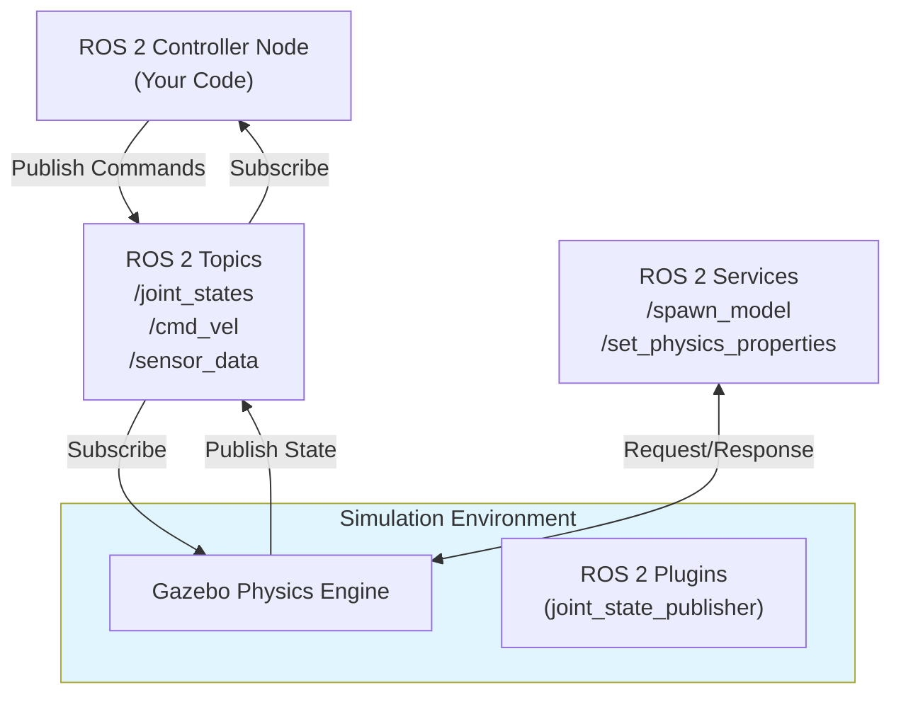

# Chapter 1: Introduction to Digital Twin Simulation

**Estimated time**: 2-3 hours | **Difficulty**: Beginner | **Week**: 6, Day 1

## Learning Objectives

After completing this chapter, you will be able to:

1. **Define Digital Twin** in robotics context and explain its purpose in humanoid robot development
2. **Justify why simulation is essential** for humanoid robotics (safety, iteration speed, cost reduction)
3. **Compare Gazebo and Unity** simulation tools, understanding their strengths and appropriate use cases
4. **Apply rigid-body dynamics fundamentals** to understand how physics simulations work
5. **Identify humanoid-specific simulation challenges** (center of mass, balance, contact dynamics) unique to bipedal robots
6. **Diagnose and tune physics parameters** (friction, damping, collision margins) to achieve stable simulations
7. **Explain how ROS 2 connects** with simulation tools through topics, services, and computation graphs
8. **Evaluate industrial Digital Twin applications** used by companies like Boston Dynamics, Tesla, and Unitree

## Key Concepts

Before diving into the technical details, let's establish the core ideas you'll encounter throughout this chapter:

1. **Digital Twin**: A virtual replica of a physical system that mirrors its behavior, enabling safe experimentation and validation
2. **Simulation fidelity**: The accuracy of virtual behavior compared to real-world physics
3. **Physics engine**: Software that computes rigid-body dynamics, collisions, and constraint enforcement
4. **Gazebo**: An open-source physics simulator optimized for robotics (non-real-time, physics-accurate)
5. **Unity**: A game engine also used for robotics, optimized for real-time rendering and interaction

---

## What is a Digital Twin?

### Definition

A **Digital Twin** is a virtual replica of a physical robot that runs in simulation. It mirrors the structure, physics, sensors, and dynamics of the real robot, allowing you to:

- **Test algorithms safely** without risking hardware damage
- **Iterate quickly** on designs before manufacturing
- **Validate control systems** before deployment
- **Train machine learning models** on synthetic data
- **Debug perception systems** in controlled environments

### Real-World Examples

**Boston Dynamics Spot**: Boston Dynamics uses physics simulations to validate locomotion algorithms before deploying to the physical Spot robot. Simulation allows them to test thousands of terrain variations in hours.

**Tesla Optimus**: Tesla's humanoid robot development relies heavily on simulation for motion planning, grasping, and interaction strategies before hardware deployment.

**Unitree H1**: Unitree's humanoid robots are developed and tested extensively in simulation (both Gazebo and their proprietary simulators) before real-world validation.

### Why Digital Twins Matter for Humanoid Robotics

Humanoid robots are **complex**, **expensive**, and **physically dangerous** to experiment with:

- **Cost**: A research-grade humanoid costs $50,000-$500,000+
- **Time**: Building and tuning hardware takes months
- **Risk**: Programming errors can cause the robot to fall, break components, or injure humans
- **Scale**: You can run thousands of simulations in parallel; only one physical robot exists

With a Digital Twin, you work in simulation first (fast, cheap, safe), then deploy validated algorithms to real hardware.

---

## Why Simulation is Essential for Humanoid Robotics

### Benefits of Simulation

| Benefit | Real Hardware | Simulation |
|---------|---------------|-----------|
| **Speed** | Months to iterate | Hours to iterate |
| **Cost** | $100k-$500k+ hardware + maintenance | Free (open-source Gazebo) |
| **Safety** | Risk of falls, injuries, damage | Zero risk |
| **Repeatability** | Environmental variation | Perfect control |
| **Scale** | One robot | Hundreds of simulations in parallel |
| **Data generation** | Limited by time | Unlimited synthetic datasets |

### Use Cases for Simulation

1. **Algorithm Development**: Test walking gaits, grasping strategies, and control laws without hardware
2. **Sensor Integration**: Validate perception algorithms with realistic sensor noise models
3. **Training Data Generation**: Create large-scale synthetic datasets with ground truth annotations
4. **Sim-to-Real Transfer**: Train machine learning models in simulation, deploy to real hardware
5. **Education**: Learn robotics without access to expensive hardware

---

## Gazebo vs. Unity: Strengths and Trade-offs

When building a Digital Twin, you have choices about which simulation tools to use. The two most popular for robotics are **Gazebo** and **Unity**. They serve different purposes:

### Comparison Table

| Dimension | Gazebo | Unity |
|-----------|--------|-------|
| **Physics Accuracy** | High (research-grade engines: ODE, Bullet, DART) | Medium (PhysX optimized for real-time, not max accuracy) |
| **Rendering Quality** | Basic (sufficient for debugging, not photorealistic) | Excellent (production-quality graphics, HDRP) |
| **Real-time Performance** | Non-real-time (accurate long-horizon simulations) | Real-time (optimized for interactive use) |
| **Learning Curve** | Steep (SDF syntax, physics tuning) | Moderate (visual editor, familiar game engine) |
| **Best Use Cases** | Physics validation, algorithm testing, non-real-time batch runs | Visualization, interactive control, training data with lighting variety |
| **ROS 2 Integration** | Native (gazebo_ros packages) | Requires bridge (ros2cs or ROS-for-Unity) |
| **Cost** | Free, open-source | Free (personal) or paid (enterprise) |

### When to Use Gazebo

✅ **Use Gazebo when you need**:
- Maximum physics accuracy for algorithm validation
- Long-horizon simulations (minutes or hours)
- To test controllers before hardware deployment
- To batch-run hundreds of simulations in parallel
- Native ROS 2 integration without extra setup

❌ **Don't use Gazebo for**:
- Real-time interactive visualization
- Photorealistic rendering for human review
- Projects with strict real-time constraints

### When to Use Unity

✅ **Use Unity when you need**:
- High-fidelity visualization for stakeholder demos
- Real-time interactive control and visualization
- Synthetic training datasets with photorealistic images
- Domain randomization for visual robustness
- VR/AR integration for human-robot interaction

❌ **Don't use Unity for**:
- Maximum physics accuracy (PhysX is approximate)
- Long-duration high-load simulations
- Projects without real-time visualization requirements

### Recommended Workflow

**For most humanoid robotics projects**, use both:

1. **Gazebo**: Validate physics and algorithms (Week 6)
2. **Unity**: Generate training data and visualizations (Week 7)
3. **Gazebo + Unity together**: Export Gazebo trajectories, replay in Unity with photorealistic rendering

---

## Understanding Rigid-Body Physics

To understand how simulations work, you need to know the basics of rigid-body dynamics—the physics that simulation engines compute.

### Core Physics Concepts

**Inertia**: How much an object resists acceleration. Heavy objects (high inertia) change speed slowly; light objects change speed quickly.

```
F = m * a  (Newton's Second Law)
```

Where F is force, m is mass, a is acceleration. For rotational motion, replace m with moment of inertia (I) and a with angular acceleration.

**Gravity**: The constant downward force on all objects. On Earth, gravity is approximately 9.81 m/s².

```
F_gravity = m * g = m * 9.81 m/s²
```

**Friction**: Resistance to sliding motion between surfaces. Higher friction = more resistance.

```
Coefficient of friction (μ): typically 0.5-2.0 for common materials
Friction force ≈ μ * Normal force
```

**Collisions**: When two objects touch, contact forces prevent them from passing through each other.

```
Contact parameters configured in SDF:
- Friction coefficient: 0.5-2.0 (material dependent)
- Restitution (bounciness): 0.0-1.0
- Collision margin: 0.001-0.01m (buffer zone)
```

### How Simulation Engines Work

Physics simulation engines work by:

1. **Detecting collisions** between objects
2. **Computing contact forces** at collision points
3. **Updating velocities** based on forces (F = m*a)
4. **Updating positions** based on velocities
5. **Repeating** at high frequency (e.g., 1000 Hz)

Modern engines handle thousands of objects and interactions efficiently, though the level of accuracy varies.

---

## Common Physics Simulation Issues

Even with modern simulation engines, you'll encounter stability issues. Understanding these helps you debug:

### Issue 1: Tunneling

**What it is**: Objects pass through each other instead of colliding.

**Cause**: Simulation timestep is too large. If an object moves 2 meters per step and another is only 1 meter thick, they can skip past each other.

**Solution**: Reduce collision margin or increase simulation frequency (reduce timestep).

**Example tuning**:
```yaml
# In Gazebo SDF world file:
gravity: [0, 0, -9.81]
physics:
  max_step_size: 0.001  # 1000 Hz
  collision:
    surface:
      contact:
        collide_without_contact_max_batch: 10
```

### Issue 2: Jitter

**What it is**: Objects vibrate or bounce unnaturally, even at rest.

**Cause**: Collision forces are too stiff or damping is too low.

**Solution**: Increase friction and damping coefficients.

**Example tuning**:
```yaml
# Friction coefficient: 0.5-2.0
# Damping ratio: 0.1-0.9
# Higher values = more stable, but less responsive
```

### Issue 3: Divergence

**What it is**: Simulation becomes unstable and explodes (objects fly off).

**Cause**: Physics parameters don't match the object's properties (e.g., inertia tensor is wrong).

**Solution**: Double-check mass, inertia tensor, and friction values against real-world measurements.

---

## Humanoid-Specific Simulation Challenges

When simulating bipedal humanoid robots (not quadrupeds or wheeled platforms), you face unique challenges:

### Challenge 1: Center of Mass and Balance

Humanoids are tall, narrow, and unstable. Their center of mass (COM) must stay within the support polygon (the area bounded by their feet) to remain balanced.

```
Simulation requirement:
- Accurate inertia tensors for each body segment
- Correct mass distribution (torso heavier than arms/legs)
- Stable ground contact (no sliding feet)
```

**Debugging tip**: In Gazebo, visualize the COM (Tools → View → Show Center of Mass) and verify it's above the feet.

### Challenge 2: Contact-Rich Dynamics

Humanoids interact heavily with the environment through:
- Feet maintaining ground contact during walking
- Hands making and breaking contact with objects (grasping)
- Arms pushing against walls or supporting weight

```
Simulation requirement:
- Accurate friction coefficients for feet
- Realistic contact damping (prevents bouncing)
- Correct collision geometry for hands/feet
```

### Challenge 3: Joint Constraints

Humanoid joints have:
- **Position limits**: Knees bend only to ~120°, hips to ~90°
- **Velocity limits**: Actuators have max speed
- **Torque limits**: Motors have max force

```
Simulation requirement:
- Joint limits defined in URDF (lower/upper bounds)
- Proper damping to prevent oscillation at limits
- Actuator effort limits to prevent unrealistic accelerations
```

---

## ROS 2 Integration with Simulations

Your simulations don't exist in isolation. They communicate with ROS 2 nodes running your control algorithms.

### Architecture Overview



### ROS 2 Communication Patterns

1. **Topics**: Continuous streams of data
   - `/joint_states`: Robot configuration (published by simulator)
   - `/cmd_vel`: Velocity commands (published by controller)
   - `/scan`: LiDAR data (published by simulator)

2. **Services**: Request-response patterns
   - `/spawn_model`: Add a robot or object to the simulation
   - `/set_model_state`: Teleport object to a specific pose
   - `/get_model_state`: Query current state

3. **Actions**: Long-running operations (covered in Module 1, extended in Module 3)

---

## Industry Examples: Digital Twin in Practice

### Boston Dynamics Spot

**Context**: Spot is a quadruped (four-legged) robot, but the lessons apply to humanoids.

**Digital Twin use**:
- Terrain variation: Simulate climbing stairs, rocks, sand with different friction
- Motion planning: Test footstep sequences before deployment
- Learning: Train vision systems to classify terrain types

**Result**: Spot navigates complex terrain safely and efficiently.

### Tesla Optimus

**Context**: Tesla's humanoid is in early development, heavily reliant on simulation.

**Digital Twin use**:
- Grasping: Test object grasping strategies across 1000s of object shapes
- Walking: Validate balance and energy efficiency on varied terrain
- Interaction: Simulate hand-over-hand object passing

**Result**: Accelerates real robot development by validating hundreds of scenarios in simulation.

### Unitree H1

**Context**: Unitree's open-source humanoid framework.

**Digital Twin use**:
- Locomotion: Validate walking gaits in simulation before hardware deployment
- Control gains: Tune PID gains in physics simulation
- Sensor integration: Test perception pipelines with simulated sensors

**Result**: Community members can develop and test algorithms without expensive hardware.

---

## Capstone Integration: Where We're Heading

By Week 8, you'll complete a **capstone project** that ties everything together:

**Week 8 Capstone**: **Humanoid Simulation and Control Challenge**
- Start with a humanoid robot in a custom Gazebo world
- Implement a ROS 2 controller to achieve a task (walk, navigate, grasp)
- Use simulated sensors (LiDAR, depth camera) for perception
- Visualize in Unity for high-fidelity rendering
- Generate a synthetic dataset of the humanoid performing the task

This capstone is preparation for Module 3, where you'll add NVIDIA Isaac Sim for even more advanced features.

---

## Hands-On Code Examples

To illustrate the concepts, here are three practical examples:

### Example 1: ROS 2 Topic Listener for Joint States

This Python script subscribes to the `/joint_states` topic published by Gazebo, letting your controller read the robot's current configuration.

```python
# File: src/listener_node.py
import rclpy
from rclpy.node import Node
from sensor_msgs.msg import JointState

class JointStateListener(Node):
    def __init__(self):
        super().__init__('joint_state_listener')
        self.subscription = self.create_subscription(
            JointState,
            '/joint_states',
            self.joint_state_callback,
            10
        )
        self.get_logger().info('Joint state listener started')

    def joint_state_callback(self, msg: JointState):
        # msg.name: list of joint names
        # msg.position: current joint angles (radians)
        # msg.velocity: current joint velocities
        self.get_logger().info(f'Received {len(msg.name)} joints')
        for name, pos in zip(msg.name, msg.position):
            self.get_logger().info(f'{name}: {pos:.3f} rad')

def main(args=None):
    rclpy.init(args=args)
    node = JointStateListener()
    rclpy.spin(node)
    node.destroy_node()
    rclpy.shutdown()

if __name__ == '__main__':
    main()
```

**Run it**:
```bash
ros2 run your_package listener_node
# In another terminal, start Gazebo with the humanoid
gazebo <world_file>
```

### Example 2: ROS 2 Service Client to Spawn Objects

This script demonstrates how to use the `/spawn_model` service (provided by Gazebo's ROS 2 plugins) to add a new object to the simulation.

```python
# File: src/spawn_object_client.py
import rclpy
from rclpy.node import Node
from gazebo_msgs.srv import SpawnEntity
from geometry_msgs.msg import Pose
from std_msgs.msg import Header

class SpawnObjectClient(Node):
    def __init__(self):
        super().__init__('spawn_object_client')
        self.client = self.create_client(SpawnEntity, '/spawn_entity')
        while not self.client.wait_for_service(timeout_sec=1.0):
            self.get_logger().info('Service not available, waiting...')

    def spawn_box(self, name: str, x: float, y: float, z: float):
        # Define a simple box in SDF format
        sdf_content = f'''<?xml version="1.0" ?>
<sdf version="1.7">
  <model name="{name}">
    <link name="link">
      <inertial>
        <mass>1.0</mass>
        <inertia>
          <ixx>0.01</ixx>
          <iyy>0.01</iyy>
          <izz>0.01</izz>
        </inertia>
      </inertial>
      <collision name="collision">
        <geometry>
          <box>
            <size>0.1 0.1 0.1</size>
          </box>
        </geometry>
      </collision>
      <visual name="visual">
        <geometry>
          <box>
            <size>0.1 0.1 0.1</size>
          </box>
        </geometry>
        <material>
          <ambient>1 0 0 1</ambient>
        </material>
      </visual>
    </link>
  </model>
</sdf>'''

        # Create request
        request = SpawnEntity.Request()
        request.name = name
        request.xml = sdf_content
        request.robot_namespace = ''
        request.initial_pose = Pose()
        request.initial_pose.position.x = x
        request.initial_pose.position.y = y
        request.initial_pose.position.z = z

        # Send request
        future = self.client.call_async(request)
        rclpy.spin_until_future_complete(self, future)

        if future.result() is not None:
            self.get_logger().info(f'Spawned {name} at ({x}, {y}, {z})')
        else:
            self.get_logger().error(f'Failed to spawn {name}')

def main(args=None):
    rclpy.init(args=args)
    node = SpawnObjectClient()
    node.spawn_box('red_box_1', 1.0, 1.0, 0.5)
    node.destroy_node()
    rclpy.shutdown()

if __name__ == '__main__':
    main()
```

### Example 3: Gravity and Physics Calculation (Pseudo-code)

This illustrates the basic physics computation a simulation engine performs each timestep:

```python
# File: src/physics_demo.py
# This is pseudo-code showing physics concepts, not executable

class RigidBody:
    def __init__(self, mass, position, velocity):
        self.mass = mass
        self.position = position  # [x, y, z]
        self.velocity = velocity  # [vx, vy, vz]
        self.acceleration = [0, 0, 0]

    def apply_gravity(self, g=9.81):
        # Gravity only affects vertical motion
        # F = m*g, so a = F/m = g
        self.acceleration[2] -= g  # downward

    def apply_friction(self, friction_coeff=0.5):
        # Friction opposes motion: f = μ * N
        # For horizontal motion on ground, N = m*g
        for i in range(2):  # x and y directions
            if self.velocity[i] != 0:
                friction_force = friction_coeff * self.mass * 9.81
                # Friction direction opposes velocity
                direction = -1 if self.velocity[i] > 0 else 1
                self.acceleration[i] += direction * (friction_force / self.mass)

    def update(self, dt=0.001):
        # Euler integration (simple physics step)
        # v_new = v_old + a * dt
        for i in range(3):
            self.velocity[i] += self.acceleration[i] * dt

        # x_new = x_old + v * dt
        for i in range(3):
            self.position[i] += self.velocity[i] * dt

        # Reset acceleration for next step
        self.acceleration = [0, 0, 0]

# Example usage (not runnable, for illustration):
# box = RigidBody(mass=1.0, position=[0, 0, 1.0], velocity=[1.0, 0, 0])
# for step in range(1000):
#     box.apply_gravity()
#     box.apply_friction()
#     box.update()
#     # After 1 second, box has fallen 1 meter (h = 0.5*g*t²)
```

---

## End-of-Chapter Exercises

### Exercise 1: Define and Compare

**Task**: Write a 2-3 paragraph explanation of "Digital Twin" that you could explain to someone outside robotics.

**Acceptance Criteria**:
- Definition uses everyday language (no unexplained jargon)
- Compares Digital Twin to similar concepts (e.g., flight simulators, virtual healthcare twins, digital twins in manufacturing)
- Explains why robotics benefits uniquely from Digital Twins

**Hint**: Think about how pilots train in flight simulators before flying real planes.

### Exercise 2: Simulation Trade-offs

**Task**: Create a table or decision tree for: "When should I use Gazebo vs. Unity for my project?"

**Acceptance Criteria**:
- Identifies at least 4 factors (physics accuracy, real-time, rendering quality, use case)
- For 3 different project scenarios, recommends Gazebo, Unity, or both
- Justifies each recommendation with factors from your table

**Example scenarios**:
1. Validating a walking controller before hardware deployment
2. Creating a promotional video of a humanoid picking up objects
3. Training a deep learning model for object detection

### Exercise 3: Physics Parameter Tuning

**Task**: Given a humanoid that's vibrating excessively in simulation, identify 3 physics parameters you would adjust and explain why.

**Acceptance Criteria**:
- Names 3 specific parameters (friction, damping, collision margin, etc.)
- Explains the effect of each parameter on jitter
- Provides realistic tuning ranges (e.g., "friction coefficient from 0.5 to 2.0")

**Hint**: Reread the "Common Physics Simulation Issues" section for parameter examples.

### Exercise 4: Industrial Application Research

**Task**: Research one company using Digital Twin simulations (Boston Dynamics, Tesla, Unitree, or another). Write a 1-page summary of their application.

**Acceptance Criteria**:
- Identifies the company and their robot
- Explains how they use simulation (physics validation? training data? visualization?)
- Describes the benefits they gained (faster development, cost savings, etc.)
- Cites at least one credible source

**Resources**:
- Boston Dynamics blog: https://blog.bostondynamics.com/
- Tesla bot announcements: Search "Tesla Optimus simulation"
- Unitree documentation: https://www.unitreerobotics.com/

---

## Summary

In this chapter, you've learned:

✅ **What a Digital Twin is**: A virtual replica of a robot that enables safe, fast, cost-effective development

✅ **Why simulation matters**: Physics validation, algorithm testing, and training data generation before deploying to expensive hardware

✅ **Gazebo vs. Unity trade-offs**: Gazebo for physics accuracy, Unity for real-time rendering and visualization

✅ **Physics fundamentals**: Inertia, gravity, friction, and collisions drive simulation behavior

✅ **Humanoid challenges**: Bipedal balance, contact dynamics, and joint constraints are trickier than other robot types

✅ **ROS 2 integration**: Simulations communicate with your control algorithms via topics and services

✅ **Industry practice**: Leading robotics companies rely on Digital Twins for development

---

## What's Next?

Now that you understand the concepts, it's time to get hands-on. In [Chapter 2: Physics Simulation in Gazebo](./chapter-2-gazebo-physics-simulation.md), you'll:

1. Install Gazebo on Ubuntu 22.04
2. Create your first physics simulation world
3. Load a humanoid robot URDF
4. Configure physics parameters
5. Run your first ROS 2-controlled simulation

**Estimated time for Chapter 2**: 4-5 hours

**Difficulty increase**: From conceptual (this chapter) to hands-on (Chapter 2)

Ready? Head to Chapter 2!

---

**Have questions?** Use the RAG chatbot (select any text on this page and ask a question) for context-aware answers based on the entire curriculum.
