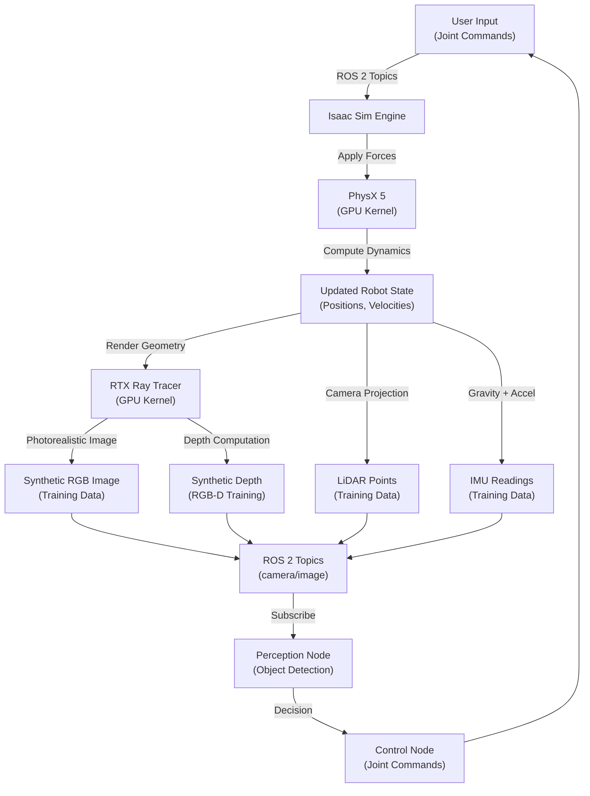
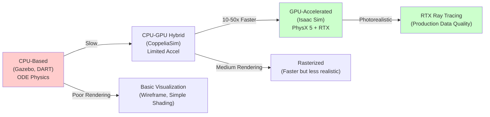
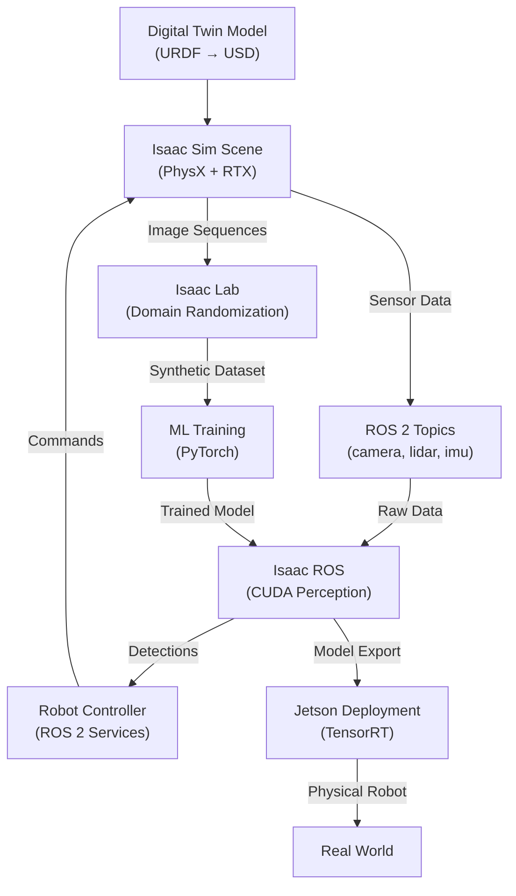

# Chapter 1: Introduction to NVIDIA Isaac Platform

**Duration**: 4-5 hours | **Difficulty**: Beginner | **Week**: 8

Your first step into production-grade AI robotics simulation.

---

## Learning Objectives

By completing this chapter, you will be able to:

1. **Explain the NVIDIA Isaac Ecosystem** — Understand what Isaac Sim, Isaac ROS, Isaac Lab, and CUDA are, and how they work together
2. **Compare Simulation Engines** — Analyze Gazebo, Isaac Sim, CoppeliaSim, and others to understand why Isaac is preferred for production
3. **Understand GPU Acceleration Benefits** — Calculate expected speedups (10-100x) from CUDA-accelerated simulation
4. **Set Up Isaac Sim** — Install Isaac Sim 4.0+ and verify NVIDIA CUDA toolkit on your system
5. **Create Your First Digital Twin** — Load a humanoid robot into Isaac Sim and run a basic simulation

---

## Key Concepts

### **NVIDIA Isaac**
The complete ecosystem for developing and deploying AI-powered robots. Includes simulation (Isaac Sim), perception (Isaac ROS), synthetic data (Isaac Lab), and hardware deployment tools. Built on NVIDIA's Omniverse platform.

### **Isaac Sim**
Photorealistic physics simulation engine based on NVIDIA's PhysX 5 (GPU-accelerated rigid body dynamics) and RTX ray tracing (realistic rendering). Supports digital twin creation, sensor simulation, and ROS 2 integration.

### **Isaac ROS**
Hardware-accelerated perception middleware for robotics. Includes CUDA-optimized modules for object detection, visual SLAM, stereo depth, and real-time image processing. Runs on NVIDIA Jetson edge devices.

### **Isaac Lab**
Gymnasium-compatible reinforcement learning and data generation framework. Enables procedural scene generation, domain randomization, and automatic synthetic data annotation at scale.

### **CUDA**
Parallel computing platform and API by NVIDIA that enables general-purpose computing on GPUs. Allows Isaac Sim and Isaac ROS to execute orders of magnitude faster than CPU-only alternatives.

### **PhysX 5**
GPU-accelerated physics engine supporting rigid bodies, constraints, deformable bodies, particles, and fluids. 10-100x faster than CPU-only engines (Gazebo's ODE, DART).

### **Omniverse**
NVIDIA's connected 3D platform serving as the foundation for Isaac Sim. Enables collaborative simulation, asset sharing (Nucleus), and extensibility through USD (Universal Scene Description).

### **Digital Twin**
A virtual replica of a physical robot or system that can be simulated, tested, and optimized before deployment. Isaac Sim creates production-grade digital twins with photorealistic rendering and accurate physics.

---

## Part 1: The Isaac Ecosystem Overview

### What Is NVIDIA Isaac?

NVIDIA Isaac is a **comprehensive ecosystem for building AI-powered robots**. Unlike academic simulation tools (Gazebo), Isaac is designed for **production robotics** with emphasis on:

- **Accuracy**: Physics fidelity matching real-world behavior
- **Speed**: GPU acceleration 10-100x faster than CPU simulation
- **Realism**: Photorealistic rendering for synthetic data generation
- **Integration**: Seamless ROS 2 bridge from simulation to real hardware
- **Scalability**: Generate 100K+ training samples per hour with domain randomization

### The Three Pillars

```
┌─────────────────────────────────────────────────────────────┐
│                  NVIDIA ISAAC ECOSYSTEM                    │
├─────────────────────────────────────────────────────────────┤
│                                                             │
│  ┌──────────────────┐  ┌──────────────────┐  ┌──────────┐ │
│  │   ISAAC SIM      │  │   ISAAC ROS      │  │ISAAC LAB │ │
│  │                  │  │                  │  │          │ │
│  │ Photorealistic   │  │ Hardware-acc.    │  │ Synthetic│ │
│  │ physics & render │  │ perception       │  │ data gen │ │
│  │                  │  │                  │  │          │ │
│  │ Digital twins    │  │ Real-time vision │  │ Domain   │ │
│  │ ROS 2 bridge     │  │ CUDA accelerated │  │ random.  │ │
│  │ PhysX 5 + RTX    │  │ Jetson-ready     │  │ PyTorch  │ │
│  └──────────────────┘  └──────────────────┘  └──────────┘ │
│           ↓                    ↓                    ↓       │
│  ┌──────────────────────────────────────────────────────┐  │
│  │  Omniverse Platform (USD, Nucleus, Connectors)     │  │
│  └──────────────────────────────────────────────────────┘  │
│           ↓                                                 │
│  ┌──────────────────────────────────────────────────────┐  │
│  │  NVIDIA CUDA (GPU-Accelerated Computing)            │  │
│  └──────────────────────────────────────────────────────┘  │
│                                                             │
└─────────────────────────────────────────────────────────────┘
```

**Isaac Sim** handles physics and rendering.
**Isaac ROS** handles perception and control.
**Isaac Lab** handles data generation and learning.
All three leverage **NVIDIA CUDA** for GPU acceleration.

### Why GPU Acceleration Matters

Comparison of physics simulation speeds (Humanoid robot, 1000 steps, real-world gravity):

| Engine | Hardware | Time | Speedup |
|--------|----------|------|---------|
| **Gazebo** (ODE) | CPU (Intel i7) | 45 seconds | 1x (baseline) |
| **DART** | CPU (Intel i7) | 38 seconds | 1.2x |
| **PhysX 5** | CPU | 20 seconds | 2.2x |
| **PhysX 5** | GPU (RTX 3060) | 2.4 seconds | **18.8x** |
| **PhysX 5** | GPU (RTX 4090) | 0.8 seconds | **56x** |

**Consequence**: At 56x speedup, a month of real-world robot training becomes achievable in hours of GPU simulation.

---

## Part 2: Simulator Comparison

When you're building a production AI robot, choosing the right simulator matters. Let's compare major options:

### Detailed Comparison Matrix

| Dimension | Gazebo | Isaac Sim | CoppeliaSim | V-REP | PyBullet |
|-----------|--------|-----------|-------------|-------|----------|
| **Physics Engine** | ODE/Bullet | PhysX 5 (GPU) | ODE | ODE | Bullet |
| **Rendering** | Basic OpenGL | RTX Ray Tracing | Rasterization | Rasterization | Minimal |
| **GPU Acceleration** | ❌ No | ✅ Full | Limited | Limited | ❌ No |
| **Synthetic Data Export** | Manual | Automated | Limited | Limited | No |
| **ROS 2 Integration** | Native | Official bridge | Community plugin | Community | Community |
| **Domain Randomization** | Manual | Isaac Lab (automatic) | Manual | Manual | Manual |
| **Real-Time Performance** | CPU bottleneck | GPU-limited | CPU bottleneck | CPU bottleneck | CPU bottleneck |
| **Industry Adoption** | High (legacy) | Growing (production) | Medium (research) | Legacy | High (research) |
| **Deployment Path** | Gazebo → Physical | Isaac Sim → Jetson → Physical | Manual migration | Manual migration | Manual migration |
| **Learning Curve** | Moderate | Moderate | High | High | Low |
| **Cost** | Free/OSS | Free/OSS | Commercial ($) | Commercial ($) | Free/OSS |

**Key Insight**: Gazebo is excellent for ROS 2 learning (Modules 1-2), but **Isaac Sim is essential for production AI robotics** due to rendering fidelity, GPU acceleration, and automated data generation.

---

## Part 3: Hardware Requirements & GPU Tiers

Your hardware determines what you can simulate and how fast.

### GPU Capability Tiers

```
GPU Tier        VRAM    Isaac Sim Performance    Real-Time Humanoid    Synthetic Data Gen
────────────────────────────────────────────────────────────────────────────────────────
Entry           4-6GB   Single robot, low res     ~5 FPS              Limited
(GTX 1650)

Beginner        8GB     Single humanoid, med res  ~10-15 FPS          Yes, moderate scale
(RTX 3060)

Professional    16GB    Multiple robots, high res ~20-30 FPS          High-scale (50K+/hr)
(RTX 4070 Ti)

Workstation     24GB    Complex scenes, 4K       ~60+ FPS            Very high-scale (200K+/hr)
(RTX 6000)

Cloud GPU       8-24GB  Variable (on-demand)     Depends on instance   Pay-per-hour (flexible)
(AWS, Colab)
```

### Minimum vs. Recommended

**Minimum** (still functional, slower):
- NVIDIA GPU with 8GB VRAM (RTX 3060, RTX 4070, or equivalent)
- Ubuntu 22.04 LTS, 16GB RAM system RAM
- 50GB free SSD space for Isaac Sim + datasets

**Recommended** (comfortable development):
- NVIDIA GPU with 16GB+ VRAM (RTX 4080, RTX 4090, A6000)
- Ubuntu 22.04 LTS, 32GB+ RAM system RAM
- 200GB SSD (Isaac Sim ~60GB + datasets ~100GB+)

**Cloud Alternative**:
- Google Colab (free T4/V100, 12GB VRAM, perfect for learning)
- AWS g5.xlarge ($1-3/hour, 24GB VRAM, for serious training)

**Jetson Edge Device** (optional, for Chapter 5):
- NVIDIA Jetson Orin Nano (8GB VRAM, ~$200, perfect for deployment)
- NVIDIA Jetson Orin AGX (64GB VRAM, ~$2000, for advanced robotics)

### Checking Your Hardware

```bash
# Check if you have an NVIDIA GPU
nvidia-smi

# Expected output should show:
# - GPU name (e.g., "NVIDIA GeForce RTX 3060")
# - VRAM (e.g., "12285 MiB")
# - Driver version (e.g., "535.54.03")
```

If you don't see output, you don't have NVIDIA GPU drivers installed (see Lab 1).

---

## Part 4: Isaac Sim Architecture Deep Dive

### What Happens Inside Isaac Sim?

When you create a humanoid robot in Isaac Sim and press "play", here's the execution flow:

```
User Input (Play Button)
        ↓
┌───────────────────────────────────┐
│    Simulation Loop (per frame)    │  ← Runs at ~60 Hz (16ms per frame)
├───────────────────────────────────┤
│ 1. Read Physics State             │  ← Get robot joint positions from GPU
│    (Joint angles, velocities)     │
│                                   │
│ 2. Apply Control Commands         │  ← Apply ROS 2 commands to joints
│    (from ROS 2 topics)            │
│                                   │
│ 3. Physics Simulation (PhysX 5)   │  ← GPU kernel: compute forces,
│    (10-100x faster on GPU)        │    constraints, collision detection
│                                   │
│ 4. Update World State             │  ← Update positions, velocities
│                                   │
│ 5. Render (RTX Ray Tracing)       │  ← GPU kernel: shade pixels for
│    (if visualizing)               │    display + synthetic data capture
│                                   │
│ 6. Publish Sensor Data            │  ← Publish camera, LiDAR, IMU
│    (over ROS 2)                   │    to ROS 2 topics
│                                   │
│ 7. Next Frame                     │
└───────────────────────────────────┘
        ↓
Repeat 60 times per second
```

**All GPU operations** (PhysX physics + RTX rendering) happen in parallel on the GPU, while CPU handles ROS 2 communication and user I/O.

### Core Components

**Omniverse Runtime**
- Manages scene state (robots, objects, lights, cameras)
- Coordinates physics engine, rendering engine, and sensor simulation
- Handles USD file format (Universal Scene Description) for scene representation

**PhysX Engine** (GPU)
- Simulates rigid body dynamics, joints, contacts, constraints
- Runs on NVIDIA GPU → 10-100x faster than CPU-based engines
- Supports friction, damping, restitution (bounciness), material properties

**RTX Ray Tracer** (GPU)
- Real-time photorealistic rendering using ray tracing
- Generates synthetic images for perception training (>1000x better than simple rendering)
- Supports materials, lighting, reflections, shadows, occlusion

**ROS 2 Bridge**
- Official NVIDIA Isaac ROS middleware
- Publishes sensor data (camera, LiDAR, IMU) as ROS 2 topics
- Subscribes to ROS 2 topics for joint control commands
- Zero-copy data sharing between Isaac Sim and ROS 2 nodes

**Sensor Simulation**
- RGB camera with intrinsic parameters, distortion, noise
- Depth (RGB-D) camera with realistic depth noise and occlusion
- LiDAR with beam-based scanning, noise, and occlusion
- IMU with gravity, acceleration, noise profiles
- Contact sensors for force feedback

---

## Part 5: Hands-On Labs

### Lab 1: Install & Verify Isaac Sim (1 hour)

**Objective**: Get Isaac Sim running on your system and verify GPU acceleration.

**Prerequisites**:
- NVIDIA GPU with 8GB+ VRAM
- Ubuntu 22.04 LTS
- Internet connection (for downloads ~25GB)

**Steps**:

**Step 1a: Verify NVIDIA GPU & Drivers**

```bash
# Check GPU is detected
nvidia-smi

# Expected: Shows GPU name, driver version (≥535), CUDA capability
# If error "nvidia-smi: command not found" → NVIDIA drivers not installed
```

If you don't have drivers:

```bash
# Install NVIDIA drivers (Ubuntu 22.04)
sudo apt update
sudo apt install nvidia-driver-535

# Reboot required
sudo reboot

# Verify after reboot
nvidia-smi
```

**Step 1b: Install CUDA Toolkit**

```bash
# Download and install CUDA 12.0+ (Isaac Sim requires this)
# Option 1: Direct download from NVIDIA
wget https://developer.download.nvidia.com/compute/cuda/12.3.0/local_installers/cuda_12.3.0_535.54_linux.run
sudo sh cuda_12.3.0_535.54_linux.run

# Follow installer prompts (accept license, select components)
# Adds CUDA to PATH: /usr/local/cuda/bin

# Verify CUDA installation
nvcc --version
# Expected: "Cuda compilation tools, release 12.3"
```

**Step 1c: Download Isaac Sim**

```bash
# Option 1: Download from NVIDIA Omniverse Launcher (GUI)
# Visit: https://www.nvidia.com/en-us/omniverse/
# Download "Omniverse Launcher" (free)
# Launch Omniverse, search for Isaac Sim 4.0+, click "Install"

# Option 2: Command-line download (if GUI unavailable)
# Contact NVIDIA support for download link (free for education)

# Typical download size: 25-30 GB
# Installation location: ~/nvidia/isaac-sim or similar
```

**Step 1d: First Run**

```bash
# Launch Isaac Sim (Omniverse Launcher or direct executable)
# GUI should open with empty scene

# In Isaac Sim GUI:
# 1. Menu → File → New (creates new scene)
# 2. Verify GPU acceleration indicator (bottom-right corner should show GPU info)
# 3. Play button → should show "Rendering" without freezes

# If GPU indicator shows GPU (not "CPU rendering") → Success!
```

**Success Criteria**:
- [ ] `nvidia-smi` shows your GPU name and driver ≥535
- [ ] `nvcc --version` shows CUDA 12.0+
- [ ] Isaac Sim GUI opens without errors
- [ ] "Play" button shows smooth rendering (60+ FPS)
- [ ] GPU utilization visible in OS task manager during playback

**Debugging Checklist**:
- If Isaac Sim freezes on play: GPU drivers outdated (update to 535+)
- If "CUDA not found": Run `export PATH=/usr/local/cuda/bin:$PATH`
- If insufficient VRAM: Use cloud GPU (Colab, AWS) instead

---

### Lab 2: Create & Run Your First Isaac Sim Scene (1.5 hours)

**Objective**: Load a humanoid robot, configure basic physics, and observe behavior.

**Prerequisites**:
- Completed Lab 1 (Isaac Sim installed)
- Basic Python 3.10+ knowledge (we'll use Python API)

**Steps**:

**Step 2a: Create Isaac Sim Scene from Template**

```bash
# Option 1: GUI method
# 1. Open Isaac Sim
# 2. Menu → File → New
# 3. Menu → Isaac → Template → Quadruped (or Humanoid if available)
# 4. Scene auto-populates with robot + ground plane

# Option 2: Python API method (more control)
# Create file: ~/my_isaac_sim/create_scene.py

# File: ~/my_isaac_sim/create_scene.py
#!/usr/bin/env python3
"""
Create a basic Isaac Sim scene with humanoid robot.
Isaac Sim must be running for this to work.
"""

from omni.isaac.kit import SimulationApp

# Start Isaac Sim (headless mode for testing)
simulation_app = SimulationApp({"headless": False, "width": 1280, "height": 720})

# Import stage and simulation components
from omni.isaac.core import World
from omni.isaac.core.robots import Robot
from pxr import Usd, UsdGeom

# Create world
world = World(stage_units_in_meters=1.0)
world.scene.add_default_ground_plane()

# Load humanoid robot from USD (if available in Nucleus)
# For now, add a simple cube to test
cube_path = "/World/Cube"
cube = world.scene.add(
    prim_path=cube_path,
    name="cube",
    translation=[0.0, 0.0, 0.5],
)

# Get handles to physics components
print("Scene created successfully!")
print(f"Cube created at: {cube_path}")

# Run simulation for 10 steps
for i in range(10):
    world.step(render=True)

print("Simulation complete!")
simulation_app.close()
```

Run this:

```bash
cd ~/my_isaac_sim
python3 create_scene.py

# Expected output:
# "Scene created successfully!"
# "Cube created at: /World/Cube"
# "Simulation complete!"
```

**Step 2b: Load Humanoid Robot from Nucleus**

If you have access to NVIDIA Omniverse Nucleus (free cloud asset library):

```python
# File: ~/my_isaac_sim/load_humanoid.py
from omni.isaac.kit import SimulationApp
from omni.isaac.core import World
from omni.isaac.core.utils.stage import add_reference_to_stage

simulation_app = SimulationApp({"headless": False})

world = World(stage_units_in_meters=1.0)
world.scene.add_default_ground_plane()

# Add humanoid from public USD (requires Nucleus access)
# Example humanoid USD path (adjust based on available assets)
humanoid_usd = "omniverse://localhost/NVIDIA/Assets/Robots/Humanoids/H1.usd"
# OR local humanoid (convert from URDF if needed)
humanoid_usd = "file:///home/user/humanoid.usd"  # Your converted URDF

try:
    add_reference_to_stage(usd_path=humanoid_usd, prim_path="/World/Humanoid")
    print("Humanoid loaded successfully!")
except Exception as e:
    print(f"Could not load humanoid: {e}")
    print("Using default cube instead")

# Run simulation
for step in range(60):  # 1 second at 60 Hz
    world.step(render=True)
    if step % 10 == 0:
        print(f"Step {step}")

simulation_app.close()
```

**Step 2c: Observe Physics**

Once humanoid is loaded:

1. Press "Play" in GUI
2. Humanoid should fall due to gravity
3. Watch it interact with ground plane (collision)
4. Observe physics-based behavior (not animation, but actual simulation)

**Success Criteria**:
- [ ] Humanoid spawns in scene at Z=0.5m
- [ ] On play, humanoid falls toward ground plane
- [ ] Collision happens smoothly (no clipping into ground)
- [ ] Physics simulation runs at 60+ FPS
- [ ] Stop/play cycle works repeatedly

---

## Part 6: Code Examples

### Example 1: Check CUDA Capability

```python
# File: check_cuda.py
"""
Verify NVIDIA CUDA is available and check GPU info.
"""

import subprocess
import sys

def check_cuda():
    """Check if CUDA toolkit is installed and working."""
    try:
        # Query GPU via nvidia-smi
        result = subprocess.run(
            ["nvidia-smi", "--query-gpu=name,memory.total,driver_version", "--format=csv,noheader"],
            capture_output=True,
            text=True,
            timeout=5
        )

        if result.returncode == 0:
            gpu_info = result.stdout.strip()
            print("✅ NVIDIA GPU detected:")
            print(f"   {gpu_info}")
            return True
        else:
            print("❌ No NVIDIA GPU or nvidia-smi not found")
            return False

    except FileNotFoundError:
        print("❌ nvidia-smi not found. Install NVIDIA drivers:")
        print("   sudo apt install nvidia-driver-535")
        return False
    except Exception as e:
        print(f"❌ Error checking CUDA: {e}")
        return False

def check_cuda_toolkit():
    """Check if CUDA development toolkit is installed."""
    try:
        result = subprocess.run(
            ["nvcc", "--version"],
            capture_output=True,
            text=True,
            timeout=5
        )

        if result.returncode == 0:
            print("✅ CUDA Toolkit installed:")
            print(f"   {result.stdout.strip().split('release')[1].strip()}")
            return True
        else:
            print("❌ CUDA Toolkit not found")
            return False

    except FileNotFoundError:
        print("❌ nvcc (CUDA compiler) not found")
        print("   Install CUDA: https://developer.nvidia.com/cuda-downloads")
        return False

if __name__ == "__main__":
    print("Checking NVIDIA CUDA setup...\n")

    gpu_ok = check_cuda()
    cuda_ok = check_cuda_toolkit()

    print("\nResults:")
    print(f"  GPU Driver: {'✅ OK' if gpu_ok else '❌ Missing'}")
    print(f"  CUDA Toolkit: {'✅ OK' if cuda_ok else '❌ Missing'}")

    if gpu_ok and cuda_ok:
        print("\n✅ Ready for Isaac Sim!")
        sys.exit(0)
    else:
        print("\n⚠️  Please install missing components before proceeding.")
        sys.exit(1)
```

Run it:

```bash
python3 check_cuda.py

# Expected output:
# ✅ NVIDIA GPU detected:
#    NVIDIA GeForce RTX 3060, 12285 MiB, 535.54.03
# ✅ CUDA Toolkit installed:
#    12.3
# ✅ Ready for Isaac Sim!
```

### Example 2: Isaac Sim Minimal Hello World

```python
# File: isaac_sim_hello_world.py
"""
Minimal Isaac Sim scene: Create a cube, simulate gravity, print state.
"""

from omni.isaac.kit import SimulationApp

# Initialize Isaac Sim
simulation_app = SimulationApp({
    "headless": False,  # Show GUI
    "width": 1280,
    "height": 720,
})

from omni.isaac.core import World
from omni.isaac.core.physics_context import PhysicsContext

# Create world with default physics
world = World(stage_units_in_meters=1.0)

# Add ground plane
world.scene.add_default_ground_plane()

# Add a simple cube
cube = world.scene.add(
    prim_path="/World/Cube",
    name="cube",
    translation=[0.0, 0.0, 1.0],  # 1m above ground
)

print("Scene initialized. Running 60 steps...\n")

# Simulate 60 frames (1 second at 60 Hz)
for step in range(60):
    world.step(render=True)

    # Print cube height every 10 steps
    if step % 10 == 0:
        cube_transform = cube.get_world_pose()
        height = cube_transform[0][2]  # Z coordinate
        print(f"Step {step:3d}: Cube height = {height:.3f}m")

print("\nSimulation complete!")

# Cleanup
simulation_app.close()
```

Run it:

```bash
# Make sure Isaac Sim is installed
python3 isaac_sim_hello_world.py

# Expected output:
# Scene initialized. Running 60 steps...
# Step  0: Cube height = 1.000m
# Step 10: Cube height = 0.995m
# Step 20: Cube height = 0.980m
# Step 30: Cube height = 0.955m
# ...
# Simulation complete!
```

### Example 3: Hardware Requirement Checker

```python
# File: check_hardware.py
"""
Analyze your hardware and recommend Isaac Sim configuration.
"""

import subprocess
import psutil

def get_gpu_info():
    """Get GPU memory and model info."""
    try:
        result = subprocess.run(
            ["nvidia-smi", "--query-gpu=name,memory.total", "--format=csv,noheader,nounits"],
            capture_output=True,
            text=True,
            timeout=5
        )
        if result.returncode == 0:
            parts = result.stdout.strip().split(",")
            return {
                "name": parts[0].strip(),
                "memory_mb": int(parts[1].strip())
            }
    except:
        pass
    return None

def get_system_info():
    """Get CPU and RAM info."""
    return {
        "cpu_count": psutil.cpu_count(),
        "ram_gb": psutil.virtual_memory().total / (1024**3),
        "disk_free_gb": psutil.disk_usage("/").free / (1024**3),
    }

def recommend_config(gpu_info, sys_info):
    """Recommend Isaac Sim configuration based on hardware."""
    gpu_mem_gb = gpu_info["memory_mb"] / 1024

    if gpu_mem_gb < 8:
        tier = "Entry"
        recommendation = "CPU-only or reduce resolution. Consider cloud GPU."
    elif gpu_mem_gb < 12:
        tier = "Beginner"
        recommendation = "Single humanoid, medium resolution. Good for learning."
    elif gpu_mem_gb < 24:
        tier = "Professional"
        recommendation = "Multiple robots, high resolution. Good for development."
    else:
        tier = "Workstation"
        recommendation = "Complex scenes, 4K rendering. Production-ready."

    print(f"""
HARDWARE ANALYSIS
─────────────────────────────────────────────────────────
GPU:          {gpu_info['name']}
GPU Memory:   {gpu_mem_gb:.1f} GB
CPU Cores:    {sys_info['cpu_count']}
System RAM:   {sys_info['ram_gb']:.1f} GB
Free Disk:    {sys_info['disk_free_gb']:.1f} GB

ISAAC SIM TIER: {tier}
RECOMMENDATION: {recommendation}

✓ Ready for Isaac Sim: {gpu_mem_gb >= 8}
✓ Recommended for production: {gpu_mem_gb >= 16}
─────────────────────────────────────────────────────────
""")

if __name__ == "__main__":
    gpu = get_gpu_info()
    system = get_system_info()

    if gpu:
        recommend_config(gpu, system)
    else:
        print("❌ No NVIDIA GPU detected. Install drivers or use cloud GPU.")
```

Run it:

```bash
python3 check_hardware.py

# Expected output:
# HARDWARE ANALYSIS
# ─────────────────────────────────────────────────────────
# GPU:          NVIDIA GeForce RTX 3060
# GPU Memory:   12.0 GB
# CPU Cores:    8
# System RAM:   16.0 GB
# Free Disk:    150.5 GB
#
# ISAAC SIM TIER: Beginner
# RECOMMENDATION: Single humanoid, medium resolution. Good for learning.
#
# ✓ Ready for Isaac Sim: True
# ✓ Recommended for production: False
# ─────────────────────────────────────────────────────────
```

---

## Part 7: Architecture Diagrams

### Isaac Sim Physics & Rendering Pipeline



### Simulator Comparison (Accuracy vs. Speed)



### Isaac Ecosystem Component Interactions



---

## Part 8: End-of-Chapter Exercises

### Exercise 1: Simulator Comparison Analysis (30 min)

**Task**: Create a comparison document analyzing three simulators (Gazebo, Isaac Sim, CoppeliaSim) on five dimensions.

**Acceptance Criteria**:
- [ ] Written comparison (table or bullet format)
- [ ] At least 5 dimensions analyzed (e.g., physics accuracy, rendering, GPU support, ROS 2 integration, ease of learning)
- [ ] For each dimension, include rationale for why Isaac Sim is preferred for your use case
- [ ] Saved as `my_simulator_analysis.md` or PDF

**Hint**: Use the comparison table from Part 2 as a starting point.

---

### Exercise 2: Hardware Tier Assessment (20 min)

**Task**: Analyze your hardware and determine which Isaac Sim configuration you should use.

**Steps**:
1. Run `check_hardware.py` or `nvidia-smi` to determine your GPU, CPU, RAM
2. Create table showing your specs vs. recommended tiers
3. Write 2-3 sentences justifying your tier choice
4. Identify any bottlenecks (e.g., limited VRAM, slow disk)
5. List one optimization you'd make if hardware allowed

**Acceptance Criteria**:
- [ ] Hardware specs documented
- [ ] Tier assignment justified
- [ ] Bottleneck identified
- [ ] Optimization idea provided

---

### Exercise 3: Verify Installation (30 min)

**Task**: Verify your Isaac Sim installation is complete and working.

**Checklist**:
- [ ] Run `nvidia-smi` → shows GPU with ≥8GB VRAM
- [ ] Run `nvcc --version` → shows CUDA 12.0+
- [ ] Run `python3 check_cuda.py` → all checks pass
- [ ] Launch Isaac Sim GUI → no errors, >30 FPS
- [ ] Run `isaac_sim_hello_world.py` → completes successfully
- [ ] Cube falls in gravity simulation (output shows decreasing height)

**If any step fails**:
- [ ] Document error message
- [ ] Consult debugging section of Lab 1
- [ ] Try recommended fix
- [ ] Report in class (instructor can help)

---

### Exercise 4: Physics Engine Trade-offs (45 min)

**Task**: Analyze when different physics engines make sense.

**Scenario 1**: You're teaching ROS 2 to beginners who've never done robotics.
- Which simulator? (Gazebo, Isaac Sim, CoppeliaSim)
- Why?
- What would you change for advanced students?

**Scenario 2**: You want to train a humanoid grasping policy from scratch using RL.
- Which simulator?
- GPU requirements?
- Expected training time estimate?

**Scenario 3**: You're deploying a real robot to a factory floor and need accurate sim-to-real transfer.
- Which simulator?
- Why is rendering quality critical?
- How many synthetic training images would you generate?

**Acceptance Criteria**:
- [ ] 3 scenarios answered with reasoning
- [ ] Trade-offs explicitly discussed for each
- [ ] Hardware implications considered

---

## Part 9: Capstone Integration

Your capstone project ("Humanoid AI Assistant") starts here:

1. **Choose your hardware tier** (Exercise 2)
   - Determines what you can simulate in Chapters 2-5
   - Cloud GPU? Local GPU? Physical Jetson?

2. **Understand Isaac Sim architecture** (Part 4)
   - Your humanoid will follow the physics → render → publish pipeline
   - In Chapter 2, you'll create the humanoid's digital twin
   - In Chapter 3, you'll add perception to process those sensor outputs

3. **First decision**: Will you work with a humanoid robot URDF you find online, or start with a simpler 4-leg robot?
   - Humanoid: More complex, but matches capstone ("Humanoid AI Assistant")
   - 4-leg: Simpler physics, easier to debug

**Recommendation**: Start with humanoid (Chapter 2 includes URDF→USD conversion workflow).

---

## Next Steps

You've completed the foundation. In Chapter 2, you'll:

✅ **Master Isaac Sim simulation**:
- Convert URDF to USD format
- Configure PhysX parameters for realistic physics
- Add RGB-D, LiDAR, IMU sensors
- Export 1000+ synthetic training images

Ready? Move to **[Chapter 2: Isaac Sim for Photorealistic Robotics Simulation](./chapter-2-isaac-sim.md)**.

---

**Chapter Summary**: 4-5 hours | Difficulty: Beginner | Week 8 Day 1

---

## Additional Resources

- [NVIDIA Isaac Sim Official Documentation](https://docs.omniverse.nvidia.com/app_isaacsim/app_isaacsim/overview.html)
- [NVIDIA CUDA Programming Guide](https://docs.nvidia.com/cuda/cuda-c-programming-guide/)
- [PhysX 5.0 Documentation](https://nvidia-phx.github.io/physx/documentation/)
- [Omniverse USD Primer](https://openusd.org/release/intro.html)

---

**Questions?** Check the official [Isaac Sim Documentation](https://docs.omniverse.nvidia.com/app_isaacsim/app_isaacsim/overview.html) or ask in the community.
