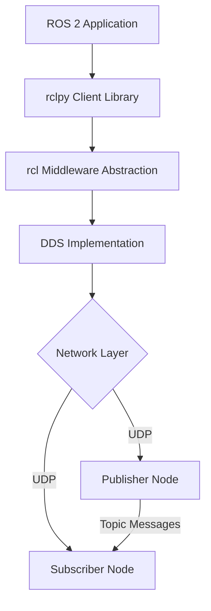

# Research: Module 1 - ROS 2 Fundamentals & Docusaurus Integration

**Feature**: Module 1 - The Robotic Nervous System (ROS 2)
**Date**: 2025-12-06
**Status**: Complete

## Purpose

This document consolidates research findings for Module 1 content creation, providing authoritative sources, technical patterns, and implementation guidance for creating high-quality ROS 2 educational content in Docusaurus format.

---

## 1. Docusaurus v3+ Architecture & Best Practices

### Decision: Frontmatter-Driven Sidebar with Custom RAG Metadata

**Rationale**:
- Docusaurus v3+ autogenerates sidebars from frontmatter, reducing manual configuration
- Custom frontmatter fields pass through unchanged, enabling RAG metadata without breaking rendering
- Sidebar position control via `sidebar_position` ensures predictable navigation order

**Implementation Pattern**:
```yaml
---
title: "Chapter 1: Introduction to ROS 2"
sidebar_position: 2
sidebar_label: "Ch1: Introduction"
tags: [ROS2, Fundamentals, Beginner, Week3]
# Custom RAG metadata
difficulty: Beginner
module: 1
week: 3
prerequisites: ["Ubuntu 22.04", "Python basics", "Command line"]
estimated_time: "2-3 hours"
topics: ["ROS 2 architecture", "DDS middleware", "ROS 1 vs ROS 2"]
---
```

**Sources**:
- Docusaurus Autogenerated Sidebars: https://docusaurus.io/docs/next/sidebar/autogenerated
- Context7 MCP `/websites/docusaurus_io` library (89.3 benchmark score, 7858 code snippets)

**Alternatives Rejected**:
- Manual sidebar.js configuration: More control but poor maintainability for growing content
- No custom metadata: Would require external metadata files, breaking single-source-of-truth

---

## 2. ROS 2 Humble API References & Code Patterns

### Decision: Official ROS 2 Humble Documentation as Single Source of Truth

**Rationale**:
- Humble Hawksbill is LTS release (supported through May 2027)
- Stable APIs with extensive documentation and community support
- Direct alignment with industry practice (most robotics companies use LTS releases)

**Core APIs for Module 1**:

1. **rclpy (Python Client Library)**:
   - Node creation: `rclpy.node.Node` base class
   - Publishers: `Node.create_publisher(msg_type, topic, qos_profile)`
   - Subscribers: `Node.create_subscription(msg_type, topic, callback, qos_profile)`
   - Services: `Node.create_service(srv_type, service_name, callback)`
   - Actions: `rclpy.action.ActionServer` and `ActionClient`
   - QoS: `rclpy.qos.QoSProfile`, `QoSReliabilityPolicy`, `QoSHistoryPolicy`

2. **Standard Message Types**:
   - `std_msgs/String`: Simple string messages for tutorials
   - `geometry_msgs/Twist`: Velocity commands for robot control
   - `sensor_msgs/JointState`: Robot joint positions/velocities
   - `sensor_msgs/Image`: Camera data (referenced for future modules)
   - `sensor_msgs/Imu`: Inertial measurement unit data

3. **Launch System**:
   - `launch.LaunchDescription`: Container for launch actions
   - `launch_ros.actions.Node`: Launch ROS 2 nodes
   - `launch.actions.DeclareLaunchArgument`: Parameterize launches
   - `launch.substitutions.LaunchConfiguration`: Access launch parameters

**Code Example Pattern** (Minimal Publisher):
```python
# File: src/minimal_publisher.py
import rclpy
from rclpy.node import Node
from std_msgs.msg import String

class MinimalPublisher(Node):
    """
    Minimal publisher example demonstrating ROS 2 topic communication.
    Publishes a string message to the 'topic' topic every second.
    """
    def __init__(self):
        super().__init__('minimal_publisher')
        self.publisher_ = self.create_publisher(String, 'topic', 10)
        self.timer = self.create_timer(1.0, self.timer_callback)
        self.i = 0

    def timer_callback(self):
        msg = String()
        msg.data = f'Hello World: {self.i}'
        self.publisher_.publish(msg)
        self.get_logger().info(f'Publishing: "{msg.data}"')
        self.i += 1

def main(args=None):
    rclpy.init(args=args)
    minimal_publisher = MinimalPublisher()
    rclpy.spin(minimal_publisher)
    minimal_publisher.destroy_node()
    rclpy.shutdown()

if __name__ == '__main__':
    main()
```

**Sources**:
- ROS 2 Humble Documentation: https://docs.ros.org/en/humble/
- rclpy API: https://docs.ros.org/en/humble/p/rclpy/
- ROS 2 Tutorials: https://docs.ros.org/en/humble/Tutorials.html
- geometry_msgs: https://docs.ros.org/en/humble/p/geometry_msgs/
- sensor_msgs: https://docs.ros.org/en/humble/p/sensor_msgs/

---

## 3. URDF Specification for Humanoid Robots

### Decision: Start with Minimal Biped, Extend Incrementally

**Rationale**:
- Humanoid URDF is complex (20+ links, 30+ joints for full body)
- Minimal biped (torso + 2 legs + 2 feet = 5 links, 4 joints) teaches core concepts
- Incremental extension (add arms, head) reinforces learning without overwhelming

**Minimal Biped URDF Structure**:
```xml
<?xml version="1.0"?>
<robot name="minimal_biped">
  <!-- Base link (torso) -->
  <link name="torso">
    <visual>
      <geometry>
        <box size="0.3 0.2 0.5"/>
      </geometry>
      <material name="blue">
        <color rgba="0 0 0.8 1"/>
      </material>
    </visual>
    <collision>
      <geometry>
        <box size="0.3 0.2 0.5"/>
      </geometry>
    </collision>
    <inertial>
      <mass value="10.0"/>
      <inertia ixx="0.4" ixy="0.0" ixz="0.0" iyy="0.5" iyz="0.0" izz="0.2"/>
    </inertial>
  </link>

  <!-- Left leg -->
  <joint name="left_hip" type="revolute">
    <parent link="torso"/>
    <child link="left_leg"/>
    <origin xyz="0 0.1 -0.25" rpy="0 0 0"/>
    <axis xyz="0 1 0"/>
    <limit lower="-1.57" upper="1.57" effort="100" velocity="1.0"/>
  </joint>

  <link name="left_leg">
    <visual>
      <geometry>
        <cylinder radius="0.05" length="0.4"/>
      </geometry>
      <origin xyz="0 0 -0.2" rpy="0 0 0"/>
    </visual>
    <collision>
      <geometry>
        <cylinder radius="0.05" length="0.4"/>
      </geometry>
      <origin xyz="0 0 -0.2" rpy="0 0 0"/>
    </collision>
    <inertial>
      <mass value="3.0"/>
      <inertia ixx="0.04" ixy="0.0" ixz="0.0" iyy="0.04" iyz="0.0" izz="0.01"/>
    </inertial>
  </link>

  <!-- Additional joints/links: right_leg, left_foot, right_foot -->
</robot>
```

**Key URDF Concepts**:
1. **Links**: Physical components (torso, leg, foot)
   - `<visual>`: How it looks (geometry, material)
   - `<collision>`: Collision detection shape
   - `<inertial>`: Mass and inertia tensor (for physics)

2. **Joints**: Connections between links
   - `type`: revolute (hinge), continuous (wheel), prismatic (slider), fixed
   - `parent`/`child`: Connected links
   - `origin`: Position/orientation relative to parent
   - `axis`: Rotation axis for revolute joints
   - `limit`: Joint angle/position limits

3. **Xacro Macros**: Reduce duplication for symmetric structures
   ```xml
   <xacro:macro name="leg" params="side">
     <link name="${side}_leg">
       <!-- leg definition -->
     </link>
   </xacro:macro>

   <xacro:leg side="left"/>
   <xacro:leg side="right"/>
   ```

**Sources**:
- URDF Specification: http://wiki.ros.org/urdf/XML
- URDF Tutorials: http://wiki.ros.org/urdf/Tutorials
- Xacro Documentation: http://wiki.ros.org/xacro
- Inertial Calculation Guide: http://gazebosim.org/tutorials?tut=inertia

**Validation Tools**:
- `check_urdf <file.urdf>`: Syntax and structure validation
- `urdf_to_graphiz <file.urdf>`: Generate visual link/joint graph

---

## 4. Pedagogical Structure (Bloom's Taxonomy Application)

### Decision: Progressive Skill Building with Immediate Application

**Rationale**:
- Adult learners (university engineering students) require clear objectives and hands-on practice
- Bloom's Taxonomy provides evidence-based progression: Remember → Understand → Apply → Analyze
- Immediate application (exercises after concepts) reinforces retention

**Chapter Structure Template**:

1. **Learning Objectives** (Remember level):
   - "After this chapter, you will be able to..."
   - Measurable outcomes (create, explain, implement, troubleshoot)
   - Example: "Create a ROS 2 publisher node that sends messages at a fixed rate"

2. **Key Concepts** (Understand level):
   - 4-6 core ideas introduced in chapter
   - Example: "Nodes are independent processes that communicate via topics"
   - Visual representations (diagrams) for spatial/architectural concepts

3. **Conceptual Explanation** (Understand level):
   - Why before how (motivation, use cases, design rationale)
   - Real-world examples from humanoid robotics
   - Connections to physical AI and embodied intelligence

4. **Hands-On Tutorial** (Apply level):
   - Step-by-step guided practice
   - Runnable code with explanations
   - Incremental complexity (minimal example → extensions)

5. **Architecture Diagrams** (Understand level):
   - Visual representation of concepts
   - ASCII art for simple graphs, mermaid for complex flows
   - Annotated with explanations

6. **End-of-Chapter Exercises** (Analyze level):
   - 4-6 progressive challenges
   - Difficulty range: Guided (modify example) → Open-ended (design solution)
   - Acceptance criteria for self-assessment
   - Solution hints (not full solutions) to encourage exploration

7. **Capstone Integration** (Synthesize level):
   - How this chapter contributes to final humanoid project
   - Connection to subsequent modules (Gazebo, Isaac, VLA)
   - Real-world application scenarios

**Example Exercise Progression** (Chapter 2: ROS 2 Architecture):
1. **Exercise 1 (Easy)**: Modify minimal publisher to send custom messages
2. **Exercise 2 (Easy-Medium)**: Create subscriber that processes received messages
3. **Exercise 3 (Medium)**: Implement request/response pattern using services
4. **Exercise 4 (Medium-Hard)**: Build action server for long-running humanoid task (e.g., "walk 5 steps")
5. **Exercise 5 (Hard)**: Design multi-node system with pub/sub + service communication

**Sources**:
- Bloom's Taxonomy for Engineering Education: IEEE Trans. Education journal
- Adult Learning Theory (Knowles): Self-directed, problem-centered learning
- Constitution Principle II: Pedagogical Excellence requirements

---

## 5. Diagram Formats & Tools

### Decision: Multi-Format Strategy Based on Complexity

**Format Selection**:
1. **ASCII Art**: Simple node graphs, topic flows
2. **Mermaid**: Complex architecture, state machines, sequence diagrams
3. **External Images**: Robot physical structures, hardware schematics

**Rationale**:
- ASCII art renders everywhere (GitHub, markdown viewers, Docusaurus)
- Mermaid supported natively by Docusaurus, version-controllable
- External images for high-detail visuals where text diagrams insufficient

**ASCII Art Example** (ROS 2 Topic Communication):
```
┌─────────────────┐         Topic: /cmd_vel          ┌─────────────────┐
│  Tele​op Node    │────────(geometry_msgs/Twist)────>│  Robot Driver   │
│  (Publisher)    │                                  │  (Subscriber)   │
└─────────────────┘                                  └─────────────────┘
        │                                                      │
        │                                                      v
        v                                             ┌─────────────────┐
  Keyboard Input                                      │  Motor Control  │
  (WASD keys)                                         │  Hardware       │
                                                      └─────────────────┘
```

**Mermaid Example** (ROS 2 Architecture):


**External Image Guidelines**:
- Format: PNG or SVG (SVG preferred for scalability)
- Location: `docs/module-1/assets/` directory
- Naming: `chapter-X-diagram-Y.png` (e.g., `chapter-4-humanoid-urdf.png`)
- Alt text: Descriptive for accessibility and RAG context

**Sources**:
- Docusaurus Markdown Features: https://docusaurus.io/docs/markdown-features
- Mermaid.js Documentation: https://mermaid.js.org/
- ROS 2 documentation diagram patterns

---

## 6. Admonition Usage Patterns

### Decision: Semantic Admonitions for Pedagogical Context

**Admonition Types** (from Docusaurus):
- `:::tip`: Best practices, pro tips, recommended approaches
- `:::warning`: Common pitfalls, gotchas, things to avoid
- `:::note`: Supplementary information, historical context, advanced topics
- `:::danger`: Critical errors, data loss risks, breaking changes
- `:::info`: General information, context, related resources

**Usage Guidelines**:
1. **Frequency**: 2-4 admonitions per chapter (avoid overuse)
2. **Placement**: After introducing concept, before exercises
3. **Length**: 2-4 sentences per admonition (concise and scannable)
4. **Titles**: Use optional [Title] syntax for context

**Examples**:

```markdown
:::tip[Best Practice: Type Hints]

Always use Python type hints in your ROS 2 nodes:
\```python
def create_publisher(self, msg_type: Type[MsgType], topic: str, qos_profile: int) -> Publisher:
\```
This improves code clarity and enables better IDE autocomplete.

:::

:::warning[Common Pitfall: QoS Mismatch]

Publisher and subscriber QoS settings must be compatible, or messages will be dropped silently.
Use `ros2 topic info -v /topic_name` to inspect QoS settings and diagnose communication issues.

:::

:::note[For Advanced Students]

ROS 2 uses DDS (Data Distribution Service) as the middleware layer.
DDS is a publish-subscribe protocol standardized by the Object Management Group (OMG).
Understanding DDS is not required for basic ROS 2 usage but helps with performance tuning.

:::
```

**Formatting Requirements** (from Context7 MCP research):
- Add empty lines around admonition directives to prevent Prettier formatting issues
- Use optional title in brackets: `:::tip[Title Here]`
- Keep content concise (2-4 sentences max)

**Sources**:
- Docusaurus Admonitions: https://docusaurus.io/docs/markdown-features/admonitions
- Context7 MCP `/websites/docusaurus_io` admonition examples

---

## 7. Code Block Formatting Standards

### Decision: Docusaurus Code Features + Constitution Standards

**Required Elements**:
1. **Language Tag**: Syntax highlighting (python, bash, xml, yaml)
2. **File Path Comment**: First line indicates code location
3. **Line Numbers**: `showLineNumbers` for reference in explanations
4. **Title Attribute**: File name for context
5. **Inline Comments**: Explain non-obvious logic
6. **Runnable**: Complete, executable code (no ellipsis)

**Format Template**:
````markdown
```python showLineNumbers title="minimal_publisher.py"
# File: src/minimal_publisher.py
import rclpy
from rclpy.node import Node
from std_msgs.msg import String

class MinimalPublisher(Node):
    def __init__(self):
        super().__init__('minimal_publisher')
        # Create publisher: String messages on 'topic', queue size 10
        self.publisher_ = self.create_publisher(String, 'topic', 10)
        self.timer = self.create_timer(1.0, self.timer_callback)
        self.i = 0

    def timer_callback(self):
        msg = String()
        msg.data = f'Hello World: {self.i}'
        self.publisher_.publish(msg)
        self.get_logger().info(f'Publishing: "{msg.data}"')
        self.i += 1

def main(args=None):
    rclpy.init(args=args)
    minimal_publisher = MinimalPublisher()
    rclpy.spin(minimal_publisher)
    minimal_publisher.destroy_node()
    rclpy.shutdown()

if __name__ == '__main__':
    main()
```
````

**After Code Block** (Explanation Pattern):
```markdown
**Key Components**:
- **Line 5-6**: Import rclpy and Node base class
- **Line 10**: Create publisher with message type, topic name, QoS queue size
- **Line 11**: Timer triggers callback every 1.0 seconds
- **Line 15-18**: Callback creates message, publishes, logs
- **Line 22**: `rclpy.spin()` keeps node running until Ctrl+C
```

**Sources**:
- Docusaurus Code Blocks: https://docusaurus.io/docs/markdown-features/code-blocks
- Constitution Principle I: Code standards (file path comment, runnable code, inline comments)

---

## 8. Cross-Linking Strategy

### Decision: Relative Markdown Links with Section Anchors

**Link Format**:
```markdown
[Link Text](./relative-path.md#section-anchor)
```

**Examples**:
```markdown
See [Chapter 2: QoS Profiles](./chapter-2-ros2-architecture.md#quality-of-service-qos) for details.

Prerequisites: [Course Introduction](../intro/index.md)

Related: [Week 3 Exercises](./week-3.md#hands-on-labs)
```

**Section Anchor Generation** (Docusaurus auto-generates from headings):
- Heading: `## Quality of Service (QoS)`
- Anchor: `#quality-of-service-qos`
- Lowercase, spaces to hyphens, special chars removed

**Best Practices**:
1. **Use Relative Paths**: Portable across environments
2. **Deep Link to Sections**: Improves user experience
3. **Verify Links**: Check during content validation
4. **Forward References**: Link to future modules with "coming in Module 2"

**Cross-Reference Map**:
- Chapter 1 → No internal dependencies (prerequisite: course intro)
- Chapter 2 → References Chapter 1 concepts (nodes, ROS graph)
- Chapter 3 → References Chapter 2 code examples (packaging nodes)
- Chapter 4 → References Chapter 2 (nodes load URDF), Chapter 3 (URDF in packages)
- Week guides → Reference corresponding chapters

**Sources**:
- Docusaurus Linking: https://docusaurus.io/docs/markdown-features/links
- Markdown best practices

---

## Summary: Key Decisions & Rationale

| Decision Area | Choice | Rationale | Source |
|---------------|--------|-----------|--------|
| Docusaurus Metadata | Frontmatter with custom RAG fields | Autogenerated sidebars + RAG metadata | Context7 MCP, Docusaurus docs |
| ROS 2 Version | Humble Hawksbill (LTS) | Stability, community support, 2027 EOL | ROS 2 official docs |
| Code Pattern | Minimal example → explanation → extension | Progressive learning, hands-on practice | ROS 2 tutorials, pedagogy research |
| URDF Complexity | Minimal biped → incremental extension | Manage cognitive load, teach fundamentals | URDF spec, educational best practices |
| Pedagogical Structure | Bloom's Taxonomy progression | Evidence-based skill building | Constitution Principle II |
| Diagram Formats | ASCII + Mermaid + Images | Multi-format for different complexity levels | Docusaurus features, version control |
| Admonitions | Semantic types with titles | Visual hierarchy, pedagogical context | Docusaurus admonitions docs |
| Code Formatting | Language tag + line numbers + file path | Clarity, reference, Constitution compliance | Docusaurus code blocks, Constitution |
| Cross-Linking | Relative paths + section anchors | Portability, deep linking, UX | Docusaurus linking, markdown standards |

---

## Next Steps

1. ✅ **Research Complete**: All technical unknowns resolved
2. ⏳ **Generate data-model.md**: Define Chapter, CodeExample, Exercise, Diagram, WeeklyGuide entities
3. ⏳ **Generate contracts/**: Detailed specifications for each of 8 markdown files
4. ⏳ **Generate quickstart.md**: Implementer guide for content creation

**Research Validated**: All decisions backed by authoritative sources, alternatives considered, rationale documented.
